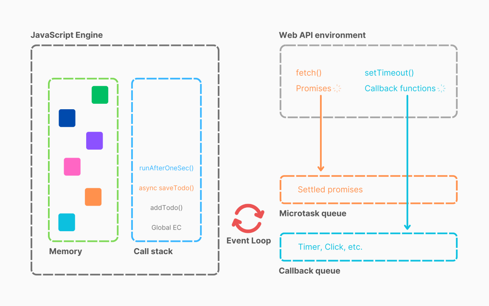

# Asynchronous JavaScript & The Event Loop

Ever wondered how JavaScript, known for being single-threaded, handles tasks that take time, like fetching data or waiting for a timer, without freezing everything else? This is where the magic of the asynchronous model, powered by the browser environment and the Event Loop, comes into play.

---
## Prerequisite:
If you don’t understand how the Call Stack works, I highly recommend reading this first:
:octicons-link-external-16: [JavaScript Call Stack](javascript-call-stack.md)
---

## :thinking: The Puzzle: JavaScript's Synchronous Nature

First, let's establish the baseline:

*   **Single-Threaded:** JavaScript, in its core execution model, has only one thread. This means it can only do *one thing at a time*.
*   **Synchronous Execution:** Code runs line by line, one after another. If one line takes a long time, the next line has to wait.
*   **The Call Stack:** This is the heart of JS execution. It's a data structure that keeps track of function calls.
    *   When a script starts, a Global Execution Context (GEC) is created and pushed onto the stack.
    *   When a function is called, a new Execution Context (EC) for that function is created and pushed onto the stack.
    *   The code inside the function executes.
    *   When the function finishes, its EC is popped off the stack.
    *   When the entire script finishes, the GEC is popped off, and the stack is empty.

**Example:**

```javascript
function greet(name) {
    console.log("Hello, " + name);
}

function start() {
    console.log("Starting...");
    greet("Alice");
    console.log("Finished!");
}

start();
console.log("All done.");

/* Execution Flow & Call Stack:
1. GEC pushed. `start()` called.
2. `start()` EC pushed. `console.log("Starting...")` runs.
3. `greet("Alice")` called.
4. `greet()` EC pushed. `console.log("Hello, Alice")` runs.
5. `greet()` finishes, EC popped.
6. Back in `start()`, `console.log("Finished!")` runs.
7. `start()` finishes, EC popped.
8. Back in GEC, `console.log("All done.")` runs.
9. Script ends, GEC popped. Stack is empty.
*/
```

**The Call Stack's main job is simple:** execute whatever is currently on top of it, immediately. It doesn't wait. So, how do we handle delays or external events?

## :question: What Happens When Things Take Time? The Browser's Role

If the Call Stack just executes code synchronously, how can we possibly wait 5 seconds for a timer without blocking the entire thread? The answer lies *outside* the JavaScript Engine itself.

{==

The **Browser** (or Node.js environment) provides additional capabilities beyond the core JS engine. These are often called **Web APIs**.

==}

## :globe_with_meridians: Meet the Browser's Helpers: Web APIs

{==

Think of the browser as a larger environment containing:

1.  **The JS Engine:** (e.g., V8 in Chrome/Node) with its Call Stack.
2.  **Web APIs:** A set of APIs provided by the browser for interacting with the outside world or performing tasks in the background. Examples include:
    *   `setTimeout()`, `setInterval()` (Timers)
    *   DOM APIs (manipulating HTML, handling events like clicks)
    *   `fetch()` (making network requests)
    *   `localStorage` (storage)
    *   `console` (debugging output)
    *   Geolocation, Bluetooth, etc.

These APIs are *not* part of the core JavaScript language itself but are provided by the environment (like the browser). We can access them through the global object (`window` in browsers).

When we call a function like `setTimeout`, the JS Engine doesn't handle the waiting itself. It hands off the task to the corresponding Web API.

==}

## :clock: Deep Dive: How `setTimeout` *Really* Works

Let's trace this code:

```javascript
console.log("Start"); // 1

setTimeout(function cb() { // cb stands for callback
    console.log("Callback after 5s"); // 4 (after delay and queue processing)
}, 5000); // 2

console.log("End"); // 3
```

**Execution Steps:**

1.  `console.log("Start")` is executed and logged.
2.  `setTimeout(cb, 5000)` is executed.
    *   The JS Engine sees `setTimeout`. It knows this is a **Web API call**.
    *   It hands the callback function `cb` and the delay `5000`ms over to the browser's Timer API.
    *   The Timer API starts a countdown for 5 seconds.
    *   **Crucially:** The JS Engine *does not wait*. It immediately moves on after handing off `cb` to the browser.
3.  `console.log("End")` is executed and logged.
4.  The main script finishes, and the GEC is popped from the Call Stack. The stack is now empty.
5.  **Meanwhile, in the browser:** The Timer API is counting down. After 5 seconds, the timer completes.
6.  **What happens to `cb` now?** It doesn't go directly back to the Call Stack. It needs a place to wait until the Call Stack is free.

## :material-email-newsletter: The Waiting Room: {++Callback Queue++} & The Gatekeeper: {++Event Loop++}

{ loading=lazy }

This is where two more crucial pieces come in:

1.  **Callback Queue (or Task Queue):** When a Web API finishes its task (like the timer expiring, or data arriving from `fetch`, or a button being clicked), the associated callback function (like our `cb`) is placed into the Callback Queue. It's a waiting line for functions ready to be executed.

2.  **Event Loop:** This is the conductor orchestrating the whole process. The Event Loop has one simple, continuous job:
    *   **Monitor:** Is the Call Stack empty?
    *   **Monitor:** Is there anything waiting in the Callback Queue?
    *   **Action:** If the Call Stack IS empty AND there IS a callback waiting in the Callback Queue, the Event Loop takes the *first* callback from the queue and pushes it onto the Call Stack for execution.

**Continuing the `setTimeout` example:**

*   After 5 seconds, the Timer API places `cb` into the Callback Queue: `[ cb ]`.
*   The Event Loop sees the Call Stack is empty (our main script finished) and sees `cb` in the queue.
*   The Event Loop pushes `cb` onto the Call Stack.
*   The code inside `cb` (`console.log("Callback after 5s")`) executes.
*   `cb` finishes and is popped from the Call Stack. The stack is empty again. The queue is empty. Everything is settled.

## :mouse: Handling Clicks: Event Listeners in Action

Event listeners work similarly:

```javascript
console.log("Start");

document.getElementById("myButton").addEventListener("click", function handleClick() {
    console.log("Button clicked!"); // Runs only AFTER a click AND stack is empty
});

console.log("End");
```

1.  `console.log("Start")` runs.
2.  `addEventListener` is called. The JS Engine tells the browser's DOM API: "Hey, watch the element with ID 'myButton'. If a 'click' happens, remember this `handleClick` function." The browser registers this listener. The JS Engine moves on.
3.  `console.log("End")` runs. The main script might finish, emptying the Call Stack.
4.  **Later:** The user clicks the button.
    5.  The browser's DOM API sees the click and finds the registered `handleClick` function.
    6.  It places `handleClick` into the Callback Queue: `[ handleClick ]`.
    7.  The Event Loop waits for the Call Stack to be empty.
    8.  Once the stack is empty, the Event Loop pushes `handleClick` onto the stack.
    9.  `console.log("Button clicked!")` executes.
    10. `handleClick` finishes and is popped off the stack.

If the user clicks the button 5 times rapidly while the Call Stack is busy, 5 `handleClick` functions will be added to the Callback Queue, waiting their turn.

## :globe_with_meridians: Fetching Data: Introducing Promises and a New Queue

Now, let's look at `fetch`, which is commonly used for network requests and involves Promises:

```javascript
console.log("Start"); // 1

setTimeout(function cbT() { // cbT = callback Timer
    console.log("Timeout Callback"); // 5?
}, 0); // 2 - Note: 0ms delay!

fetch("some/api/endpoint") // 3
    .then(function cbF() { // cbF = callback Fetch
        console.log("Fetch Callback (Promise resolved)"); // 4?
    });

console.log("End"); // 4? (or maybe 3?)
```

You might expect the `setTimeout` with 0ms delay to run very quickly. However, `fetch` introduces Promises, and Promises have a special place in the asynchronous model.

## ✨ The VIP Lane: Microtask Queue

It turns out there isn't just *one* queue. There are (at least) two important ones:

1.  **Callback Queue (or Task Queue):** Holds callbacks from `setTimeout`, `setInterval`, DOM events, I/O operations, etc.
2.  **Microtask Queue (or Job Queue):** Holds callbacks associated with Promises (like functions passed to `.then()`, `.catch()`, `.finally()`) and some other mechanisms like `MutationObserver` and `queueMicrotask()`.

!!! answer "The Crucial Difference: Priority"

The Event Loop gives the **Microtask Queue higher priority**. The rule is:

*   After a task currently executing on the Call Stack finishes, the Event Loop checks the **Microtask Queue**.
*   If the Microtask Queue has tasks, the Event Loop runs **ALL** tasks in the Microtask Queue, one by one, until it's empty.
*   *Only then* does the Event Loop check the **Callback Queue** and move *one* task from there to the Call Stack (if the stack is empty).

!!! note "Revisiting the `fetch` example"

1.  `console.log("Start")` runs.
2.  `setTimeout(cbT, 0)`: The JS Engine hands `cbT` to the Timer API. The Timer API almost immediately (after ~4ms minimum delay in browsers typically, not truly 0) places `cbT` into the **Callback Queue**.
3.  `fetch()`: The JS Engine initiates the network request via the browser's Fetch API. `fetch` returns a Promise immediately. The `.then(cbF)` part registers `cbF` to run when the Promise resolves.
4.  `console.log("End")` runs. The main script finishes. Call Stack is empty.
5.  **Now the Event Loop checks:**
    *   **Microtask Queue:** Let's assume the `fetch` completed quickly and the Promise resolved. `cbF` is now in the **Microtask Queue**.
    *   **Callback Queue:** `cbT` is waiting here.
6.  **Event Loop Action:** Because the Microtask Queue has priority, the Event Loop pushes `cbF` onto the Call Stack.
7.  `console.log("Fetch Callback...")` runs. `cbF` finishes and is popped.
8.  **Event Loop checks again:** Microtask Queue is empty.
9.  **Event Loop checks Callback Queue:** It finds `cbT`. The Call Stack is empty.
10. **Event Loop Action:** It pushes `cbT` onto the Call Stack.
11. `console.log("Timeout Callback")` runs. `cbT` finishes and is popped.

**Output:**
```
Start
End
Fetch Callback (Promise resolved)
Timeout Callback
```
Even with a 0ms delay, the `setTimeout` callback runs *after* the Promise callback because of the Microtask Queue's priority.

## :warning: A Potential Problem: Starvation

Because the Event Loop processes *all* microtasks before moving to the next task from the Callback Queue, it's possible to "starve" the Callback Queue. If a microtask keeps adding *more* microtasks, the Event Loop might never get a chance to process tasks waiting in the Callback Queue (like `setTimeout` or rendering updates). This is generally something to be aware of but less common in typical application code unless dealing with recursive Promise resolutions or complex MutationObserver scenarios.

## :notepad_spiral: Putting It All Together

JavaScript achieves asynchronicity not through multi-threading within the JS Engine itself, but by leveraging the capabilities of its hosting environment (like the browser):

1.  The **Call Stack** executes synchronous code.
2.  **Web APIs** handle long-running tasks or external events off the main thread.
3.  The **Callback Queue** holds callbacks from less urgent async operations (timers, clicks).
4.  The **Microtask Queue** holds callbacks from more urgent async operations (Promises).
5.  The **Event Loop** constantly monitors the Call Stack and the Queues, moving callbacks from the queues (Microtasks first!) onto the stack when the stack is empty, allowing asynchronous operations to integrate back into the synchronous flow without blocking.
