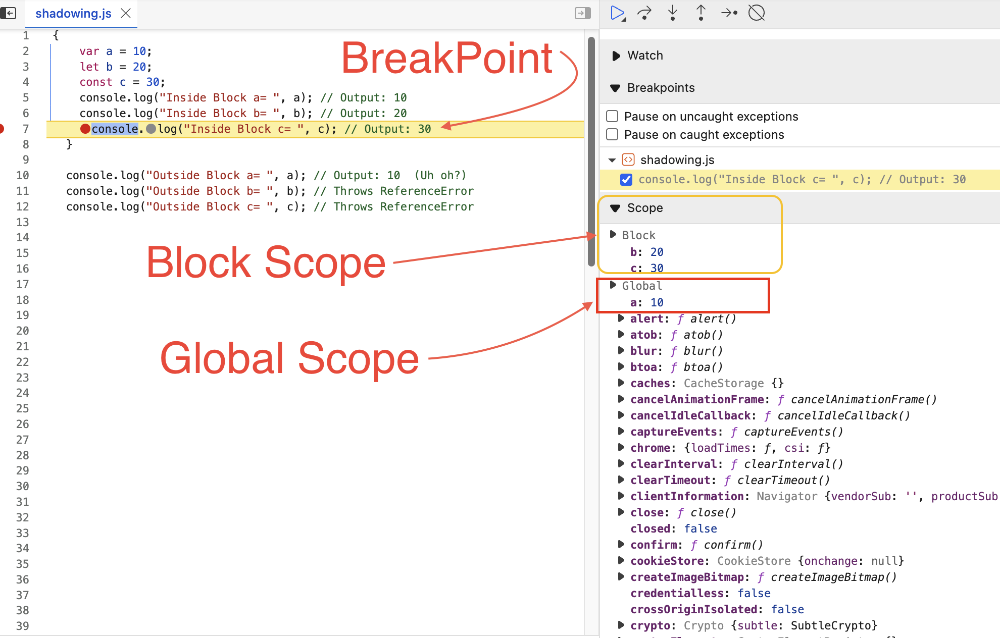
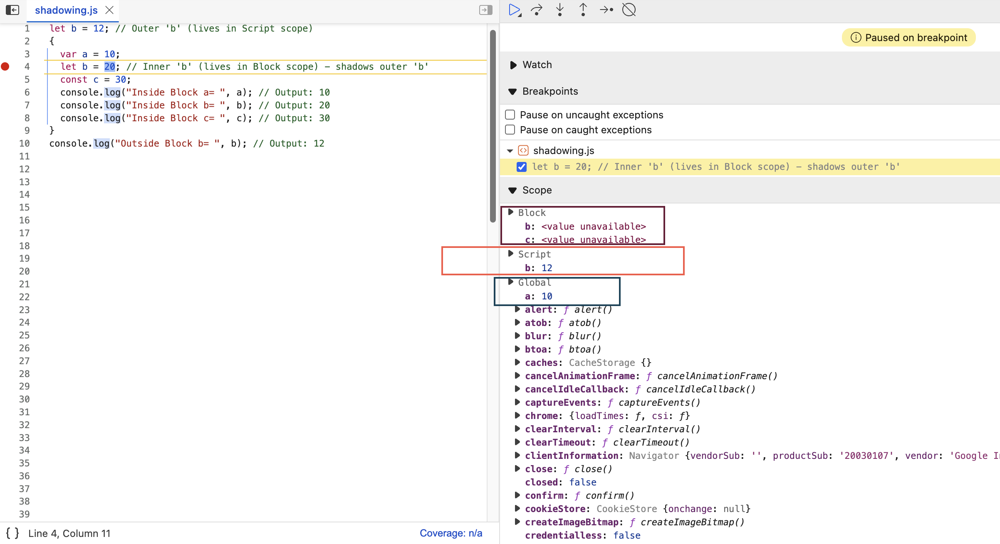
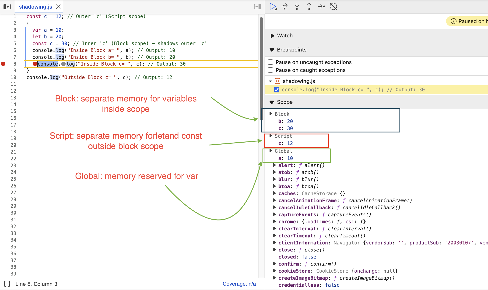

# Scope in JavaScript: Block, Function, and Shadowing

Ever wondered how JavaScript knows which variable you're referring to, especially when names are reused in different parts of your code? This boils down to the concept of **scope**. Let's explore how `block scope`, `function scope`, and a related idea called `shadowing` work in JS.

---

## 🤔 What is a Block?

You've definitely seen curly braces `{}` in JavaScript, especially with `if` statements, `for` loops, or just on their own.

```javascript
if (true) {
  // This is a block
  let message = "Hello!";
  console.log(message);
}
```

These curly braces define a **block**. Think of a block as a way to group multiple JavaScript statements together where JavaScript might otherwise expect only one. It's also known as a **compound statement**.

!!! question "Why group statements?"
    Consider the `if` statement. Syntactically, it expects a single statement to execute if the condition is true. Blocks allow us to execute *multiple* statements conditionally.

```javascript title="Example: Block with if"
if (true) {
  // Compound Statement (Block)
  var a = 10; // We'll discuss 'var' vs 'let'/'const' soon!
  console.log(a);
}
```

---

## 🚪 What is Block Scope?

Now, why are blocks important for variables? Because they create a **scope**. Block scope determines the accessibility of variables declared *inside* that block. ==Specifically, variables declared with `let` and `const` are **block-scoped**.==

Let's see what happens when we declare variables with `var`, `let`, and `const` inside a block and try to access them both inside and outside.

```javascript title="index.js" linenums="1"
{
  var a = 10;
  let b = 20;
  const c = 30;
  console.log("Inside Block a= ", a); // Output: 10
  console.log("Inside Block b= ", b); // Output: 20
  console.log("Inside Block c= ", c); // Output: 30
}

console.log("Outside Block a= ", a); // Output: 10  (Uh oh?)
console.log("Outside Block b= ", b); // Throws ReferenceError
console.log("Outside Block c= ", c); // Throws ReferenceError
```

**Console Output:**

```console title="console output"
Inside Block a=  10
Inside Block b=  20
Inside Block c=  30
Outside Block a=  10
Uncaught ReferenceError: b is not defined
```

{==

**What's happening here?**

*   `let b` and `const c` are **block-scoped**. They exist *only* within the `{}` block. Trying to access them outside results in a `ReferenceError`. They live in a special memory space associated with the block.
*   `var a`, however, is **not** block-scoped (it's typically function-scoped or globally-scoped). It "escapes" the block and becomes accessible outside. In this case, it attaches to the global scope.

==}


<figure markdown="span">
  
  <figcaption>Image illustrating 'b' and 'c' in Block scope, 'a' in Global scope</figcaption>
</figure>

!!! info
    This is a key reason why `let` and `const` (introduced in ES6) are generally preferred over `var` – they limit the variable's "lifespan" to the block where they are needed, reducing potential bugs.

---

## 🎭 What is Shadowing?

What if you declare a variable inside a block with the *same name* as a variable declared outside the block? This is called **shadowing**. The inner variable temporarily "hides" or "shadows" the outer variable *within the block's scope*.

Let's see how `var`, `let`, and `const` behave with shadowing.

### Scenario 1: Shadowing `var` with `var`

```javascript title="index.js" linenums="1"
var a = 12; // Outer 'a'
{
  var a = 10; // Inner 'a' - shadows the outer 'a'
  let b = 20;
  const c = 30;
  console.log("Inside Block a= ", a); // Output: 10
  console.log("Inside Block b= ", b); // Output: 20
  console.log("Inside Block c= ", c); // Output: 30
}
console.log("Outside Block a= ", a); // Output: 10 (Wait, what?)
```

**Console Output:**

```console title="console output"
Inside Block a= 10
Inside Block b= 20
Inside Block c= 30
Outside Block a= 10
```

{==

Because `var` is not block-scoped, both `var a = 12` and `var a = 10` refer to the *same* variable in the outer (in this case, global) scope. The inner declaration **shadows** the outer one *and* **modifies its value**.

==}

### Scenario 2: Shadowing `let` with `let`

```javascript title="index.js" linenums="1"
let b = 12; // Outer 'b' (lives in Script scope)
{
  var a = 10;
  let b = 20; // Inner 'b' (lives in Block scope) - shadows outer 'b'
  const c = 30;
  console.log("Inside Block a= ", a); // Output: 10
  console.log("Inside Block b= ", b); // Output: 20
  console.log("Inside Block c= ", c); // Output: 30
}
console.log("Outside Block b= ", b); // Output: 12
```

**Console Output:**

```console title="console output"
Inside Block a= 10
Inside Block b= 20
Inside Block c= 30
Outside Block b= 12
```

{==

This is different! The inner `let b = 20` creates a *completely new variable* `b` that only exists within the block. It shadows the outer `b` inside the block, but doesn't affect it. Once the block finishes, the inner `b` disappears, and the outer `b` (value 12) is accessible again.

==}

<figure markdown="span">
  
  <figcaption>Image illustrating Global scope for 'a', Script scope for outer 'b', Block scope for inner 'b' and 'c'
  </figcaption>
</figure>

### Scenario 3: Shadowing `const` with `const`

`const` behaves identically to `let` regarding shadowing and block scope.

```javascript title="index.js" linenums="1"
const c = 12; // Outer 'c' (Script scope)
{
  var a = 10;
  let b = 20;
  const c = 30; // Inner 'c' (Block scope) - shadows outer 'c'
  console.log("Inside Block a= ", a); // Output: 10
  console.log("Inside Block b= ", b); // Output: 20
  console.log("Inside Block c= ", c); // Output: 30
}
console.log("Outside Block c= ", c); // Output: 12
```

**Console Output:**

```console title="console output"
Inside Block a= 10
Inside Block b= 20
Inside Block c= 30
Outside Block c= 12
```

Again, the inner `const c` is a separate variable confined to the block scope.

<figure markdown="span">
  
  <figcaption>Image illustrating Global scope for 'a', Script scope for outer 'c', Block scope for 'b' and inner 'c'
  </figcaption>
</figure>

## 🏛️ Does Shadowing Work the Same in Functions?

Yes! Functions also create their own scope (function scope). Variables declared inside a function can shadow variables from outer scopes, similar to how `let` and `const` work in blocks.

```javascript title="index.js" linenums="1"
const c = 12; // Global 'c'

function myFunction() {
  const c = 30; // Function-scoped 'c' - shadows global 'c'
  console.log("Inside Function c= ", c); // Output: 30
}

myFunction();

console.log("Outside Function c= ", c); // Output: 12
```

**Console Output:**

```console title="console output"
Inside Function c= 30
Outside Function c= 12
```

The `c` inside `myFunction` is distinct from the global `c`.

## :police_officer: Illegal Shadowing

While shadowing with `let` and `const` is predictable, mixing them with `var` can lead to errors.

### Case 1: Shadowing `let` with `var` (Illegal)

```javascript
let a = 20;
{
  var a = 10; // SyntaxError!
}
```

**Console Output:**

```console title="console output"
Uncaught SyntaxError: Identifier 'a' has already been declared
```

This is **illegal shadowing**. You cannot shadow a `let` (or `const`) variable with `var` *within the same block scope*.

!!! question "Why is this illegal?"
    Remember, `var` is not truly block-scoped. A `var a = 10` inside the block tries to declare a variable in the *outer* scope (function or global) where `let a` already exists. Since `let` variables cannot be re-declared in the same scope, this causes a `SyntaxError`. `var` tries to "cross the boundary" of its block, interfering with the outer `let`.

### Case 2: Shadowing `var` with `let` (Legal)

```javascript
var a = 20;
{
  let a = 10; // Perfectly fine!
  console.log("Inside block a =", a); // Output: 10
}
console.log("Outside block a =", a); // Output: 20
```

This works because the inner `let a` creates a *new*, block-scoped variable. It doesn't interfere with the outer `var a`.

{==

**Important Note on Functions:** The illegal shadowing rule applies within the *same* block context. If the `var` is inside a *function* within the block, it's okay because the function creates its own separate scope:

==}

```javascript title="shadowing.js" linenums="1"
let a = 20; // Script scope

function test() {
  // Function scope starts here
  var a = 10; // This 'a' is local to the function 'test'
  console.log("Inside function:", a); // Output: 10
}

test();
console.log("Outside function:", a); // Output: 20 (Unaffected)
```

```console title="console output"
Inside function: 10                 shadowing.js:6
Outside function: 20                shadowing.js:10
```

## 🧪 Practice Time!

Add `debugger;` statements or use your browser's developer tools to inspect the scopes for these examples:

**Example 1: Nested Blocks**

```javascript title="shadowing.js" linenums="1"
const a = 20; // Outer scope (Script)
{
  const a = 30; // First block scope
  console.log("Inside Block 1, a = ", a);
  {
    const a = 40; // Second block scope (nested)
    console.log("Inside Block 2, a = ", a);
  }
  console.log("Back in Block 1, a = ", a); // What will this print?
}
console.log("Outside Block, a = ", a);
```

**Example 2: Lexical Scope**

```javascript title="shadowing-1.js" linenums="1"
const a = 20; // Outer scope (Script)
{
  const a = 30; // First block scope
  console.log("Inside Block 1, a = ", a);
  {
    // No 'a' declared here!
    console.log("Inside Block 2, a = ", a); // Which 'a' does this access?
  }
}
console.log("Outside Block, a = ", a);
```

!!! answer
    These examples also demonstrate the **Lexical Scope** chain: JavaScript looks for a variable in the current scope, then in the outer scope, then the next outer scope, and so on, until it finds it or reaches the global scope.

    Understanding block scope, function scope, and shadowing (especially the differences between `var`, `let`, and `const`) is crucial for writing predictable and bug-free JavaScript code!

```console title="console output"
Inside Block 1, a =  30                     shadowing.js:4
Inside Block 2, a =  40                     shadowing.js:7
Back in Block 1, a =  30                    shadowing.js:9
Outside Block, a =  20                      shadowing.js:11
```

```console title="console output"
Inside Block 1, a =  30                     shadowing-1.js:4
Inside Block 2, a =  30                     shadowing-1.js:7
Outside Block, a =  20                      shadowing-1.js:10
```

