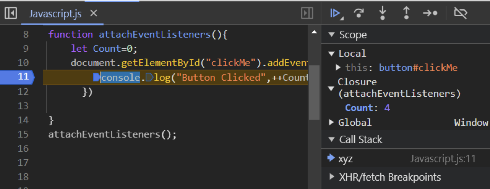
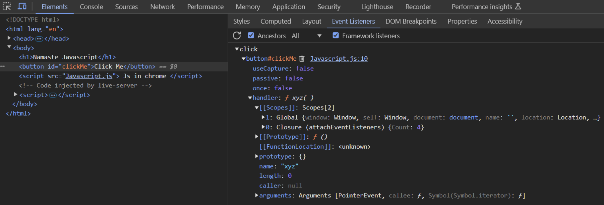
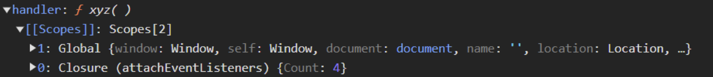

# Callback Functions

Ever wondered how JavaScript, a language that typically runs code line by line (synchronously), handles tasks that take time, like waiting for user input, fetching data, or timers, without freezing everything up? The answer often lies in a fundamental concept: **Callback Functions**.

## :thinking: What is a Callback Function?

In JavaScript, functions are special – they are =="first-class citizens."== This means you can treat them like any other variable: {++assign them, pass them around, and yes, even pass them *into* other functions as arguments++}.

!!! answer "Callback function"
    A **callback function** is simply a function that you pass into another function as an argument, with the intention that the outer function will execute (or "call back") your function at a later time or when a specific event occurs.

**Why are they useful?**

- Enable asynchronous operations (timers, HTTP requests, file I/O) in a single-threaded environment.
- Control execution order: “Do this, then do that.”
- Keep the main thread free—long tasks won’t block UI updates or user interactions.

### :timer: Example: setTimeout & Custom Callbacks

**Problem:** You want to run code after a delay without freezing the UI.

**Solution:** Use `setTimeout()` — it takes a callback and a delay, schedules the callback via the {++browser’s Web APIs++}, then immediately returns control to the call stack.

```javascript
// After 5 seconds, print "Hello World"
setTimeout(function() {
  console.log("Hello World");
}, 5000);

// Demonstrate custom callback invocation
function x(callback) {
  console.log("Inside x");
  callback();
}

x(function() {
  console.log("Inside callback y");
});
```

What happens under the hood:

1. `setTimeout()` registers the callback in the browser’s timer queue.
2. JS continues to the next line—no blocking.
3. `x()` runs, prints “Inside x” then calls your callback, printing “Inside callback y.”
4. After ~5000 ms, the timer expires, and the callback is pushed onto the call stack for execution.

This demonstrates how callbacks allow JavaScript to handle delays without stopping execution.

## The Problem: Blocking the Main Thread

Since JavaScript runs on a single thread (in the browser context), executing code line by line in the call stack, what happens If you run a heavy computation on the main thread:

```javascript
// Example of a (simulated) long-running synchronous task
function blockThread() {
    console.log("Starting blocking task...");
    const start = Date.now();
    while (Date.now() - start < 5000) {
        // Do nothing, just wait synchronously for 5 seconds
    }
    console.log("Blocking task finished.");
}

console.log("Before blocking task.");
blockThread(); // The browser will freeze here for 5 seconds!
console.log("After blocking task.");
// Any UI interactions (clicks, scrolls) during these 5s won't register until after.
```

- The browser can’t handle user input, rendering or other JS until that task finishes.
- The UI freezes—bad for UX.

This is **blocking the main thread**, and it leads to a poor user experience.

!!! tip "Callbacks, used with asynchronous APIs"
    Callbacks, used with asynchronous APIs (like `setTimeout`, `fetch`, or event listeners), are the solution. They allow you to say, "Go do this task, and run *this specific function* (the callback) when you're done," letting the main thread continue with other work in the meantime.

## Event Listeners as Callbacks

Event listeners are callbacks tied to user or DOM events:

```html
<button id="btn-one">Click Me</button>
<script>
  const btn = document.getElementById('btn-one');
  btn.addEventListener('click', function handleClick() {
    console.log('Button Clicked');
  });
</script>
```

- The anonymous function (or named `handleClick`) is your callback.
- When the user clicks the button, the browser pushes this callback onto the call stack and executes it.

## Closures with Event Listeners

Callbacks become even more powerful when combined with [closures](closures.md). A closure allows a function to "remember" the environment (the variables) in which it was created, even after that environment is gone.

Let's say we want to count how many times a button is clicked:

```javascript
// Function to set up the listener and its private counter
function attachClickCounter() {
    let count = 0; // 'count' is in the scope of attachClickCounter

    // Assuming HTML has <button id="btn-two">Click Counter</button>
    const counterButton = document.getElementById('btn-two');

    // Attach the event listener
    counterButton.addEventListener('click', function handleCountClick() {
        // This callback function forms a closure.
        // It "remembers" the 'count' variable from its parent scope.
        count++;
        console.log('Button Clicked ' + count + ' times');
    });
}

// Call the setup function
attachClickCounter();

// Even though attachClickCounter() has finished executing,
// the handleCountClick callback still has access to 'count'.
```

**Output (after clicking the button multiple times):**

```
Button Clicked 1 times
Button Clicked 2 times
Button Clicked 3 times
...
```

The `handleCountClick` function (our callback) forms a closure over the `attachClickCounter` function's scope, specifically capturing the `count` variable. Every time the button is clicked, the *same* callback function runs, and because of the closure, it can access and modify the *same* `count` variable it remembered from when it was created.

You can often inspect these closures in your browser's developer tools:

<figure markdown="span">
    {laoding=lazy}
    <figcaption>Closures with event listeners</figcaption>
</figure>

<figure markdown="span">
  {laoding=lazy}
  <figcaption>Click event listeners are added to the button.</figcaption>
</figure>

<figure markdown="span">
  {laoding=lazy}
  <figcaption>Callback function inside event Listeners have access to the global scope and scope
    inside closure also.</figcaption>
</figure>

## Garbage Collection and Removing Event Listeners

While powerful, event listeners and their associated closures aren't free. They consume memory.

*   **The Problem:** If you add many event listeners, especially ones that form closures over large amounts of data, and you don't remove them when they're no longer needed (e.g., when the element is removed from the page or the component is unmounted), they can lead to **memory leaks**. The browser can't garbage collect the listener function or the variables trapped in its closure because it thinks they might still be needed. This can slow down your application over time.
*   **The Solution:** It's crucial to clean up event listeners when they are no longer necessary. You can do this using the `removeEventListener` method. It requires a reference to the *exact same function* that was originally attached.

```javascript linenums="1" title="index.js"
function setupListener() {
    const button = document.getElementById('myRemovableButton'); // Assume this button exists

    // IMPORTANT: Define the callback as a named function or store it in a variable
    function handleButtonClick() {
        console.log('Removable listener clicked!');
        // Maybe remove the listener after the first click?
        button.removeEventListener('click', handleButtonClick);
        console.log('Listener removed.');
    }

    if (button) {
        button.addEventListener('click', handleButtonClick);
    }

    // You might also remove the listener based on other application logic,
    // e.g., when a component unmounts or a feature is disabled.
}

setupListener();
```

!!! success "Key Takeaway"
    Event listeners are heavy because they keep their callback function and its closure scope alive. Always remove listeners when they're no longer needed to prevent memory leaks and keep your application performant.