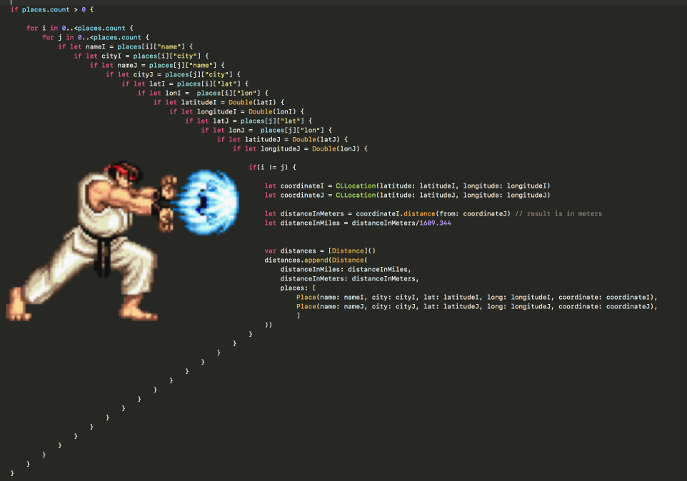

# Callback Hell in JavaScript

Callbacks help JavaScript handle asynchronous operations. But when callbacks pile up, they create a messy, hard-to-follow nest—famously known as **Callback Hell**.

---

## Setting the Scene: Online Shopping with Callbacks

Let’s step into an online store. Imagine the flow a customer follows:

1. **Add items to cart**
2. **Place order**
3. **Make payment**
4. **View summary**
5. **Update wallet**

Each action must finish before the next begins, and every step uses asynchronous APIs.

---

Here’s what this can really look like in code:

```javascript linenums="1"
// The user's shopping cart
const cart = ["shoes", "pants", "kurta"];

// Start the order process
api.createOrder(cart, function(order) {
  // order is now available from createOrder
  api.proceedToPayment(order, function(paymentInfo) {
    // paymentInfo is available from proceedToPayment
    api.showOrderSummary(paymentInfo, function(summary) {
      // summary is available from showOrderSummary
      api.updateWallet(summary, function(walletStatus) {
        // walletStatus is available from updateWallet
        console.log("Order complete! Final wallet status:", walletStatus);
      });
    });
  });
});
```

**How values get passed:**

- Each API function does some work (like talking to a server), then calls your callback with the result.
- That result becomes available as a parameter in your callback function.
- You then use that result in the next step.

!!! notice
    Each step depends on the previous callback. The code drifts to the right, forming what’s called a **Pyramid of Doom**.

---

{ loading=lazy }

---
## Minimal Example (with Dummy Functions)

Here’s a fully working, super-simplified mock-up using timeouts instead of real APIs:

```javascript title="callback-hell.js" linenums="1"
function createOrder(cart, cb) {
  setTimeout(() => cb("order123"), 500);
}

function proceedToPayment(order, cb) {
  setTimeout(() => cb("paymentOK"), 500);
}

function showOrderSummary(paymentInfo, cb) {
  setTimeout(() => cb("summaryReady"), 500);
}

function updateWallet(summary, cb) {
  setTimeout(() => cb("wallet+$100"), 500);
}

const cart = ["shoes", "pants", "kurta"];

createOrder(cart, function(order) {
  proceedToPayment(order, function(paymentInfo) {
    showOrderSummary(paymentInfo, function(summary) {
      updateWallet(summary, function(walletStatus) {
        console.log("Order complete. Wallet:", walletStatus);
      });
    });
  });
});
```

> **Each callback gets its result as an argument—just like real-world async APIs!**

---

### Why is This a Problem?

- **Difficult to Read:** The deeper you nest, the harder it is to see what’s going on.
- **Hard to Debug:** Tracing issues means jumping in and out of multiple nested functions.
- **Unmaintainable:** Adding new logic or handling errors becomes a nightmare.

---

## The Inversion of Control Trap

A callback doesn’t just mess with code structure—it hands over program flow to someone else.

Suppose the API authors aren’t careful:

- What if your callback is **never called**?
- What if it's **called twice**?
- What if **errors aren’t handled**?

You’ve lost control, and debugging becomes frustrating.

!!! notice "Inversion of Control"
    When you pass a function to another module, you trust it to handle your logic correctly—but you can’t be sure it will!

---

## Modern Solutions to Callback Hell

Want cleaner code? Explore how **Promises** and **async/await** can flatten the pyramid and return control to your hands.

[Continue to: Promises and async/await →](promises_async_await.md)