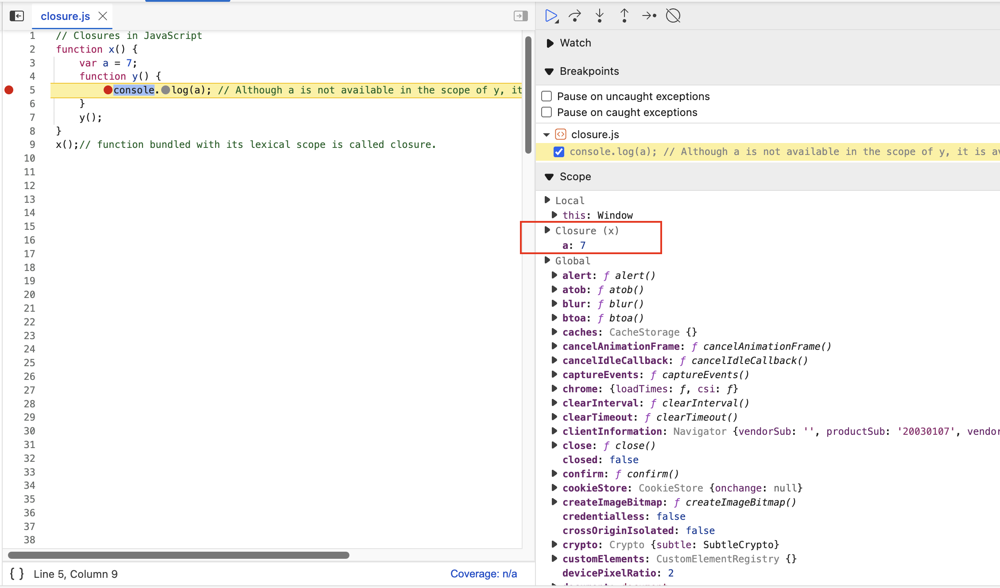
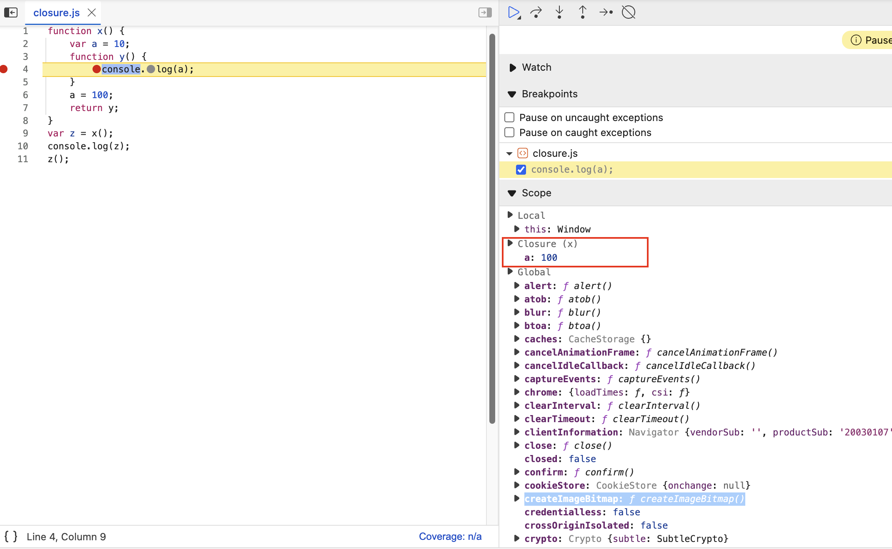
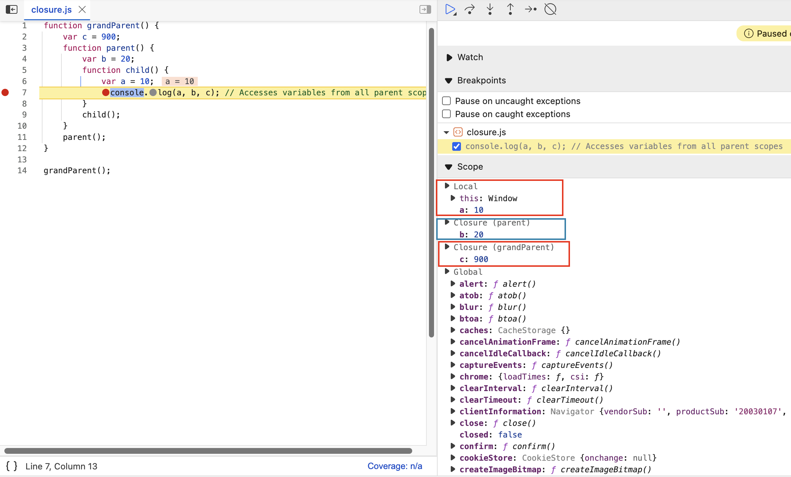

# Closures in JavaScript

{==

Have you ever wondered what happens to a function's local variables after the function has finished executing? Can inner functions still access them? This is where the powerful concept of closures comes into play in JavaScript.

==}

Let's start by understanding the foundation: **Lexical Scoping**.

Consider this simple example:

```javascript linenums="1" title="index.js"
function x() {
    var a = 7; // 'a' is lexically scoped to function x
    function y() {
        // 'y' is lexically inside 'x'
        console.log(a); // Tries to find 'a' in y's scope, then looks up to x's scope
    }
    y();
}
x();
```

When `y()` is executed, it needs the value of `a`. JavaScript's lexical scoping rule means `y()` first looks in its own local scope. Not finding `a` there, it looks up to its lexical parent's scope, which is `x()`. It finds `a` in `x()`'s scope and uses its value.

```console title="Expected Output"
7
```

This seems straightforward. But what happens when we return the inner function *before* executing it?

## ✨ The Magic of Returning Functions

Let's modify the previous example:

```javascript linenums="1" title="index.js"
function x() {
    var a = 7;
    function y() {
        console.log(a);
    }
    return y; // Return the function y itself, not its result
}

var z = x(); // Execute x(), which returns function y. Store y in z.
console.log(z);

// What happens now when we call z()?
z();
```

**Here's the puzzle:**

1.  We execute `x()`, and it returns the *entire function* `y`. This returned function is stored in the variable `z`.
2.  After line 9 (`var z = x();`), the function `x()` has finished executing. Its execution context is gone from the call stack. Normally, we'd expect its local variable `a` to be garbage collected.
3.  But then, on line 13 (`z();`), we execute the function that *used to be* `y`. This function still needs to access variable `a`. How does it find it if `x()` is gone?

```console title="Expected Output"
ƒ y() {
    console.log(a);
}
7
```

It still prints `7`!

!!!tip "This happens because of **closures**."

## 🤔 What is a Closure?

{==

A closure is the combination of a function bundled together with references to its surrounding state (the **lexical environment**). In simpler terms, **a closure gives you access to an outer function’s scope from an inner function, even after the outer function has finished executing.**

==}

When `y` was returned from `x`, it didn't just return the function's code; it returned the function *along with* a persistent reference to its lexical environment, which included the variable `a`. This "package" of the function and its environment is the closure.

<figure markdown="span">
  { loading=lazy }
  <figcaption>Illustrative debugger view showing `y` retaining access to `a` via closure</figcaption>
</figure>

## :safety_pin: Closures Capture References, Not Just Values

Closures don't just capture the *value* of a variable at the moment the closure is created; they capture a *reference* to the variable itself. This means if the variable's value changes *before* the closure is executed, the closure will see the updated value.

Consider this:

```javascript linenums="1" title="index.js"
function x() {
    var a = 7;
    function y() {
        console.log(a); // 'a' here refers to the variable 'a' in x's scope
    }
    a = 100; // Change 'a' *after* y is defined, but *before* y is returned/called
    return y;
}

var z = x();
console.log(z);
z(); // Execute the closure
```

!!! question "What will `z()` print now?"

```console title="Expected Output"
ƒ y() {
    console.log(a);
}
100
```

It prints `100` because the closure associated with `y` holds a reference to the *variable* `a`. By the time `z()` (which is `y`) is executed, the value of `a` in its remembered lexical scope is `100`. The variable `a` wasn't garbage collected because the closure still held a reference to it.

<figure markdown="span">
    { loading=lazy }
    <figcaption>Illustrative debugger view showing the closure referencing the updated value of `a`</figcaption>
</figure>

## :material-key-chain: Nested Functions and Chained Closures

Closures work across multiple levels of nested functions. An inner function forms closures over the scope of all its parent functions.

```javascript linenums="1" title="index.js"
function grandParent() {
  var c = 900;
  function parent() {
    var b = 20;
    function child() {
      var a = 10;
      console.log(a, b, c); // Accesses variables from all parent scopes
    }
    child();
  }
  parent();
}

grandParent();
```

When `child()` executes, it needs `a`, `b`, and `c`.

*   It finds `a` in its own scope.
*   It finds `b` in its lexical parent's scope (`parent`).
*   It finds `c` in its grandparent's scope (`grandParent`).

If `child` were returned, it would form a closure containing references to `a`, `b`, and `c`.

```console title="Expected Output"
10 20 900
```

<figure markdown="span">
    { loading=lazy }
    <figcaption>Illustrative debugger view showing closures for both `parent` (containing `b`) and `grandParent` (containing `c`) scopes</figcaption>
</figure>


## :white_check_mark: Why Use Closures? (Use Cases)

Closures are fundamental to many patterns and techniques in JavaScript:

*   **Data Hiding and Encapsulation:** Creating private variables and methods (Module Pattern).
*   **Maintaining State in Asynchronous Operations:** Callbacks in `setTimeout`, event listeners, or promises often rely on closures to access variables from their original context.
*   **Function Factories:** Creating functions with preset configurations (e.g., currying).
*   **Memoization:** Caching results of expensive function calls.
*   **Iterators:** Implementing custom iteration logic.
*   **Partial Application & Currying:** Creating specialized functions from more general ones.

## :warning: Potential Downsides

While powerful, closures should be used mindfully:

*   **Memory Consumption:** Since variables within a closure's scope are not garbage collected as long as the closure exists, they can potentially consume significant memory if closures are created excessively or hold large data structures unnecessarily.
*   **Memory Leaks:** If closures are inadvertently kept alive (e.g., circular references, uncleared event listeners), the memory they hold onto will never be released, leading to memory leaks.

Understanding closures is key to mastering JavaScript, enabling you to write more elegant, efficient, and powerful code.