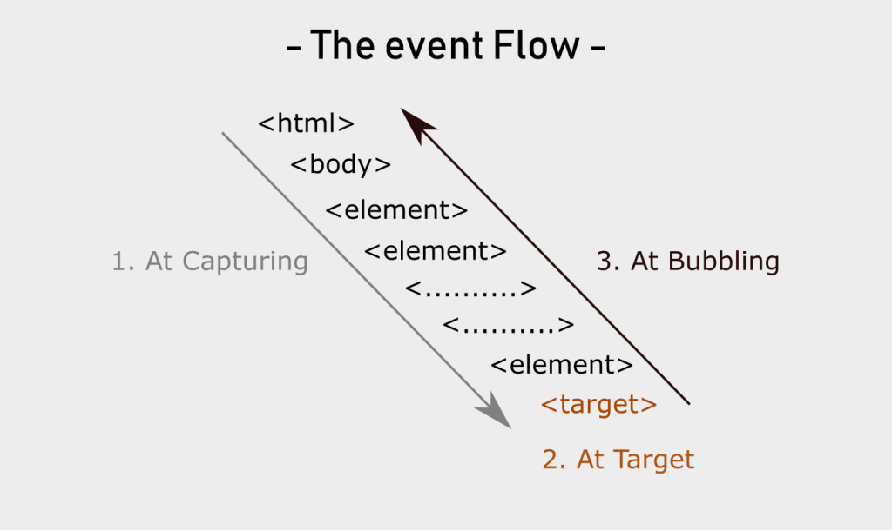

# Event Delegation

Event propagation is how events travel through the DOM tree. When an event occurs on an element, it doesn't just affect that element but also travels through its ancestors in the DOM hierarchy. There are two main phases of event propagation:

1. **Capturing Phase**: Events start from the root element and travel down to the target element
2. **Bubbling Phase**: Events start from the target element and bubble up to the root element

## The Event Flow

The complete event flow consists of three phases:

{loading=lazy}

1. **Capturing Phase**: From window to the target element
2. **Target Phase**: The event reaches the target element
3. **Bubbling Phase**: From the target element back up to the window

## Example: Capturing vs Bubbling

```html
<div id="grandparent">
  <div id="parent">
    <div id="child">Click me!</div>
  </div>
</div>
```

```javascript
document.querySelector('#grandparent').addEventListener('click', function () {
    console.log('Grandparent clicked');
}, true); // true enables capturing phase

document.querySelector('#parent').addEventListener('click', function () {
    console.log('Parent clicked');
}, true);

document.querySelector('#child').addEventListener('click', function (e) {
    console.log('Child clicked');
    e.stopPropagation(); // Stops the event from further propagation
}, false); // false (default) uses bubbling phase
```

### What happens when the child is clicked?

1. Capturing phase starts: Grandparent → Parent
2. Target phase: Child
3. Bubbling phase: Stops immediately due to `e.stopPropagation()`

Without `stopPropagation()`, the event would continue bubbling up.

## Event Delegation

Event delegation is a technique that leverages event bubbling to handle events efficiently, especially when dealing with multiple similar elements.

### Example

```javascript
document.querySelector('#parent').addEventListener('click', function (e) {
    if (e.target.id === 'child') {
        console.log('Child clicked');
    }
});
```

This pattern is particularly useful for:

- Dynamic elements that might be added/removed from the DOM
- Lists with many items
- Performance optimization when dealing with many elements


### Benefits of This Approach

1. **Efficiency**: Only one event listener for multiple elements
2. **Dynamic elements**: Works with elements added after page load
3. **Memory**: Reduces the number of event handlers in memory
4. **Simplicity**: Centralizes event handling logic

This pattern is particularly useful when working with lists, tables, or any UI where you have multiple similar interactive elements.

## Practical Tips

- Use capturing rarely, bubbling is more common
- `stopPropagation()` prevents further propagation in either direction
- `stopImmediatePropagation()` prevents other handlers on the same element from executing
- Event delegation can significantly improve performance for complex UIs

## Further Reading

1. Event Deligation:
<iframe width="90%" height="380" src="https://www.youtube.com/embed/cOoP8-NPLSo" title="Learn Event Delegation In 10 Minutes" frameborder="0" allow="accelerometer; autoplay; clipboard-write; encrypted-media; gyroscope; picture-in-picture; web-share" referrerpolicy="strict-origin-when-cross-origin" allowfullscreen></iframe>

2. JavaScript Event Listeners:
<iframe width="90%" height="380" src="https://www.youtube.com/embed/XF1_MlZ5l6M" title="Learn JavaScript Event Listeners In 18 Minutes" frameborder="0" allow="accelerometer; autoplay; clipboard-write; encrypted-media; gyroscope; picture-in-picture; web-share" referrerpolicy="strict-origin-when-cross-origin" allowfullscreen></iframe>