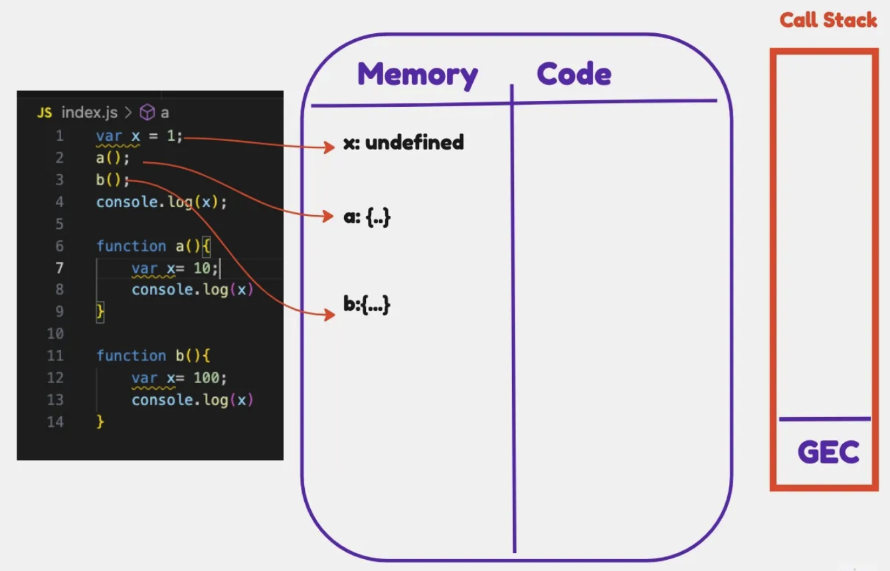
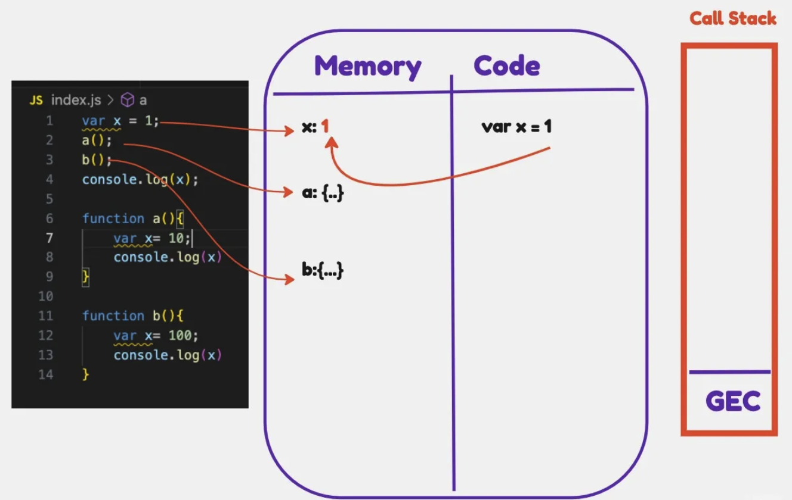
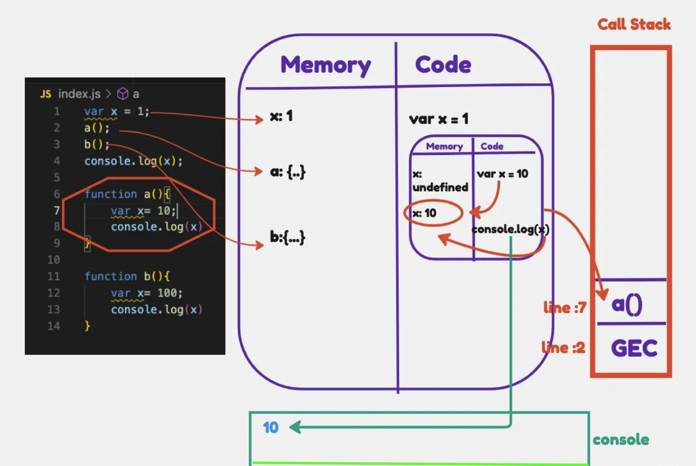
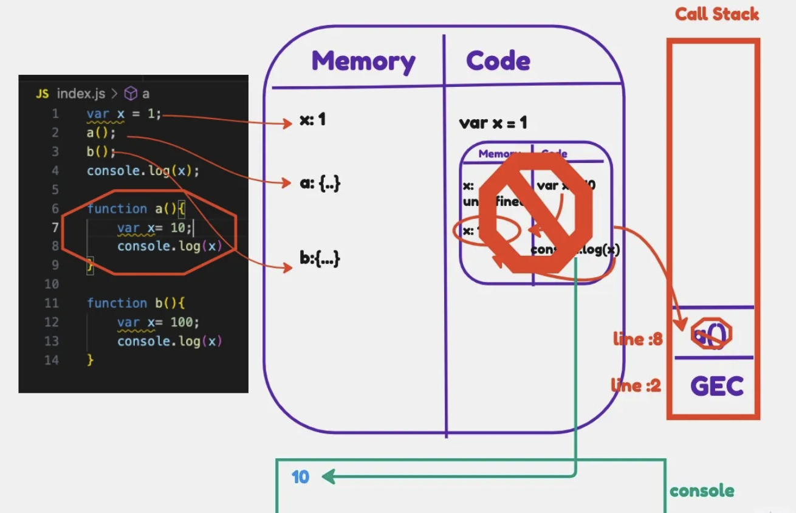
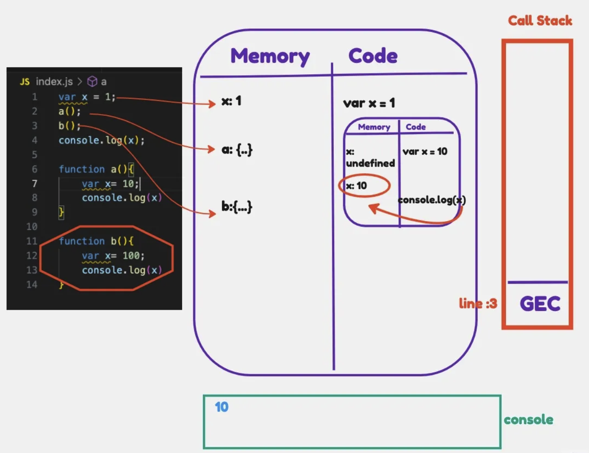
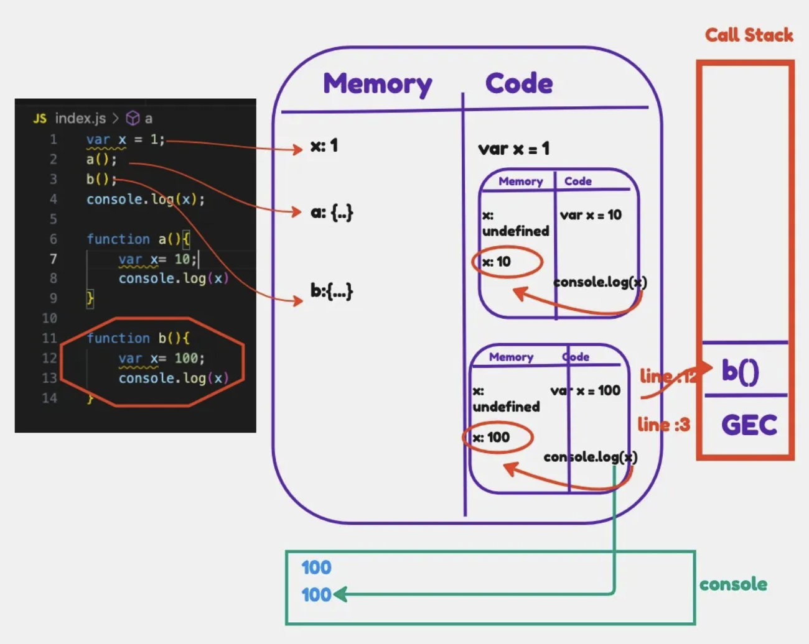
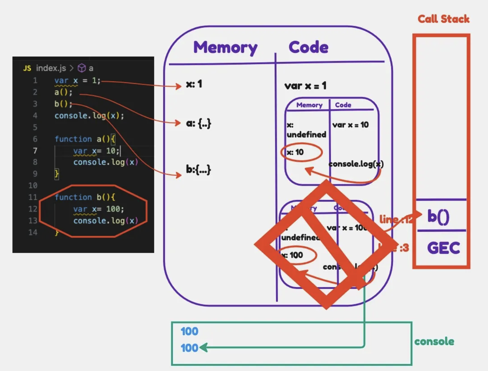
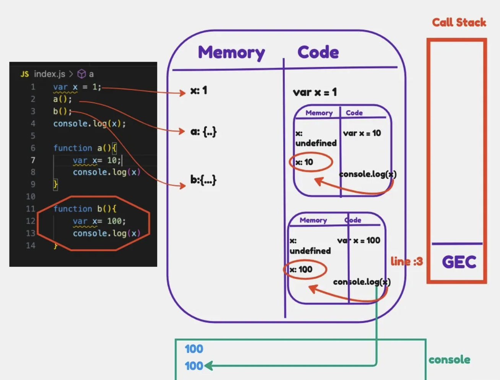
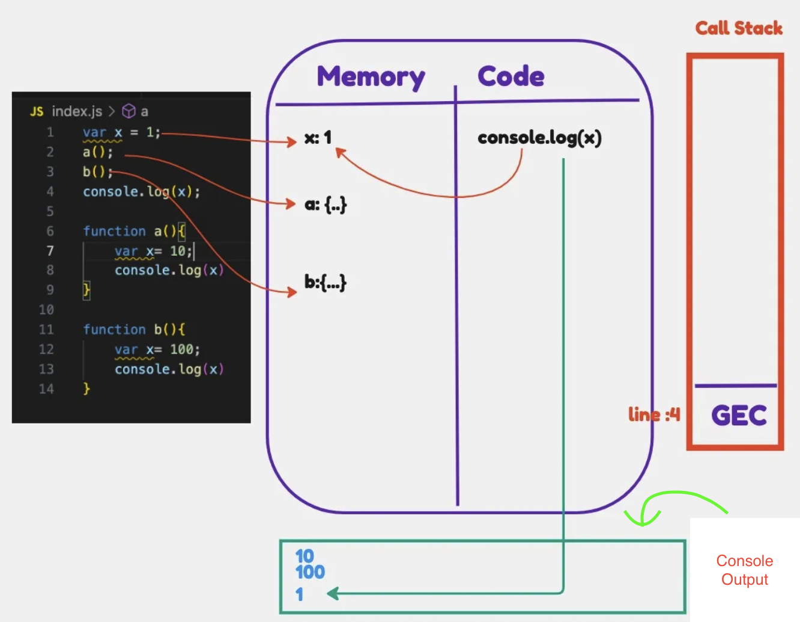
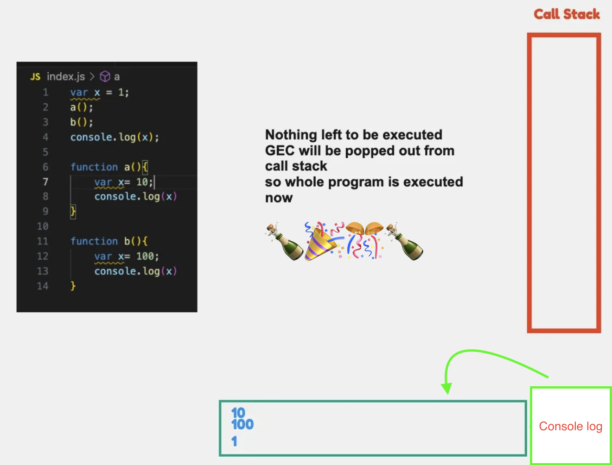

# Function Invocation and Variable Environment in JavaScript

This section explains how JavaScript handles function calls and manages variables using execution contexts, illustrated with an example involving two functions, `a()` and `b()`, each declaring a variable named `x` but with different values. We also include a global variable `x` to demonstrate scope differences.

Understanding this process is fundamental to grasping concepts like scope and closures in JavaScript

Consider the following code:

```javascript linenums="1" title="index.js"
var x = 1;
a();
b();
console.log(x);

function a(){
    var x= 10;
    console.log(x)
}

function b(){
    var x= 100;
    console.log(x)
}
```

```console title="The expected output is"
10                                  index.js:8
100                                 index.js:13
1                                   index.js:4
```

Let's break down the execution step-by-step:

!!! abstract "Execution Context Overview"
    When a JavaScript program runs, a **Global Execution Context (GEC)** is created. Every execution context has two phases:

    1.  **Creation Phase:** The JavaScript engine sets up the memory space for variables and functions (the Variable Environment). Variables declared with `var` are initialized with `undefined`. Function declarations are stored entirely.
    2.  **Execution Phase:** The code is executed line by line.

    The **Call Stack** manages execution contexts. The GEC is the base of the stack. When a function is called, a new Function Execution Context (FEC) is created and pushed onto the stack. When the function finishes, its FEC is popped off the stack.


# Step-by-Step Execution:

1.  **GEC Creation:**
    *   The GEC is created and pushed onto the Call Stack.
    *   Memory is allocated for `x`, `a`, and `b` in the GEC's Variable Environment. `x` is initialized to `undefined`. `a` and `b` store their function definitions.
    { loading=lazy }

2.  **GEC Execution (Line 1):**
    *   `var x = 1;` is executed.
    *   The value `1` is assigned to the global variable `x`.
    { loading=lazy }

3.  **GEC Execution (Line 2): `a()` Invocation:**
    *   Function `a()` is called.
    *   A new **Function Execution Context (FEC)** for `a` is created.
    *   **`a` FEC Creation Phase:** Memory is allocated for `a`'s local variable `x`, initialized to `undefined`.
    *   The `a` FEC is pushed onto the Call Stack. Control enters function `a`.

4.  **`a` FEC Execution (Line 7):**
    *   `var x = 10;` is executed within `a`.
    *   The value `10` is assigned to the *local* variable `x` within `a`'s FEC.

5.  **`a` FEC Execution (Line 8):**
    *   `console.log(x);` is executed.
    *   JavaScript looks for `x` in the current FEC (`a`'s context). It finds the local `x` with the value `10`.
    *   `10` is printed to the console.
    { loading=lazy }

6.  **`a` FEC Completion (End of function `a`):**
    *   Function `a` finishes execution.
    *   The FEC for `a` is popped off the Call Stack and destroyed. Control returns to the GEC at the point where `a` was called (after line 2).
    { loading=lazy }

7.  **GEC Execution (Line 3): `b()` Invocation:**
    *   Control is now at line 3 in the GEC.
    { loading=lazy }
    *   Function `b()` is called.
    *   A new **FEC** for `b` is created.
    *   **`b` FEC Creation Phase:** Memory is allocated for `b`'s local variable `x`, initialized to `undefined`.
    *   The `b` FEC is pushed onto the Call Stack. Control enters function `b`.

8.  **`b` FEC Execution (Line 12):**
    *   `var x = 100;` is executed within `b`.
    *   The value `100` is assigned to the *local* variable `x` within `b`'s FEC.

9.  **`b` FEC Execution (Line 13):**
    *   `console.log(x);` is executed.
    *   JavaScript looks for `x` in the current FEC (`b`'s context). It finds the local `x` with the value `100`.
    *   `100` is printed to the console.
    { loading=lazy }

10. **`b` FEC Completion (End of function `b`):**
    *   Function `b` finishes execution.
    *   The FEC for `b` is popped off the Call Stack and destroyed. Control returns to the GEC at the point where `b` was called (after line 3).
    { loading=lazy }
    { loading=lazy }

11. **GEC Execution (Line 4):**
    *   Control is now at line 4 in the GEC.
    *   `console.log(x);` is executed.
    *   JavaScript looks for `x` in the current execution context (the GEC). It finds the global `x` with the value `1`.
    *   `1` is printed to the console.
    { loading=lazy }

12. **GEC Completion:**
    *   The script reaches the end.
    *   The GEC is popped off the Call Stack. The program finishes.
    { loading=lazy }

This detailed breakdown illustrates how JavaScript manages separate execution contexts for global code and each function call, ensuring variables in different scopes do not interfere with each other.

> For video explanation, refer to [Namaste Javascript series](https://youtu.be/gSDncyuGw0s?list=PLlasXeu85E9cQ32gLCvAvr9vNaUccPVNP).