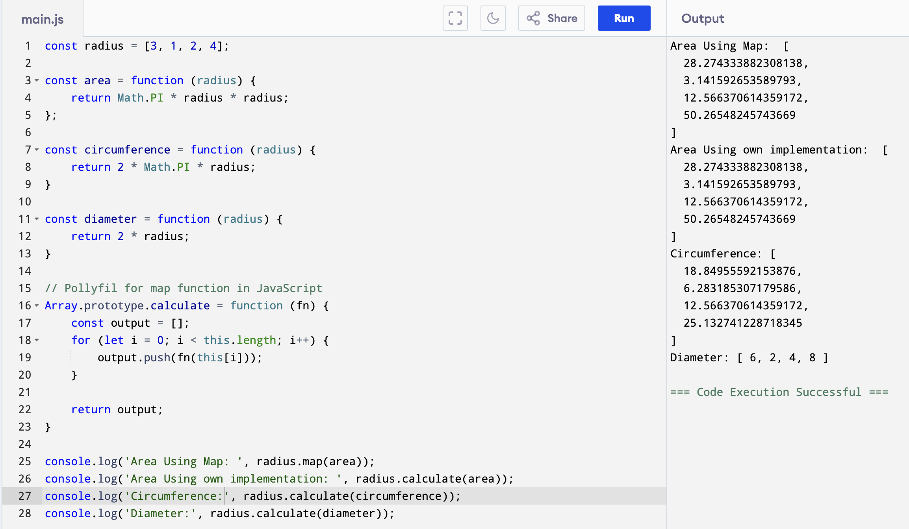

# Higher-Order Functions in JavaScript

Imagine you have a list of numbers, say, the radii of different circles: `[3, 1, 2, 4]`. Now, what if you need to calculate the area for each circle? And then the circumference? And maybe the diameter too?

You *could* write separate loops for each calculation, but that feels repetitive, right? There must be a more elegant way to apply different operations to the same list. This is where Higher-Order Functions come into play!

## :thinking: What Exactly Are They?

Let's start with a simple definition and example:

!!! answer "A function that either takes another function as an argument, returns a function, or does both, is called a **Higher-Order Function (HOF)**. The function passed as an argument is often called a **callback function**."

Consider this basic JavaScript code:

```javascript title="index.js" linenums="1"
// This is just a simple function
function x() {
    console.log("Hello");
}

// This function 'y' takes another function ('x' in this case) as an argument
function y(callbackFn) {
    callbackFn(); // Execute the function that was passed in
}

// Here, we pass the function 'x' to the function 'y'
y(x); // Output: Hello
```

In this example:

*   `y` is the **Higher-Order Function** because it accepts `x` as an argument.
*   `x` is the **Callback Function** because it's passed into `y` to be called later.

## A Practical Example: Calculating with Radii

Now, let's revisit our circle problem. We want to perform different calculations on an array of radii.

First, define the specific calculation logic as separate functions:

```javascript title="main.js" linenums="1"
// Array of radii
const radius = [3, 1, 2, 4];

// Function to calculate area
const area = function (radius) {
    return Math.PI * radius * radius;
};

// Function to calculate circumference
const circumference = function (radius) {
    return 2 * Math.PI * radius;
};

// Function to calculate diameter
const diameter = function (radius) {
    return 2 * radius;
};
```

JavaScript's built-in `Array.prototype.map` is a perfect example of a Higher-Order Function. It takes a callback function and applies it to each element in the array, returning a new array with the results.

```javascript
// Use the built-in map HOF
console.log(radius.map(area));
// Output: [ 28.27..., 3.14..., 12.56..., 50.26... ]

console.log(radius.map(circumference));
// Output: [ 18.84..., 6.28..., 12.56..., 25.13... ]

console.log(radius.map(diameter));
// Output: [ 6, 2, 4, 8 ]
```

See how clean that is? We defined the *what* (the calculation logic: `area`, `circumference`, `diameter`) separately from the *how* (the iteration logic, handled by `map`).

## Building Our Own Higher-Order Function

To really understand how HOFs work, let's create our own version of `map`, like a polyfill. We'll call it `calculate`.

```javascript title="main.js" linenums="1"
// Add a 'calculate' method to the Array prototype
Array.prototype.calculate = function (logicFn) { // logicFn is our callback
    const output = [];
    // 'this' refers to the array instance (e.g., radius)
    for (let i = 0; i < this.length; i++) {
        // Call the provided logic function for each element
        output.push(logicFn(this[i]));
    }
    return output;
};

// Now use our custom HOF
console.log(radius.calculate(area));
// Output: [ 28.27..., 3.14..., 12.56..., 50.26... ]

console.log(radius.calculate(circumference));
// Output: [ 18.84..., 6.28..., 12.56..., 25.13... ]

console.log(radius.calculate(diameter));
// Output: [ 6, 2, 4, 8 ]
```

Our `calculate` function doesn't know or care *what* calculation `logicFn` performs. It only knows it needs to call *some* function for each element. This separation of concerns makes the code incredibly reusable and flexible.

{ loading=lazy }

## The Benefits

Using Higher-Order Functions leads to:

1.  **Reusability:** Write common logic (like iterating over an array) once and reuse it with different callback functions.
2.  **Abstraction:** Hide complex or repetitive logic inside the HOF, making the code that *uses* the HOF cleaner and easier to understand.
3.  **Readability:** Functions like `map`, `filter`, and `reduce` often make the *intent* of the code clearer than manual loops.
4.  **Functional Programming:** HOFs are a cornerstone of functional programming, encouraging the use of pure functions and immutable data.

By treating functions as first-class citizens (meaning they can be passed around like any other variable), JavaScript empowers you to write more modular, expressive, and maintainable code.