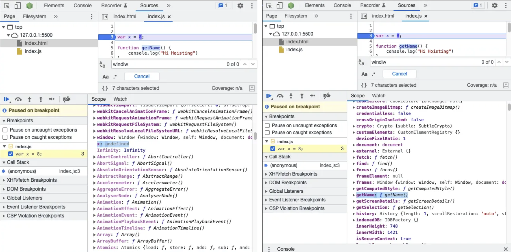
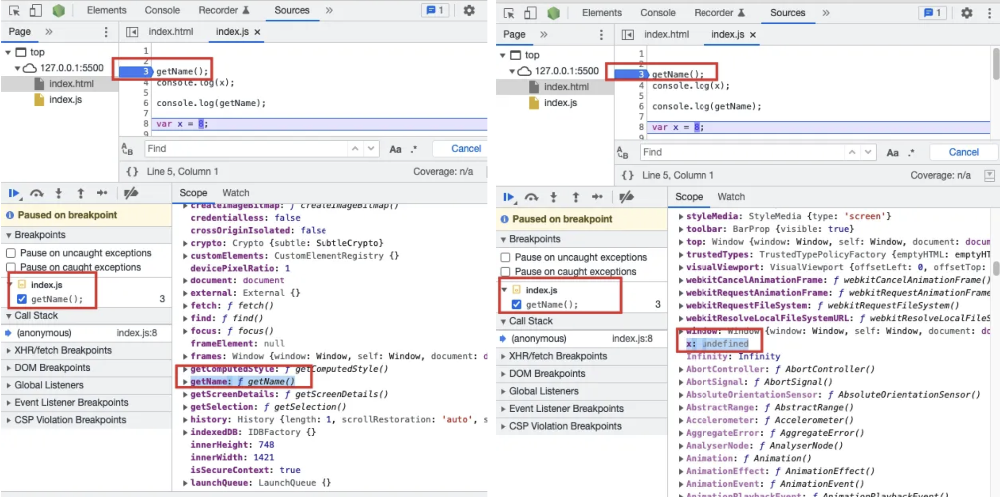
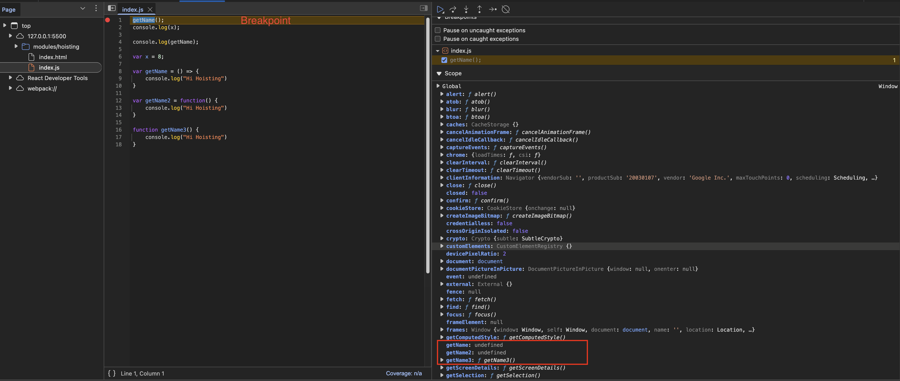

# Hoisting in JavaScript

Hoisting is a JavaScript behavior where variable and function declarations are moved to the top of their scope during the compilation phase. This means you can reference variables and functions before they are defined in the code.

## Example: Hoisting with `var` and Functions

```javascript linenums="1" title="index.js"
var x = 8;

function getName() {
    console.log("Hellow World");
}

getName();
console.log(x);
```

```console title="Console Output"
Hellow World                    index.js:4
8                               index.js:8
```

We can also try accessing them before their declarations:

```javascript linenums="1" title="index.js"
console.log(x);
getName();

var x = 8;

function getName() {
    console.log("Hellow World");
}
```

```console title="Console Output"
undefined                       index.js:1
Hellow World                    index.js:7
```

- `getName` is accessible and works as expected.
- `x` is `undefined` because only the declaration is hoisted, not the initialization.

If you remove `var x = 8;`

```javascript linenums="1" title="index.js"
console.log(x);
getName();

function getName() {
    console.log("Hellow World");
}
```

```console title="Console Output"
Uncaught ReferenceError: x is not defined at index.js:1:6    index.js:1
Hellow World                                                 index.js:5
```

- Now, `x` is not declared at all, so we get a ReferenceError.

!!! question "Is `undefined` and `not defined` are same thing?"
    No, `undefined` means that the variable is declared but not initialised. `not defined` means the variable was never declared.

## 🔍 Inspecting Function Hoisting

```javascript linenums="1" title="index.js"
function getName() {
    console.log("Hellow World");
}
console.log(getName)
```

```console title="Console Output"
ƒ getName() {
    console.log("Hellow World");
}
```
It Just prints the function. :thinking:

:question: What if try to get function name before initialising it like did for `x` which gives `undefined`?

```javascript linenums="1" title="index.js"
console.log(getName)
var x = 8;
function getName() {
    console.log("Hellow World");
}
```

```console title="Console Output"
f getName() {
    console.log("Hellow World");
}
```

!!! tip "Why Does This Happen?"
    Before JavaScript executes your code, it allocates memory for variables and functions. Functions are fully hoisted (their code is available), while variables declared with `var` are hoisted but initialized as `undefined`.

So,

```javascript linenums="1" title="index.js"
getName();
console.log(x);
console.log(getName);

var x = 8;
function getName() {
    console.log("Hellow World");
}
```

```console title="Console Output"
Hellow World                            index.js:7
undefined                               index.js:2
f getName() {                           index.js:4
    console.log("Hellow World");
}
```

:brain: So, let’s dig down deep and see why it is behaving like this. Remember how Execution context works in previous sections.

So, even before this whole javascript code executes in javascript, memory gets allocated to each and every variable and function. Evern if we put debugger here on first line of code, that means even first line of code is not executed yet but we can see variable and function already have memory allocated.

{ loading=lazy }


```javascript linenums="1" title="index.js"
getName();
console.log(x);

console.log(getName);

var x = 8;

function getName() {
    console.log("Hellow World");
}
```

{ loading=lazy }

```console title="Console Output"
Hellow World                             index.js:9
undefined                                index.js:2
f getName() {                            index.js:4
    console.log("Hellow World");
}
```

## :warning: `undefined` vs `not defined`

- If a variable is declared but not initialized, it is undefined.
- If a variable is never declared, it is not defined and accessing it throws a ReferenceError.

## :bow_and_arrow: Hoisting with Arrow Functions
Arrow functions behave differently:

```javascript linenums="1" title="index.js"
getName();
console.log(x);

console.log(getName);

var x = 8;

var getName = () => {
    console.log("Hellow World");
}
```

```console title="Console Output"
Uncaught TypeError: getName is not a function at index.js....
```

!!! note "Why?"
    Arrow functions are not hoisted in the same way as regular functions. They are treated like variables, so they are hoisted but not initialized. This means you cannot call them before their declaration. During the hoisting phase, `getName` is `undefined`.

{ loading=lazy }

!!! quote "Points to Remember"
    Only function declarations are fully hoisted. Function expressions and arrow functions are treated as variables.


---

For more details, check out [this article on hoisting.](https://medium.com/swlh/hoisting-in-javascript-10729798a326)