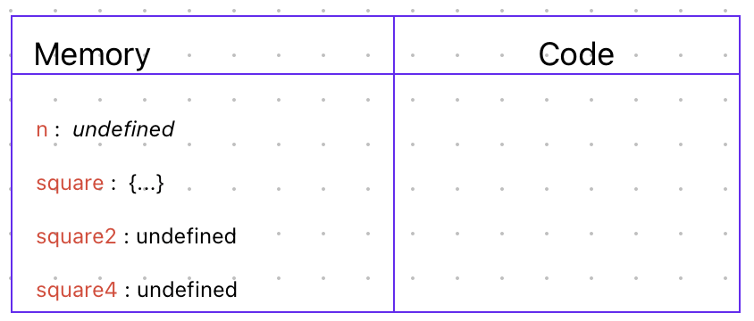
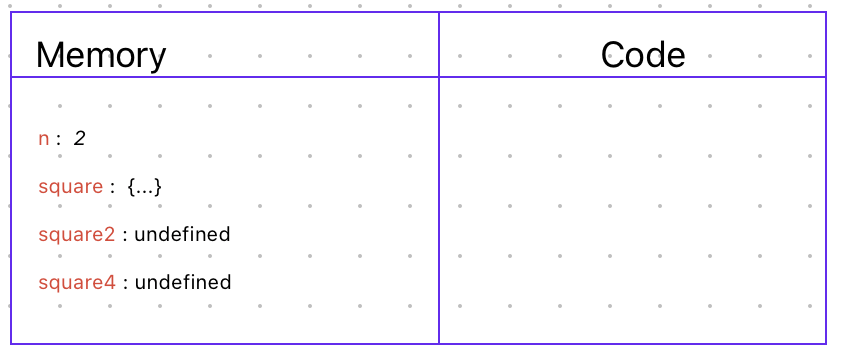
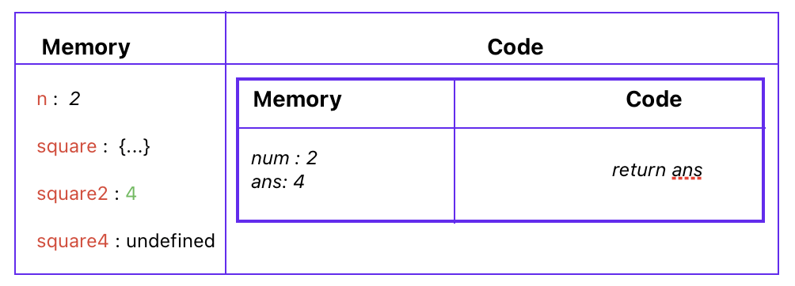
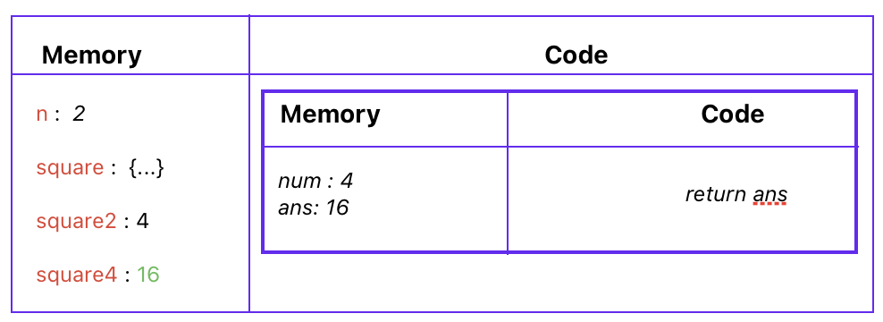
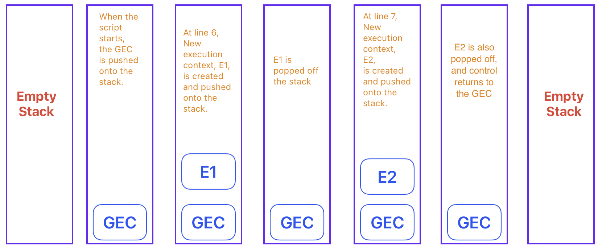

# Execution Contexts and the Call Stack

## What happens when you run JavaScript Code?

- Execution context is created when javascript code is run.
- Execution context is created in two phases
    1. Memory creation phase
    2. Code execution phase

```javascript linenums="1"
var n =2;

function square (num){
    var ans = num * num;
    return ans;
}

var square2 = square(n);
var square4 = square(4);
```

Here's an explanation of how the JavaScript code is executed:

### 1️⃣ Global Execution Context Creation
* When the script starts, JavaScript creates a main container called the Global Execution Context.
* This context handles memory allocation and code execution.

#### Memory Creation Phase
* Memory is set aside for the variable `n` (initially `undefined`).
* The entire `square` function definition is stored in memory.
* Memory is set aside for variables `square2` and `square4` (initially `undefined`).

{ loading=lazy width=600 }

#### Code Execution Phase
* The code is executed line by line.
* `var n = 2;`: The value `2` is assigned to the variable `n`.

{ loading=lazy width=600 }

### 2️⃣ First Function Call: `square(n)`
* `var square2 = square(n);`: The `square` function is called with the current value of `n` (which is `2`).
* **New Function Execution Context:**  A new, temporary context is created specifically for this function call.
    * **Memory Phase:** Memory is allocated for the parameter `num` and the variable `ans` (both initially `undefined`).

        | Identifier | Value     |
        |:-----------|----------:|
        | num        | undefined |
        | ans        | undefined |

    * **Code Execution Phase:**
        * `num` gets the value passed into the function (`2`).
        * `var ans = num * num;`: `ans` is calculated as `2 * 2`, which is `4`.
        * `return ans;`: The value `4` is returned from the function.

{ loading=lazy width=600 }

* **Context Deletion:** The Function Execution Context for `square(2)` is destroyed.
* The returned value (`4`) is assigned to the variable `square2`.


### 3️⃣ Second Function Call: `square(4)`

- `var square4 = square(4);` is executed.
- **New Function Execution Context** (for `square(4)`)
    * **Memory Creation Phase:** Memory is allocated for `num` and `ans` (both `undefined`).

        | Identifier | Value     |
        |:-----------|----------:|
        | num        | undefined |
        | ans        | undefined |

    * **Code Execution Phase:**
        * `num` gets the value passed into the function (`4`).
        * `var ans = num * num;`: `ans` is calculated as `4 * 4`, which is `16`.
        * `return ans;`: The value `16` is returned.

{ loading=lazy width=600 }

- Function context is destroyed.
- `square4` is assigned the returned value `16`.

### 4️⃣ End of Script
After all lines are executed, the Global Execution Context is deleted.

## 📝 Final Output

After the code runs:

* `n` will have the value `2`.
* `square2` will have the value `4`.
* `square4` will have the value `16`.

----

!!! info "Video Explanation"
    - For a more detailed explanation, check out the video by Akshay Saini
    - [YouTube - Namaste JavaScript](https://youtu.be/iLWTnMzWtj4?list=PLlasXeu85E9cQ32gLCvAvr9vNaUccPVNP)

# 🗂️ Call Stack in JavaScript

The **call stack** is a fundamental mechanism in JavaScript that manages the creation, deletion, and control of execution contexts during code execution.

The call stack works just like a physical stack—**last in, first out (LIFO)**. At the bottom of the stack is the **Global Execution Context (GEC)**. Whenever a JavaScript program runs, the GEC is created and pushed onto the call stack.

## 🔄 Step-by-Step Example

```javascript linenums="1"
var n = 2;
function square(num) {
    var ans = num * num;
    return ans;
}
var square2 = square(n);
var square4 = square(4);
```

Here's how the call stack manages execution:

<figure markdown="span">
  { loading=lazy }
  <figcaption>Call Stack</figcaption>
</figure>

* __Global Execution Context (GEC):__

    When the script starts, the GEC is pushed onto the stack.

* __Function Invocation:__

    Each time a function is invoked (e.g., square(n) at line 6), a new execution context (let's call it E1) is created and pushed onto the stack above the GEC.

* __Function Completion:__

    Once the function finishes executing, E1 is popped off the stack, and control returns to the GEC.

* __Subsequent Function Calls:__

    When another function is called (e.g., square(4) at line 7), a new execution context (E2) is created and pushed onto the stack. After execution, E2 is also popped off, and control returns to the GEC.

* __End of Script:__

    After all code has executed, the GEC is removed, leaving the call stack empty.


!!! abstract "Key Points"
    - The call stack is a LIFO structure that manages order of execution contexts.
    - Each function call creates a new context, which is pushed onto the stack.
    - When a function completes, its context is popped off the stack.
    - The GEC is always at the bottom of the stack.
    - The call stack is also known as:
        - Execution Context Stack
        - Program Stack
        - Control Stack
        - Runtime Stack
        - Machine Stack


---
### Further Reading

Please refer to the :octicons-link-external-16: [Asynchronous JavaScript & Event Loop](./async-js-and-event-loop.md) for more details on how the call stack interacts with asynchronous operations.

---


> @AkshaySaini’s: Namaste JavaScript Tutorial was the main source of inspiration.