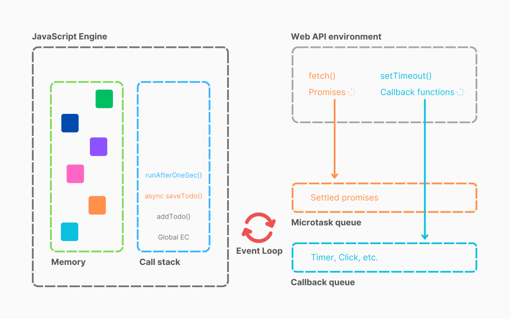
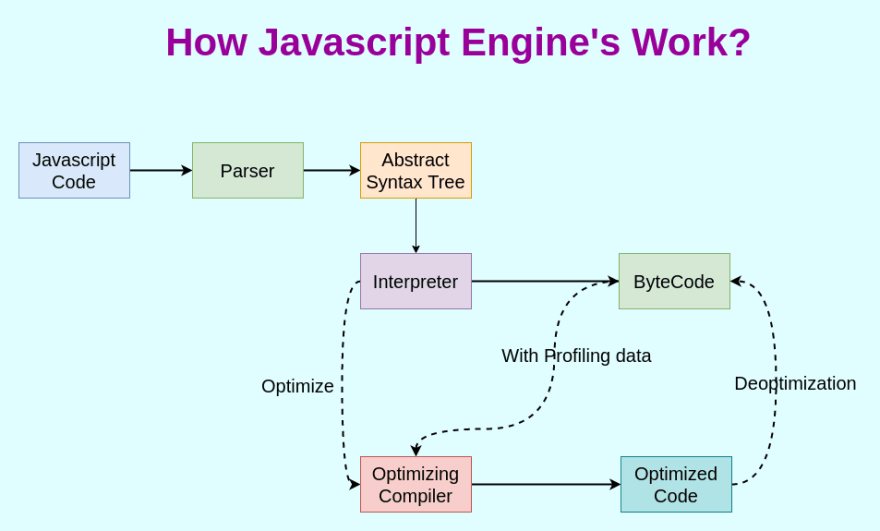
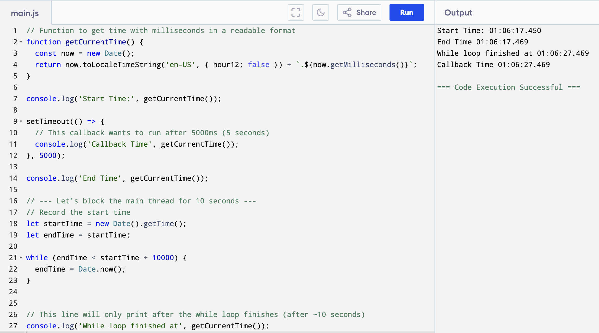

# JavaScript Engine Architecture

:thinking: Ever wondered how the JavaScript code you write actually *runs*? It's not magic! It happens inside something called a **JavaScript Runtime Environment**, and at the heart of it lies the JavaScript Engine. Let's peel back the layers and see what's going on under the hood, focusing on Google's powerful V8 engine.

## :card_box: JavaScript Runtime Environment

Think of the **JavaScript Runtime Environment (JRE)** as a big container holding everything needed to execute JavaScript code. Whether it's in your browser or on a server using Node.js, the JRE provides the necessary components.

{ loading=lazy }

Key parts of a JRE typically include:

*   **JavaScript Engine:** The core component that actually understands and executes your JS code. (We'll dive deep into this!)
*   **Web APIs / Node APIs:** Connectors that allow your JavaScript code to interact with the outside world (like the browser's DOM, timers (`setTimeout`), file system access in Node.js, etc.).
*   **Callback Queue:** A waiting area for callback functions that are ready to be executed (e.g., after a timer finishes or data arrives).
*   **Microtask Queue:** A special queue, often with higher priority than the Callback Queue, used for things like Promises.
*   **Event Loop:** The orchestrator that constantly checks if the Call Stack is empty and moves functions from the Callback Queue or Microtask Queue to the Call Stack for execution.

The **JS Engine** is truly the heart of the JRE.

## :computer: Browser vs. Node.js Runtime

JavaScript isn't limited to browsers anymore!

1.  **Browser:** Executes JS code using its built-in JRE. This allows for dynamic websites and web applications.
2.  **Node.js:** An open-source JRE that lets you run JavaScript *outside* the browser, typically for server-side applications, build tools, and more.

While both environments run JavaScript, the specific APIs available might differ. For example, browsers have APIs to manipulate the web page (DOM APIs), while Node.js has APIs for server-specific tasks like file system access or networking. However, some APIs, like `setTimeout`, exist in both, though their internal implementation might vary. The existence of JREs is why JavaScript can run on so many different devices!

## :material-hand-heart: JavaScript Engines: The Heart of Execution

Different browsers and environments often use different JS engines.

### Common Engines

*   **V8:** Google's engine, used in Chrome, Edge, Node.js, Deno, and more. Known for its speed.
*   **SpiderMonkey:** Mozilla's engine, used in Firefox. The *original* JS engine!
*   **JavaScriptCore (JSC):** Apple's engine, used in Safari.
*   **Chakra:** Microsoft's engine (though Edge now uses V8).

All reputable engines strive to follow the **ECMAScript** standard, which is the official specification defining the JavaScript language. ECMAScript is the governing body ensuring consistency across different JavaScript implementations.

### The First Engine

The very first JavaScript engine was created by ==Brendan Eich, the inventor of JavaScript itself!== It was initially called Mocha, then LiveScript, and eventually became **SpiderMonkey**, which powers Firefox today.

### Busting Myths

*   **Myth:** A JS Engine is a physical machine.
*   **Reality:** A JS Engine is sophisticated *software*, typically written in a lower-level language like C++. Google's V8, for instance, is primarily written in C++. These programs take the high-level JavaScript code we write and convert it into low-level machine code that the computer's processor can directly execute.

## :diamond_shape_with_a_dot_inside: Inside the JS Engine: How Code Becomes Reality

So, what actually happens when you feed JavaScript code into an engine like V8? It generally goes through three major phases:

{ loading=lazy }

### 1. Parsing: Breaking Down the Code

The engine first needs to understand the structure of your code.

*   **Syntax Parser:** Reads your code character by character and checks if it follows the rules (syntax) of the JavaScript language.
*   **Abstract Syntax Tree (AST):** If the syntax is valid, the parser builds a tree-like structure representing your code's logic. Each node in the tree represents a part of your code (like a variable declaration, a function call, or an operation).

You can visualize ASTs using tools like [AST Explorer](https://astexplorer.net/). The generated AST is then passed on to the next phase.

### 2. Compilation: Optimizing for Speed

Modern JS engines don't just interpret code line by line anymore. They use sophisticated compilation techniques, often **Just-In-Time (JIT)** compilation, which combines the best of interpreters and compilers.

*   **Interpreter (e.g., V8's Ignition):** Takes the AST and quickly converts it into an intermediate representation called **Bytecode**. Bytecode is lower-level than JavaScript but not yet machine code. This allows the code to start executing relatively fast.
*   **Compiler (e.g., V8's TurboFan):** While the interpreter is running, the engine monitors the code. If it identifies "hot" sections (code that runs frequently or could be made faster), the optimizing compiler kicks in. It takes the Bytecode (or sometimes the original source/AST) and generates highly optimized machine code for those specific parts. This optimized code replaces the Bytecode execution for subsequent runs, leading to significant performance improvements.

*Note: Some engines might also perform Ahead-of-Time (AOT) compilation in certain scenarios.*

Compilation and execution often happen hand-in-hand in modern engines.

### 3. Execution: Running the Code

This is where the code actually does its work. Two crucial components managed by the engine are essential for execution:

1.  **Memory Heap:** A large, unstructured region of memory where objects, variables, and function definitions are stored. This is where memory allocation happens.
2.  **Call Stack:** A data structure that keeps track of function calls. When a function is called, a new "execution context" (a frame containing the function's arguments and local variables) is pushed onto the stack. When the function finishes, its frame is popped off the stack. JavaScript is single-threaded, meaning it has only one call stack and can only do one thing at a time.

## :question: Interpreted vs. Compiled: The JavaScript Debate

So, is JavaScript an interpreted or a compiled language? The answer is... **it depends on the engine, but most modern engines make it *both***!

*   **Historically:** JavaScript started as purely interpreted.
*   **Today:** Most modern engines (like V8, SpiderMonkey, JSC) use **Just-In-Time (JIT) compilation**.

**JIT Compilation Recap:**

1.  Code is initially interpreted (e.g., into Bytecode by V8's Ignition) for a fast startup.
2.  The engine monitors the running code.
3.  Frequently executed or optimizable parts are compiled into highly efficient machine code by an optimizing compiler (e.g., V8's TurboFan) *during* execution.

This gives JavaScript the benefits of both: quick startup (like interpreters) and high performance for frequently run code (like compilers).

## :simple-ccleaner: Garbage Collection

Remember the **Memory Heap**? As your program runs, it allocates memory for variables and objects. What happens when that memory is no longer needed?

*   **Garbage Collector (GC):** This is a background process within the JS engine responsible for automatically finding and freeing up memory that is no longer reachable or in use by the program. This prevents memory leaks and keeps the application running smoothly.
*   **Mark & Sweep Algorithm:** A common algorithm used by GCs (including variants in V8).
    1.  **Mark:** The GC starts from the root objects (like the global object) and traverses all reachable objects, marking them as "in use".
    2.  **Sweep:** The GC scans the entire memory heap. Any object that was *not* marked is considered garbage and the memory it occupies is reclaimed.

V8 uses sophisticated garbage collectors like **Orinoco** and **Oil Pan** with various optimizations.

Engines also perform other optimizations during compilation, such as:

*   **Inlining:** Replacing a function call with the actual code of the function.
*   **Inline Caching:** Optimizing repeated access to object properties.
*   *(And many more...)*

## :eye: Google's V8 Engine: A Closer Look

V8 is widely regarded as one of the fastest and most advanced JavaScript engines. Key components include:

*   **Ignition:** V8's interpreter, responsible for generating and executing Bytecode. Provides fast startup.
*   **TurboFan:** V8's optimizing compiler. Creates highly optimized machine code for hot functions.
*   **Orinoco & Oil Pan:** V8's state-of-the-art garbage collectors, employing parallel and concurrent techniques to minimize pauses.

For deep dives, the [official V8 blog](https://v8.dev/blog) is an excellent resource.

## :thinking: TRUST ISSUES with setTimeout()

Let's switch gears slightly and talk about a common source of confusion: `setTimeout`. You might think `setTimeout(callback, 5000)` guarantees your `callback` function will run *exactly* 5 seconds later.

Prepare for a surprise!

### The Problem: Why the Delay Isn't Guaranteed?

The core issue is that `setTimeout` doesn't guarantee *execution* time, only *minimum* delay time before the callback is *queued*. JavaScript's single-threaded nature and the Event Loop model are key here.

Here's the typical flow:

1.  Your main JavaScript code starts running (a Global Execution Context - GEC - is pushed onto the Call Stack).
2.  When `setTimeout(callback, delay)` is encountered:
    *   The `callback` function is *not* executed immediately.
    *   It's handed off to a separate part of the Runtime Environment (like the Web API in browsers).
    *   A timer starts for the specified `delay`.
3.  **Crucially:** Your main JavaScript code *continues running* without waiting for the timer. The Call Stack keeps processing synchronous code.
4.  Once the timer expires, the `callback` function is moved to the **Callback Queue**.
5.  The **Event Loop** constantly monitors: Is the **Call Stack** empty? If yes, it checks the Callback Queue.
6.  If the Call Stack is empty *and* there's a callback waiting in the queue, the Event Loop pushes that callback onto the Call Stack, finally allowing it to execute.

**The "Trust Issue":** If your main thread (the Call Stack) is busy executing long-running synchronous code when the `setTimeout` timer expires, the callback *must wait* in the Callback Queue. It can only run when the Call Stack becomes empty, which might be significantly later than the `delay` you specified!

This mechanism is part of JavaScript's **concurrency model**, allowing asynchronous operations (like timers, network requests) to happen without blocking the main thread entirely.

### Blocking the Main Thread

Let's see this delay in action. We'll use a `while` loop to deliberately block the main thread for 10 seconds *after* setting a 5-second timeout.

{ loading=lazy }

**What happens?**

1.  "Start" is logged.
2.  `setTimeout` registers the callback with the browser/Node API and starts a 5-second timer. The main code continues.
3.  "End" is logged.
4.  The `while` loop starts, blocking the Call Stack.
5.  **After 5 seconds:** The `setTimeout` timer expires. The callback function is moved to the Callback Queue, waiting patiently.
6.  **After 10 seconds:** The `while` loop finally finishes. "While loop finished!" is logged. The Global Execution Context finishes its synchronous work.
7.  The Call Stack becomes empty.
8.  The Event Loop sees the empty Call Stack and the waiting callback in the Callback Queue.
9.  The Event Loop pushes the callback onto the Call Stack.
10. "Callback" is finally logged, approximately **10 seconds** after "Start", not 5!


This demonstrates that `setTimeout` only guarantees the *minimum* time before queuing, not the exact execution time.

### What About `setTimeout(0)`?

Setting a timeout of `0` milliseconds might seem like it should run the callback immediately, but it doesn't.

```javascript
console.log("Start");

setTimeout(() => {
    // Even with 0ms delay, this waits!
    console.log("Callback");
}, 0);

console.log("End");
```

**Execution Flow:**

1.  "Start" is logged.
2.  `setTimeout` registers the callback and starts a timer (effectively 0ms).
3.  The main code continues. "End" is logged.
4.  The timer immediately expires (or very close to it), and the callback is moved to the Callback Queue.
5.  The synchronous code finishes, and the Global Execution Context is popped from the Call Stack.
6.  The Call Stack is now empty.
7.  The Event Loop moves the callback from the queue to the stack.
8.  "Callback" is logged.

```console title="Expected Outcome"
Start
End
Callback
```

So, `setTimeout(0)` is a useful trick to **defer** the execution of a function until the Call Stack is clear. It essentially says, "Run this function as soon as possible, but *after* the current synchronous code finishes."

Understanding the JRE, the engine, the call stack, and the event loop is crucial for writing efficient and predictable JavaScript, especially when dealing with asynchronous operations!