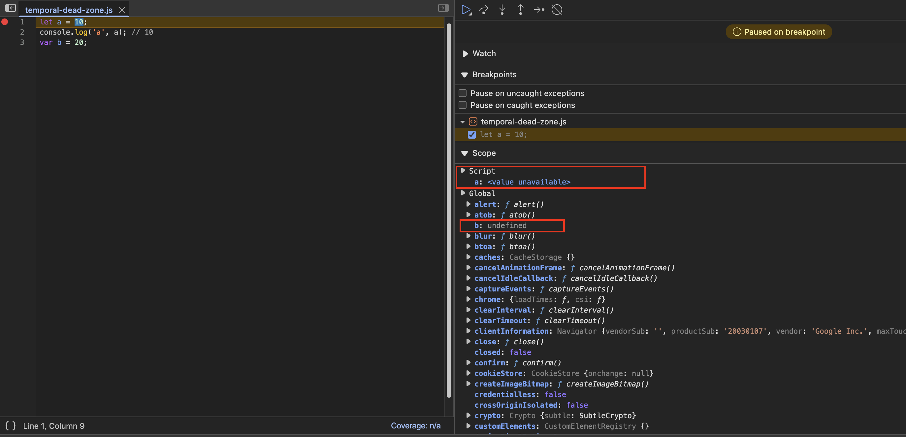

# `let`, `const`, and the Temporal Dead Zone (TDZ)

!!! summary "We’ll explore"
    1.  Why can we access `var` variables before declaration, but not `let` or `const`?
    2.  Are `let` and `const` declarations hoisted?
    3.  What exactly *is* the Temporal Dead Zone (TDZ)?
    4.  What's the difference between SyntaxError, ReferenceError, and TypeError in this context?

## :thinking: Are `let` and `const` declarations hoisted?

==Yes, they absolutely are! 👍🏼==

However, they are hoisted *differently* than `var` declarations. While `var` variables are hoisted and initialized with `undefined` in the global or function scope, `let` and `const` are hoisted but remain *uninitialized*. They are placed in a different memory space, separate from the global object.

This leads to a concept called the Temporal Dead Zone (TDZ).

Let's compare:

```javascript title="index.js"
// Using var
console.log(b); // Output: undefined
var b = 100;

// Using let
console.log(a); // Throws ReferenceError!
let a = 10;
```

With `var b = 100;`, memory is allocated for `b` and it's initialized to `undefined` *before* execution. So, `console.log(b)` works, even though it appears before the declaration line.

But with `let a = 10;`, trying to access `a` before the `let a = 10;` line results in an error. Why? Because `a` is in the Temporal Dead Zone.

---

## :watch: What is the Temporal Dead Zone (TDZ)?

The **Temporal Dead Zone** is the period **from the start of the scope until the `let` or `const` variable is declared and initialized**.

During this period:

1.  The variable *has* been hoisted (memory space is reserved).
2.  The variable is *not* initialized.
3.  Attempting to access the variable results in a `ReferenceError`.

```javascript title="index.js"
// Start of TDZ for 'a'
console.log(a); // ReferenceError: Cannot access 'a' before initialization

let a = 10;     // End of TDZ for 'a'
console.log(a); // Output: 10

var b = 100;
```

The TDZ exists to prevent bugs that can occur when accessing variables before they are explicitly assigned a value.

---

!!! warning "Can we access `let`/`const` via window?"

Since `let` and `const` variables are not added to the global `window` object (unlike `var` declared in the global scope), you cannot access them using `window.variableName` or `this.variableName` (in the global context).

```javascript title="index.js"
let a = 10;
var b = 20;
```

```console title="Console Output (Browser)"
> window.a
< undefined

> window.b
< 20

> this.a
< undefined

> this.b
< 20
```

This demonstrates that `let` and `const` provide better scope encapsulation compared to `var`.

## :material-hololens: Visualizing Hoisting and TDZ

Using browser developer tools helps visualize this:

{ loading=lazy }

{==

Notice how `a` (declared with `let`) is listed under `Script` scope and shows `<value unavailable>`, indicating it's in the TDZ at that point. In contrast, `b` (declared with `var`) is directly attached to the `Global` object (or `Window`) and initialized with `undefined`.

==}

---

## ❌ Redeclaring Variables

### `let`

You **cannot** redeclare a `let` variable within the same scope.

```javascript title="index.js" linenums="1"
let a = 10;
let a = 100; // Error!
```

```console title="Console output"
Uncaught SyntaxError: Identifier 'a' has already been declared
```

This also applies if you try to redeclare a `let` variable using `var`:

```javascript title="index.js" linenums="1"
let a = 10;
var a = 100; // Error!
```

```console title="Console output"
Uncaught SyntaxError: Identifier 'a' has already been declared
```

A `SyntaxError` occurs because the code itself is grammatically incorrect according to JavaScript rules. The engine detects this *before* execution even begins.

### `var`

You **can** redeclare a `var` variable within the same scope without errors.

```javascript title="index.js" linenums="1"
var x = 10;
console.log(x); // Output: 10
var x = 100;
console.log(x); // Output: 100
```

### `const`

Similar to `let`, you **cannot** redeclare a `const` variable within the same scope.

```javascript title="index.js" linenums="1"
const b = 100;
const b = 1000; // Error!
```

```console title="Console output"
Uncaught SyntaxError: Identifier 'b' has already been declared
```

---

## ✨ `const` Initialization and Re-assignment

### Initialization

`const` declarations **must** be initialized with a value on the same line.

```javascript title="index.js" linenums="1"
let a;   // OK - initialized with undefined implicitly
var c;   // OK - initialized with undefined implicitly
const b; // Error!

a = 10;
b = 100;
c = 1000;
```

```console title="Console output"
Uncaught SyntaxError: Missing initializer in const declaration
```

### 🔒 Re-assignment

You **cannot** re-assign a new value to a `const` variable after it has been initialized.

```javascript title="index.js" linenums="1"
let a = 10;
const b = 100;

a = 20; // OK
b = 200; // Error!
```

```console title="Console output"
Uncaught TypeError: Assignment to constant variable.
```

A `TypeError` occurs when an operation is performed on a value of an inappropriate type, like trying to re-assign a constant. This error happens during runtime when the invalid assignment is attempted.

---

!!! abstract "Which Declaration Should You Use?"
    1.  **`const` by default:** Use `const` whenever you declare a variable whose value should not be reassigned after initialization. This makes your code more predictable.
    2.  **`let` when reassignment is needed:** Use `let` if you know the variable's value will need to change during its lifetime (e.g., loop counters, state variables).
    3.  **Avoid `var`:** Generally, avoid using `var` in modern JavaScript due to its looser scoping rules and hoisting behavior, which can lead to unexpected bugs. `let` and `const` provide block scope and the TDZ, leading to safer code.

## 🛡️ How to Avoid TDZ Errors

The best way to avoid `ReferenceError` due to the TDZ is to **always declare and initialize your `let` and `const` variables at the top of their scope** before they are accessed.

```javascript title="Good Practice"
function exampleScope() {
  // Declare and initialize at the top
  let count = 0;
  const MAX_RETRIES = 3;

  // ... rest of the code that uses count and MAX_RETRIES
  if (count < MAX_RETRIES) {
    // ...
    count++;
  }
}
```

## 🔗 Accessing Global Variables from Block Scope

!!! question "If `let` and `const` aren't in the global scope, how can they access variables *from* the global scope?""

```javascript title="index.js" linenums="1"
var x = 34; // Global scope

function checkScope() {
  // Function scope (inner scope)
  let y = x; // Accessing global 'x' is fine!
  console.log(y);
}

checkScope();
```

```console title="Console output"
34
```

!!! answer
    This works because of **Lexical Scoping** and the **Scope Chain**.

    *   **Lexical Scoping:** JavaScript determines the scope of variables based on where they are declared in the source code (lexically). Inner scopes automatically have access to variables declared in their outer scopes.
    *   **Scope Chain:** When JavaScript needs to find a variable, it first looks in the current scope. If it doesn't find it, it looks in the immediate outer scope, then the next outer scope, and so on, all the way up to the global scope.

    In the example above, when `let y = x;` is executed inside `checkScope`, JavaScript looks for `x` within `checkScope`. It doesn't find it, so it looks in the outer scope (the global scope), finds `var x = 34;`, and uses that value.