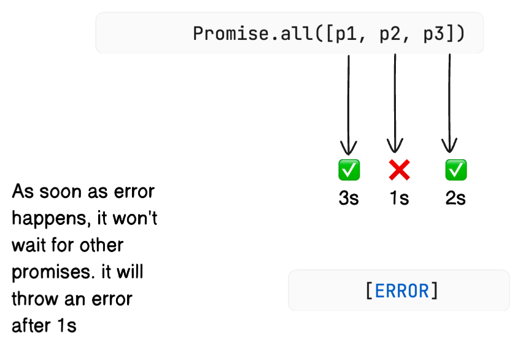
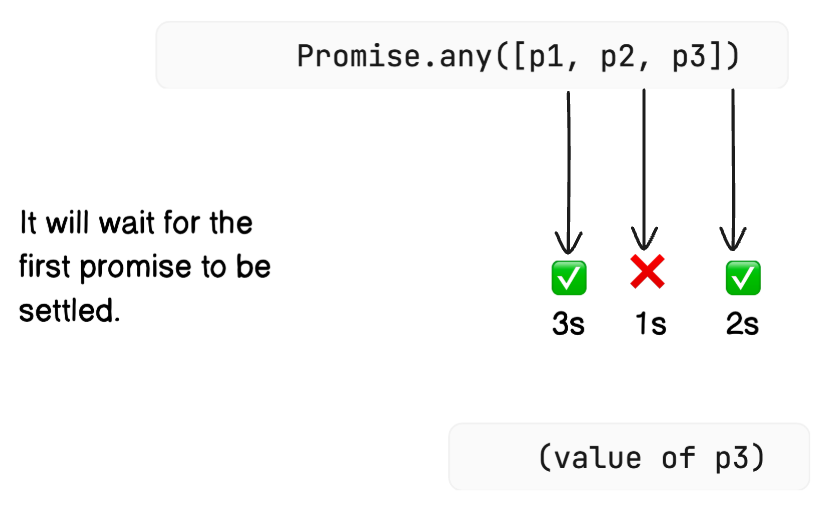
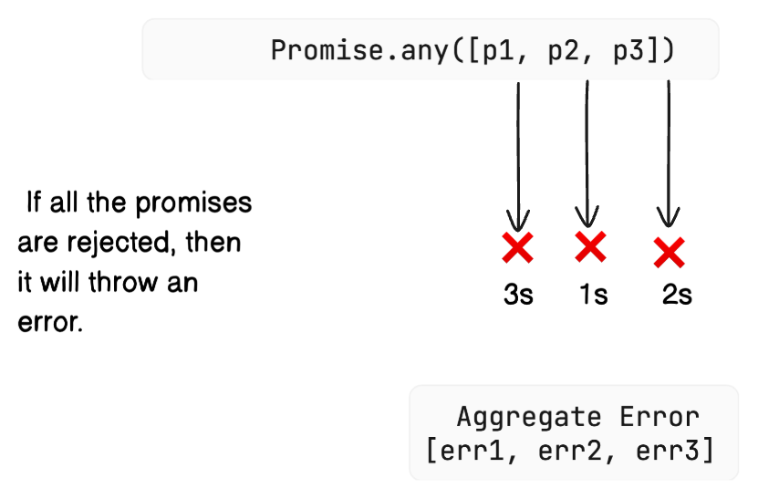

# Promise APIs

Ever scrambled to manage several asynchronous tasks in JavaScript—like fetching data from different APIs all at once? JavaScript’s Promise APIs give you powerful tools to coordinate these operations, regardless of whether you’re waiting for everything, just need the first result, or want to know every outcome.

The four key APIs we’ll explore are:

1. **`Promise.all()`**
2. **`Promise.allSettled()`**
3. **`Promise.race()`**
4. **`Promise.any()`**

Each is suited for common, real-world async scenarios. Let’s see how they solve our toughest concurrency problems.

---

## `Promise.all()`: Wait Until Everything Succeeds

**Problem:** You need to fetch data for multiple users and only want to act when *all* calls finish successfully.

**Solution:** Use `Promise.all()`.

- **Input:** An array (or iterable) of promises.
- **Behavior:** Waits for *all* promises to resolve.
    - **If all succeed:** Resolves with an array containing the results of each promise, in the same order they were passed in.
    - **If any fail:** Rejects immediately with that first error (others keep running, but their results are ignored). It doesn't wait for the others; it "fails fast."
- **Use this when:** Every task is critical before you can move on.

### How `Promise.all()` Handles Success

Let's say we have three promises: P1 (takes 3s), P2 (takes 1s), and P3 (takes 2s). All of them will eventually resolve successfully.

{ loading=lazy }

### What Happens When a Promise Fails in `Promise.all()`?

Now, what if one of those promises rejects? Let's use the same timings (P1: 3s, P2: 1s, P3: 2s), but this time, P2 rejects after 1 second.

{ loading=lazy }

!!! note "Important Note"
    Even though `Promise.all()` rejects early, the other promises (P1 and P3 in this case) will continue running until they complete. You just won't get their results via this `Promise.all()` call. JavaScript doesn't provide a standard way to cancel a promise once it's started.

## `Promise.allSettled()`: Getting All Outcomes

**Problem:** What if you want to run multiple independent tasks and need a result for *every* one, whether it succeeded or failed?

**Solution:** Try `Promise.allSettled()`.

- **Input:** An array (or iterable) of promises.
- **Behavior:** Waits for all promises to settle (resolve or reject).
*   **Output:** Resolves with an array of objects:
    *   For fulfilled promises: `{ status: "fulfilled", value: <resolved_value> }`
    *   For rejected promises: `{ status: "rejected", reason: <rejection_reason> }`
*   **Use Case:** Ideal when you need to perform several independent tasks and want to know the result of each one, regardless of individual successes or failures.

### How `Promise.allSettled()` Handles Failure

Now, let's say P2 (1s) rejects, while P1 (3s) and P3 (2s) resolve.

{ loading=lazy }

!!! note "Key Difference"
    `Promise.all()` is "fail-fast," while `Promise.allSettled()` waits for *all* results, success or failure.

## `Promise.race()`: The Fastest Result Wins

**Problem:** You have several possible data sources (like redundant servers) and want whichever responds *first*, no matter which.

**Solution:** Use `Promise.race()`!

- **Input:** An array (or iterable) of promises.
- **Behavior:** Resolves or rejects as soon as *any* promise settles.
    - If the first to settle resolves, so does `Promise.race()`.
    - If the first to settle rejects, so does `Promise.race()`.
- **Use this when:** You only care about the fastest result, regardless of success or failure.

### How `Promise.race()` Handles Success

Consider P1 (3s), P2 (1s), and P3 (2s), all resolving successfully.

{ loading=lazy }

### How `Promise.race()` Handles Failure

What if the fastest promise *rejects*? Let's use P1 (3s, resolves), P2 (1s, *rejects*), P3 (2s, resolves).

{ loading=lazy }

!!! note "In Short"
    `Promise.race()` mirrors the outcome of the very first promise to finish, regardless of whether it's a success or failure.

## `Promise.any()`: First Success (Ignoring Failures)

**Problem:** You only want the *first successful* result—even if some tasks fail. Only fail if *all* options do.

**Solution:** Choose `Promise.any()`.

- **Input:** An array (or iterable) of promises.
- **Behavior:** Waits for the first promise to **fulfill**.
    - Resolves with that result.
    - Ignores all rejections unless *every* promise rejects.
- **On total failure:** Rejects with an `AggregateError` (containing all rejection reasons).
- **Use this when:** You want any success, such as fallback or backup requests.

!!! tip "It's a success seeking race."

### How `Promise.any()` Handles Success

Let's use P1 (3s, resolves), P2 (1s, resolves), P3 (2s, resolves).

{ loading=lazy }

### How `Promise.any()` Handles Partial Failure

Now, what if the fastest promise fails? P1 (3s, resolves), P2 (1s, *rejects*), P3 (2s, resolves).

{ loading=lazy }

### How `Promise.any()` Handles Total Failure

What if *all* promises reject? P1 (3s, rejects), P2 (1s, rejects), P3 (2s, rejects).

{ loading=lazy }

!!! note "Key Distinction"
    `Promise.race()` settles with the *first settled* promise (success or failure). `Promise.any()` settles with the *first fulfilled* (successful) promise, only rejecting if *all* promises reject.

## :material-code-json: Code Examples: `Promise.all()`

Let's see `Promise.all()` in action. We'll create three promises with different resolution times.

### Case 1: All Promises Resolve Successfully

```javascript linenums="1"
const promise1 = new Promise(function (resolve, reject) {
    setTimeout(function () {
        resolve('Value 1');
    }, 3000); // Resolves after 3 seconds
});

const promise2 = new Promise(function (resolve, reject) {
    setTimeout(function () {
        resolve('Value 2');
    }, 1000); // Resolves after 1 second
});

const promise3 = new Promise(function (resolve, reject) {
    setTimeout(function () {
        resolve('Value 3');
    }, 2000); // Resolves after 2 seconds
});


Promise.all([promise1, promise2, promise3])
    .then(function (values) {
        // This runs only after ALL promises resolve (at ~3 seconds)
        console.log(values);
    })
    .catch(function (err) {
        // This won't run in this case
        console.error("Promise.all rejected:", err);
    });
```

```console title="Expected Console Output"
[ 'Value 1', 'Value 2', 'Value 3' ]
```
### Case 2: One Promise Rejects (Fail-Fast)

Now, let's make `promise2` reject.

```javascript linenums="1"
const promise1 = new Promise(function (resolve, reject) {
    setTimeout(function () {
        resolve('Value 1');
    }, 3000); // 3 seconds
});

const promise2 = new Promise(function (resolve, reject) {
    setTimeout(function () {
        reject('Error from Promise 2'); // Rejects!
    }, 1000); // 1 second
});

const promise3 = new Promise(function (resolve, reject) {
    setTimeout(function () {
        resolve('Value 3');
    }, 2000); // 2 seconds
});

Promise.all([promise1, promise2, promise3])
    .then(function (values) {
        // This won't run
        console.log(values);
    })
    .catch(function (err) {
        // This runs as soon as promise2 rejects (at ~1 second)
        console.error("Promise.all rejected:", err);
    });
```

```console title="Expected Console Output"
Promise.all rejected: Error from Promise 2
```

!!! info "Important Note"
    Always add a `.catch()` block when using `Promise.all()` to handle potential rejections gracefully. Relying on uncaught error handlers in the browser is not recommended.

## :octicons-file-code-16: Code Examples: `Promise.allSettled()`

Let's use the same scenario where `promise2` rejects, but this time with `Promise.allSettled()`.

```javascript linenums="1"
const promise1 = new Promise(function (resolve, reject) {
    setTimeout(function () {
        resolve('Value 1');
    }, 3000); // 3 seconds
});

const promise2 = new Promise(function (resolve, reject) {
    setTimeout(function () {
        reject('Error from Promise 2'); // Rejects!
    }, 1000); // 1 second
});

const promise3 = new Promise(function (resolve, reject) {
    setTimeout(function () {
        resolve('Value 3');
    }, 2000); // 2 seconds
});

Promise.allSettled([promise1, promise2, promise3])
    .then(function (results) {
        // This runs only after ALL promises settle (at ~3 seconds)
        console.log(JSON.stringify(results, null, 2)); // Pretty print the results
    })
    .catch(function (err) {
        // This generally won't run unless there's an issue with the input itself
        console.error("Promise.allSettled somehow failed:", err);
    });
```

```console title="Expected Console Output"
[
  { "status": "fulfilled", "value": "Value 1"},
  { "status": "rejected", "reason": "Error from Promise 2"},
  { "status": "fulfilled", "value": "Value 3"}
]
```

!!! notice "Notice how `Promise.allSettled()` waited for all promises to complete and gave us a detailed report of each outcome.""

## :octicons-file-code-16: Code Examples: `Promise.race()`

Let's see who wins the race!

### Example 1: Fastest Promise Succeeds

P2 (1s) is the fastest and resolves successfully.

```javascript linenums="1"
const promise1 = new Promise(function (resolve, reject) {
    setTimeout(function () {
        resolve('Value 1');
    }, 3000); // 3 seconds
});

const promise2 = new Promise(function (resolve, reject) {
    setTimeout(function () {
        resolve('Value 2'); // Resolves first!
    }, 1000); // 1 second
});

const promise3 = new Promise(function (resolve, reject) {
    setTimeout(function () {
        resolve('Value 3');
    }, 2000); // 2 seconds
});

Promise.race([promise1, promise2, promise3])
    .then(function (winnerValue) {
        // This runs as soon as promise2 resolves (at ~1 second)
        console.log("Promise.race winner (resolved):", winnerValue);
    })
    .catch(function (winnerError) {
        // This won't run
        console.error("Promise.race winner (rejected):", winnerError);
    });
```

```console title="Expected Console Output"
Promise.race winner (resolved): Value 2
```

### Example 2: Fastest Promise Rejects

P3 (2s) is the fastest, but it rejects.

```javascript linenums="1"
const promise1 = new Promise(function (resolve, reject) {
    setTimeout(function () {
        resolve('P1 successfully resolved');
    }, 3000); // 3 seconds
});

const promise2 = new Promise(function (resolve, reject) {
    setTimeout(function () {
        resolve('P2 successfully resolved');
    }, 5000); // 5 seconds
});

const promise3 = new Promise(function (resolve, reject) {
    setTimeout(function () {
        reject('P3 failed'); // Rejects first!
    }, 2000); // 2 seconds
});

Promise.race([promise1, promise2, promise3])
    .then(function (winnerValue) {
        // This won't run
        console.log("Promise.race winner (resolved):", winnerValue);
    })
    .catch(function (winnerError) {
        // This runs as soon as promise3 rejects (at ~2 seconds)
        console.error("Promise.race winner (rejected):", winnerError);
    });
```

```console title="Expected Console Output"
Promise.race winner (rejected): P3 failed
```

## :octicons-file-code-16: Code Examples: `Promise.any()`

Let's see how `Promise.any()` seeks the first success.

### Example 1: First Success Wins (Ignoring Earlier Failure)

P2 rejects quickly (1s), but P3 resolves successfully later (2s). `Promise.any()` should give us P3's result.

```javascript linenums="1" title="promise-any.js"
const promise1 = new Promise(function (resolve, reject) {
    setTimeout(function () {
        resolve('Value 1');
    }, 3000); // 3 seconds
});

const promise2 = new Promise(function (resolve, reject) {
    setTimeout(function () {
        reject('Error from P2'); // Rejects first!
    }, 1000); // 1 second
});

const promise3 = new Promise(function (resolve, reject) {
    setTimeout(function () {
        resolve('Value 3'); // Resolves successfully after P2 fails
    }, 2000); // 2 seconds
});

Promise.any([promise1, promise2, promise3])
    .then(function (firstSuccessValue) {
        // This runs when P3 resolves (at ~2 seconds)
        console.log("Promise.any first success:", firstSuccessValue);
    })
    .catch(function (aggregateError) {
        // This won't run
        console.error("Promise.any failed:", aggregateError);
    });
```

```console title="Expected Console Output"
Promise.any first success: Value 3
```

### Example 2: Waiting for the Only Success

P3 fails first (2s), P1 fails next (3s), but P2 eventually succeeds (5s).

```javascript linenums="1" title="promise-any.js"
const promise1 = new Promise(function (resolve, reject) {
    setTimeout(function () {
        reject('Error from P1');
    }, 3000); // 3 seconds
});

const promise2 = new Promise(function (resolve, reject) {
    setTimeout(function () {
        resolve('Value 2'); // The only success, takes the longest
    }, 5000); // 5 seconds
});

const promise3 = new Promise(function (resolve, reject) {
    setTimeout(function () {
        reject('Error from P3'); // Rejects first
    }, 2000); // 2 seconds
});

Promise.any([promise1, promise2, promise3])
    .then(function (firstSuccessValue) {
        // This runs when P2 resolves (at ~5 seconds)
        console.log("Promise.any first success:", firstSuccessValue);
    })
    .catch(function (aggregateError) {
        // This won't run
        console.error("Promise.any failed:", aggregateError);
    });
```

```console title="Expected Console Output"
Promise.any first success: Value 2
```

### Example 3: All Promises Fail

If every promise rejects, `Promise.any()` rejects with an `AggregateError`.

```javascript linenums="1"
const promise1 = new Promise(function (resolve, reject) {
    setTimeout(function () {
        reject('Error P1');
    }, 3000); // 3 seconds
});

const promise2 = new Promise(function (resolve, reject) {
    setTimeout(function () {
        reject('Error P2');
    }, 5000); // 5 seconds (last one to fail)
});

const promise3 = new Promise(function (resolve, reject) {
    setTimeout(function () {
        reject('Error P3');
    }, 2000); // 2 seconds
});

Promise.any([promise1, promise2, promise3])
    .then(function (firstSuccessValue) {
        // This won't run
        console.log("Promise.any first success:", firstSuccessValue);
    })
    .catch(function (aggregateError) {
        // This runs when the last promise (P2) rejects (at ~5 seconds)
        console.error("Promise.any failed as all promises rejected.");
        console.error("Aggregate Error:", aggregateError);
        // You can inspect the individual errors
        console.error("Individual errors:", aggregateError.errors);
    });
```

```console title="Expected Console Output"
Promise.any failed as all promises rejected.
Aggregate Error: [AggregateError: All promises were rejected] {
  [errors]: [ 'Error P1', 'Error P2', 'Error P3' ]
}
Individual errors: [ 'Error P1', 'Error P2', 'Error P3' ]
```

### Handling Aggregate Errors in `Promise.any()`

{==

When `Promise.any()` rejects because all input promises failed, the error object it provides is an `AggregateError`. This object has a useful property: `errors`.

*   `aggregateError.errors`: This is an array containing the rejection reason from each of the promises that failed, in the order they were originally passed to `Promise.any()`.

==}

## :key: Key Terms & Concepts

*   **Pending:** The initial state; the promise is neither fulfilled nor rejected.
*   **Fulfilled (or Resolved):** The asynchronous operation completed successfully. The promise now has a resulting value. This is a final state.
*   **Rejected:** The asynchronous operation failed. The promise now has a reason (usually an error object) for the failure. This is also a final state.
*   **Settled:** ==The promise is no longer pending; it has either been *fulfilled* or *rejected*. It has reached its final state.==

    { loading=lazy }

Think of it like this:

*   A promise *settles* when it's done.
*   Settling can result in *fulfillment* (success) or *rejection* (failure).
*   `resolve()` is the function you call to move a promise to the *fulfilled* state.
*   `reject()` is the function you call to move a promise to the *rejected* state.
