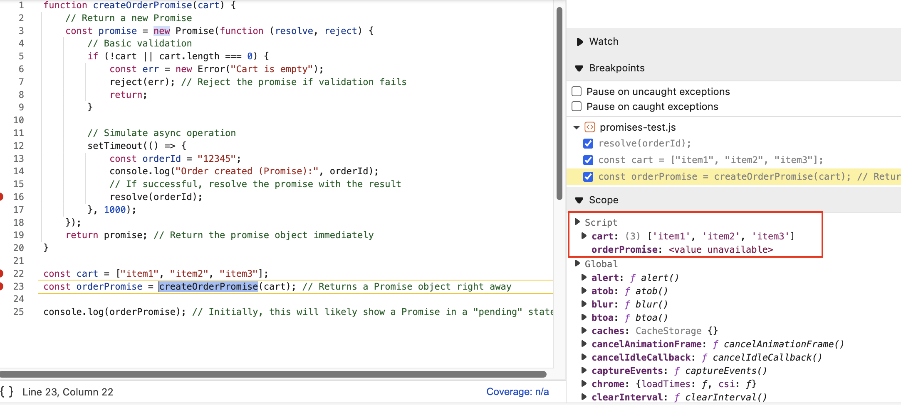
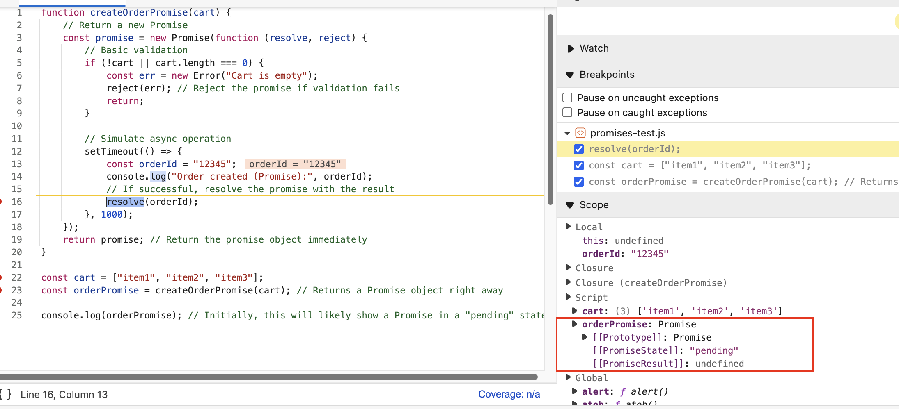
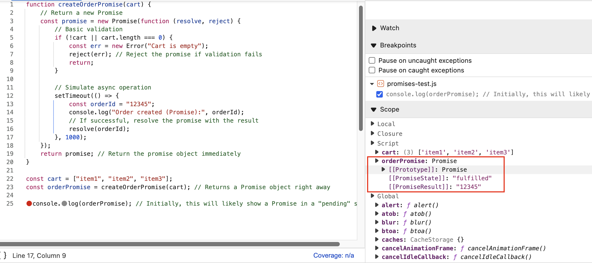
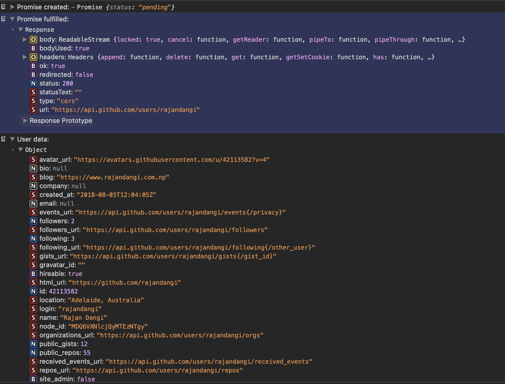

# Promises in JavaScript

Promises offer a cleaner, more reliable way to handle asynchronous operations in JavaScript compared to traditional callbacks. Let's explore how they work and why they're beneficial.

## :question: The Problem: Handling Asynchronous Operations

Imagine you're building an e-commerce feature. You need to perform a sequence of actions:

1.  Create an order based on the items in the cart.
2.  Proceed to payment using the Order ID obtained from step 1.

Both `createOrder(cart)` and `proceedToPayment(orderId)` are asynchronous operations – they take some time to complete, and we don't know exactly how long. Crucially, `proceedToPayment` *depends* on `createOrder` finishing first.

### The Old Way: Callbacks

Before Promises, we often used callback functions. You'd pass the next step (`proceedToPayment`) as a function *into* the first step (`createOrder`).

```javascript
const cart = [ "item1", "item2", "item3" ];

// Define the functions (simplified)
function createOrder(cart, callback) {
  console.log("Creating order...");
  // Simulate async operation
  setTimeout(() => {
    const orderId = "12345";
    // Call the callback function *after* order is created
    callback(orderId);
  }, 1000);
}

function proceedToPayment(orderId) {
  console.log("Proceeding to payment for order:", orderId);
  // Simulate async payment
  setTimeout(() => {
    console.log("Payment successful for order:", orderId);
  }, 500);
}

// Using the callback approach
createOrder(cart, function(orderId) { // Pass proceedToPayment (wrapped in an anonymous function) as a callback
  proceedToPayment(orderId);
});
```

**The Problem with Callbacks: Inversion of Control**

When you pass a callback function (`proceedToPayment`) to another function (`createOrder`), you're giving up control. You *trust* that `createOrder` will:

1.  Call your callback function correctly.
2.  Call it only *once*.
3.  Call it with the correct data (`orderId`).

What if the `createOrder` function (perhaps written by someone else or part of a library) has a bug? It might never call your callback, or it might call it multiple times. This loss of control is called **Inversion of Control**, and it makes code harder to reason about and debug.

## The Solution: Promises :handshake:

Promises provide a way to manage asynchronous operations without giving up control.

Instead of passing a callback *into* the asynchronous function, the function *returns* a special object called a **Promise**.

!!! question "What is a Promise?"

{==

Think of a Promise as a placeholder for a future value. It represents the *eventual result* of an asynchronous operation. Initially, this result is unknown.

==}

Let's rewrite `createOrder` to return a Promise:

```javascript linenums="1"
function createOrderPromise(cart) {
  // Return a new Promise
  const promise = new Promise(function(resolve, reject) {
    // Basic validation
    if (!cart || cart.length === 0) {
      const err = new Error("Cart is empty");
      reject(err); // Reject the promise if validation fails
      return;
    }

    // Simulate async operation
    setTimeout(() => {
      const orderId = "12345";
      console.log("Order created (Promise):", orderId);
      // If successful, resolve the promise with the result
      resolve(orderId);
    }, 1000);
  });
  return promise; // Return the promise object immediately
}
```

Now, when you call `createOrderPromise(cart)`, it doesn't take a callback. Instead, it immediately returns a `promise` object.

```javascript
const cart = [ "item1", "item2", "item3" ];
const orderPromise = createOrderPromise(cart); // Returns a Promise object right away

console.log(orderPromise); // Initially, this will likely show a Promise in a "pending" state
```

This `orderPromise` object acts as that placeholder. At first, it's like an empty box: `{ data: undefined }` (conceptually). The asynchronous `createOrderPromise` operation runs in the background. When it eventually finishes successfully, it *fills* the box with the result (the `orderId`) using the `resolve` function. If it fails, it uses the `reject` function.

{loading=lazy}

{loading=lazy}

{loading=lazy}

## Using `.then()` to Attach Callbacks

So, how do we run `proceedToPayment` *after* the `orderPromise` is filled (resolved)? We *attach* our callback function to the promise using the `.then()` method.

```javascript linenums="1"
const cart = [ "item1", "item2", "item3" ];

// Assume createOrderPromise and proceedToPayment are defined as above

const orderPromise = createOrderPromise(cart);

// Attach a function to run *when* the promise resolves successfully
orderPromise.then(function(orderId) {
  // This function only runs *after* createOrderPromise resolves
  // and it receives the resolved value (orderId)
  proceedToPayment(orderId);
});
```

**Key Difference:**

*   **Callbacks:** You *pass* your function *into* the async function (`createOrder(cart, callback)`). Control is inverted.
*   **Promises:** The async function *returns* a promise (`orderPromise = createOrderPromise(cart)`). You *attach* your function *to* the promise (`orderPromise.then(callback)`). Control stays with you.

The `.then()` method guarantees that the attached function will be called:

1.  Only *after* the promise resolves.
2.  Exactly *once*.
3.  With the resolved value.

This solves the Inversion of Control problem!

## Why Are Promises Important?

*   **Trust & Reliability:** Promises provide guarantees about when and how your callback code will execute.
*   **Control:** You retain control over the execution flow, attaching callbacks rather than passing them in.
*   **Readability (Chaining):** They help avoid "Callback Hell" (deeply nested callbacks) through promise chaining (see below).
*   **Error Handling:** Promises have built-in mechanisms for handling errors (`.catch()`).
*   **Composability:** Promises can be combined and managed in powerful ways (e.g., `Promise.all`, `Promise.race`).

## :microscope: Anatomy of a Promise Object

Let's look at a real-world example using `fetch`, a browser API for making network requests, which returns a Promise.

```javascript linenums="1"
const GITHUB_API = "https://api.github.com/users/";
const username = "rajandangi";
const userPromise = fetch(GITHUB_API + username); // fetch returns a Promise

console.log("Promise created:", userPromise); // Logs the Promise object immediately

userPromise.then(function(response) {
  // This runs when the fetch completes and the server responds
  console.log("Promise fulfilled:", response);
  // Note: fetch resolves with a Response object.
  // You often need another step to get the actual data (e.g., JSON)
  return response.json(); // .json() also returns a Promise!
})
.then(function(userData) {
    // This runs after response.json() resolves
    console.log("User data:", userData);
})
.catch(function(error) {
    // This runs if fetch() or response.json() fails (e.g., network error, invalid JSON)
    console.error("Promise rejected:", error);
});
```

{loading=lazy}

When you inspect a Promise object (e.g., in browser developer tools), you'll typically see two key things:

1.  **State:** The current status of the Promise. It can be:
    *   `pending`: The initial state; the asynchronous operation is still in progress.
    *   `fulfilled` (or `resolved`): The operation completed successfully.
    *   `rejected`: The operation failed.
    *   *A Promise transitions from `pending` to either `fulfilled` or `rejected` exactly once.*

2.  **Result (or Value):** The outcome of the operation.
    *   If `fulfilled`, this holds the resolved value (e.g., the `orderId`, the `Response` object from `fetch`).
    *   If `rejected`, this holds the reason for failure (usually an `Error` object).
    *   The result is `undefined` while the promise is `pending`.

**Immutability:** Once a Promise settles (becomes `fulfilled` or `rejected`), its state and result cannot change. This makes them reliable carriers of asynchronous outcomes. You can pass a settled promise around without worrying about its value being mutated.

## Promise Chaining: Escaping Callback Hell

Consider a more complex sequence:

==Create Order → Proceed to Payment → Show Order Summary → Update Wallet==

With callbacks, this leads to nested code, often called "Callback Hell":

```javascript
// Callback Hell Example (Conceptual)
createOrder(cart, function(orderId){
    proceedToPayment(orderId, function(paymentInfo){
        showOrderSummary(paymentInfo, function(summary){
            updateWallet(summary, function(walletStatus){
                console.log("Order complete! Final wallet status:", walletStatus);
                // ...and so on, potentially deeper nesting
            });
        });
    });
});
```

This code grows horizontally and becomes very difficult to read and maintain.

Promises solve this elegantly with **chaining**. Since `.then()` itself often returns a *new* Promise (especially if the function inside `.then()` returns a Promise, like `response.json()`, you can chain `.then()` calls one after another:

```javascript title="Promise Chaining Example" linenums="1"
const cart = ['Shoes', 'Shirt', 'Pant', 'Socks'];

function validateCart(cart) {
    if (cart.length) {
        return true;
    }
    return false;
}

function createOrder(cart) {
    const pr = new Promise(function (resolve, reject) {
        // validate cart
        if (!validateCart(cart)) {
            const err = new Error('Invalid Cart');
            reject(err);
        }
        // Logic for create order
        const orderID = "ORD" + Math.floor(Math.random() * 1000);
        if (orderID) {
            setTimeout(function () {
                resolve(orderID);
            }, 5000);
        }
    })
    return pr;
}

function proceedToPayment(orderId) {
    return new Promise(function (resolve, reject) {
        setTimeout(function () {
            resolve('Payment Done for Order ID: ' + orderId);
        }, 5000);
    })
}

createOrder(cart)
    .then(function (orderId) {
        console.log('Order ID: ', orderId);
        return orderId;
    })
    .catch(function (err) {
        // this will only catch the error from the createOrder function
        console.log('Error: ', err.message);
    })
    .then(function (orderId) {
        return proceedToPayment(orderId)
    })
    .then(function (paymentInfo) {
        console.log('Payment Info: ', paymentInfo);
    })
    .catch(function (err) {
        console.log('Error: ', err.message);
    });
```

**Key Points for Chaining:**

*   **Return Promises:** Inside a `.then()`, if your next step is asynchronous, *return* its promise. This allows the next `.then()` in the chain to wait for it. If you forget to `return`, the chain might break or behave unexpectedly.
*   **Readability:** Code flows vertically, making it much easier to follow the sequence of asynchronous operations.
*   **Error Handling:** A single `.catch()` at the end can handle errors from any point in the chain.

### Using Arrow Functions (Concise Syntax)

Arrow functions make promise chains even more concise:

```javascript title="Arrow Function Example" linenums="1"
createOrderPromise(cart)
    .then(orderId => proceedToPaymentPromise(orderId))
    .then(paymentInfo => showOrderSummaryPromise(paymentInfo))
    .then(summary => updateWalletPromise(summary))
    .then(walletStatus => {
        console.log("Order complete! Final wallet status:", walletStatus);
    })
    .catch(error => {
        console.error("An error occurred:", error);
    });
```

!!! abstract "Summary: Key Takeaways"
    *   **Purpose:** Promises manage the results of asynchronous operations. They are placeholders for future values.
    *   **States:** `pending`, `fulfilled`, `rejected`. A promise settles only once.
    *   **Result:** The value (on fulfillment) or reason (on rejection).
    *   **`.then()`:** Attaches callbacks to run when a promise is fulfilled.
    *   **`.catch()`:** Attaches callbacks to run when a promise is rejected.
    *   **Control:** Promises solve the "Inversion of Control" problem seen with raw callbacks.
    *   **Chaining:** `.then()` allows chaining asynchronous operations sequentially, avoiding "Callback Hell" and improving readability. Remember to `return` promises within the chain.
    *   **Immutability:** Once settled, a promise's state and result cannot change.