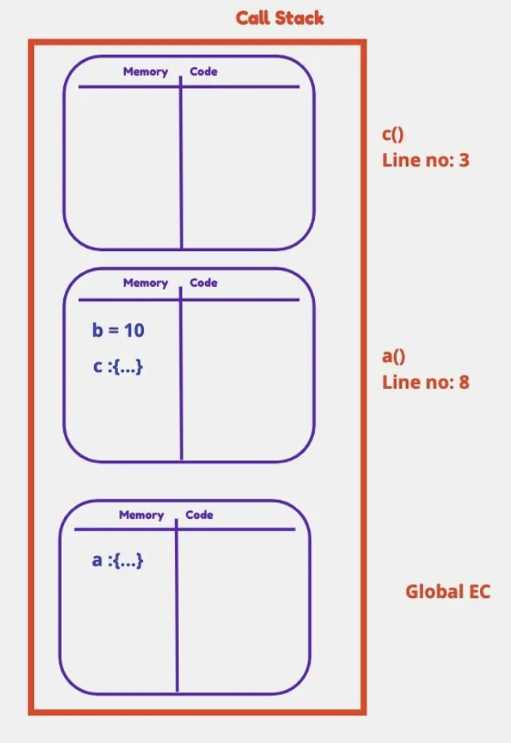
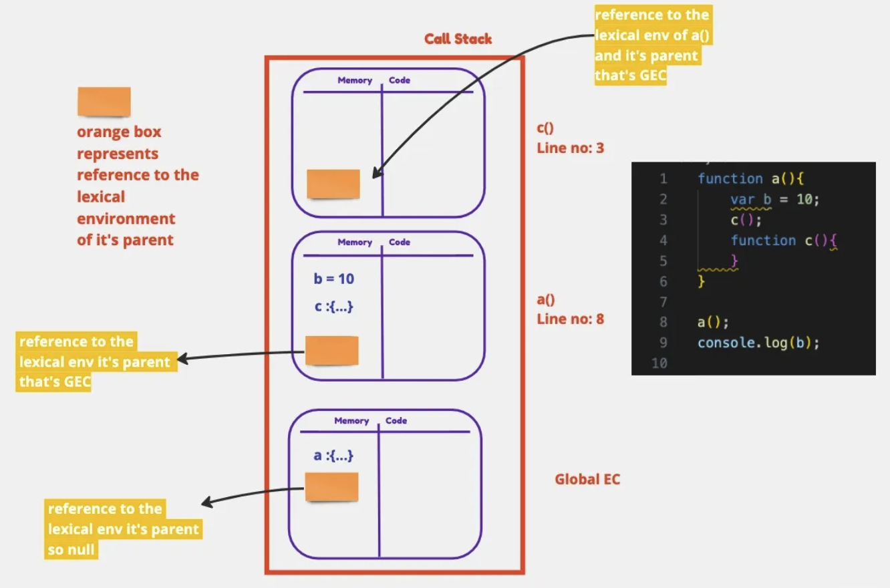
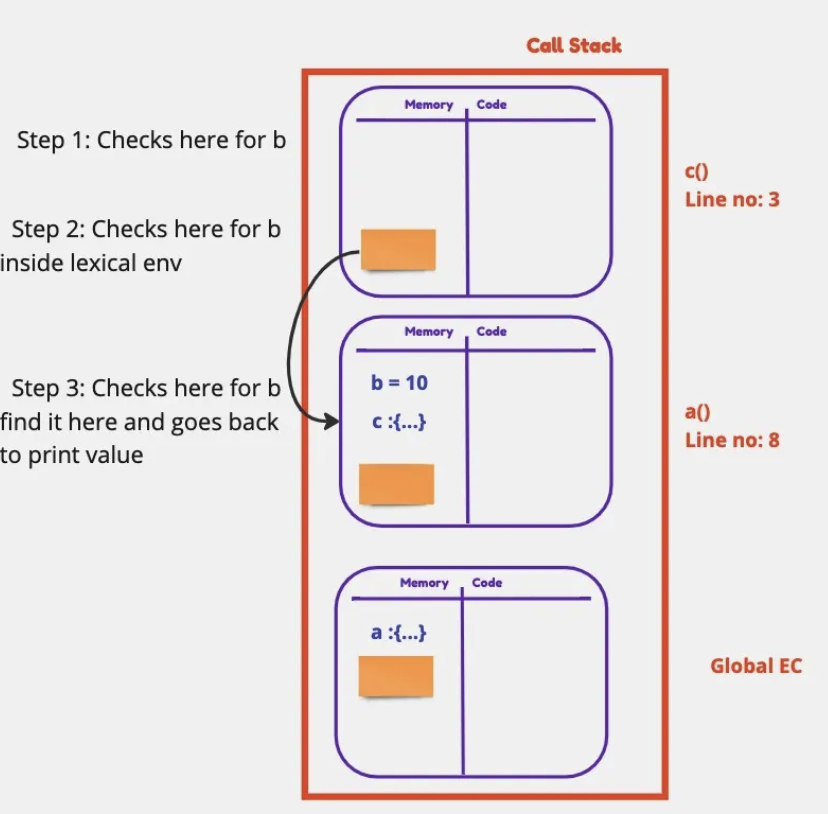
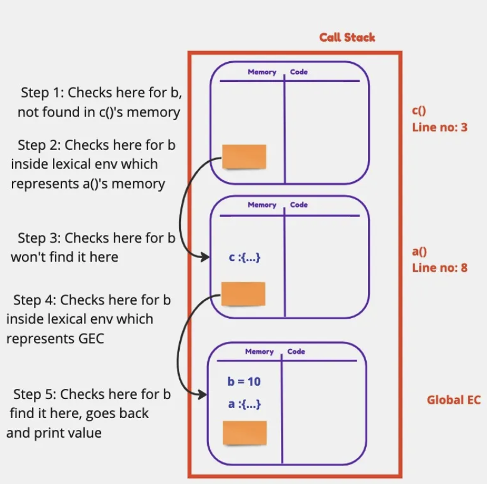
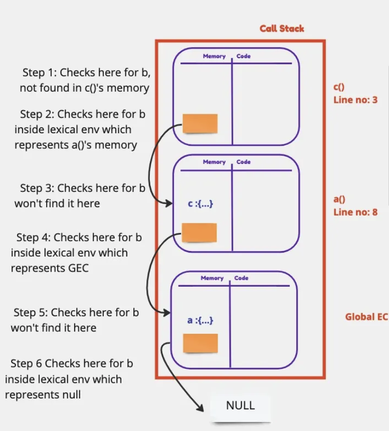
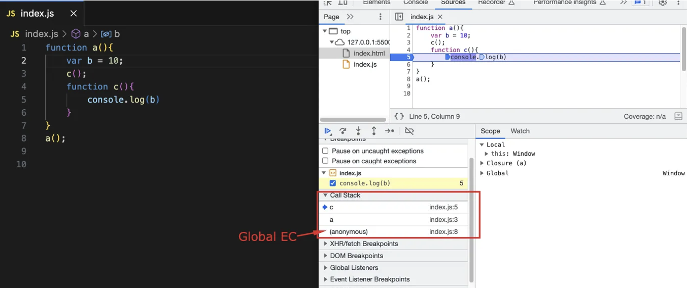
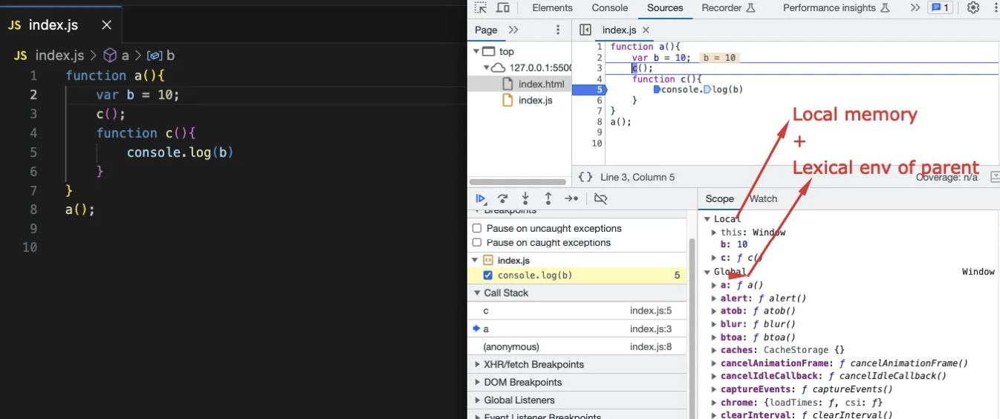
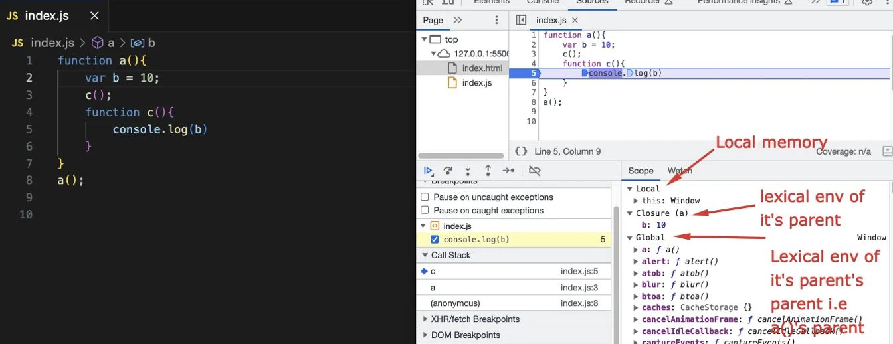

# Scope Chain, Scope and Lexical Environment

This article explores three fundamental concepts in JavaScript: Scope, Lexical Environment, and the Scope Chain. Understanding these is crucial for writing predictable and bug-free code.

*   What is Scope?
*   What is Lexical Environment?
*   What is Scope Chain?

---

Scope in JavaScript is intrinsically linked to the Lexical Environment. Let's start with an example:

```javascript linenums="1"
function a(){
   console.log(b); // Tries to access 'b'
}

var b = 10; // 'b' is declared in the global scope
a();        // Call function a
```

When the JavaScript engine executes `console.log(b)` inside function `a()`, it first looks for `b` within the local scope (memory space) of `a()`. Since `b` wasn't declared inside `a()`, it's not found there.

What happens next? Will it print `undefined`, throw an error, or find the value?

Running this code gives:

```console title="Console Output"
10
```

Somehow, the function `a()` was able to access the variable `b` defined outside of it.

Let's add another layer of nesting:

```javascript linenums="1"
function a(){
    c(); // Call nested function c
    function c(){
        console.log(b); // Tries to access 'b' from within c
    }
}

var b = 10; // 'b' is still global
a();        // Call function a
```

Running this version yields the same result:

```console title="Console Output"
10
```

Function `c()` can also access the global variable `b`.

Now, let's try the opposite: define `b` inside `a()` and try to access it globally:

```javascript linenums="1"
function a(){
    var b = 10; // 'b' is local to function a
    c();
    function c(){
       // Function c is empty now
    }
}

a();
console.log(b); // Try to access 'b' globally
```

This time, we get an error:

```console title="Console Output"
Uncaught ReferenceError: b is not defined
```

This error occurs because `b` is defined *only* within the scope of `a()` and is not accessible outside of it. This brings us to the concept of __Scope__.

## What is Scope? 🎯

Scope determines the accessibility or visibility of variables and functions in your code during runtime. It answers two main questions:

1.  **What is the scope of a specific variable/function?** (Where is it accessible?)
2.  **Is a variable/function within the current scope?** (Can I access it from here?)

Consider the previous example where the `ReferenceError` occurred:

```javascript linenums="1"
function a(){
    var b = 10; // Scope of 'b' is function 'a'
    c();
    function c(){
       // Scope of 'c' is function 'a'
    }
}
a();
console.log(b); // 'b' is NOT in the global scope
```

When this program runs:

1.  A Global Execution Context (GEC) is created and pushed onto the Call Stack.
2.  `a()` is invoked. A new Execution Context for `a` is created and pushed onto the stack.
3.  Memory is allocated within `a`'s context for its local variable `b` (initially `undefined`) and local function `c`.
4.  The code inside `a` executes: `b` is assigned the value `10`.
5.  `c()` is invoked. A new Execution Context for `c` is created and pushed onto the stack.
6.  `c` executes (it's empty in this version). Its context is popped from the stack.
7.  `a` finishes. Its context is popped from the stack.
8.  The global `console.log(b)` executes. The engine looks for `b` in the GEC. It doesn't find it, resulting in the `ReferenceError`.

{ loading=lazy width=300 }

## What is Lexical Environment?

Whenever an Execution Context is created, a **Lexical Environment** is also created.

!!! info
    **Lexical Environment = Local Memory + Reference to the Lexical Environment of its Parent.**

__Lexical__ refers to the way code is physically written or structured. It means hierarchy or sequence based on the code structure, not the call order.

In this code:

```javascript linenums="1"
// Global Scope
function a(){ // a is lexically inside Global Scope
    var b = 10;
    c();
    function c(){ // c is lexically inside function a
        // ...
    }
}
a();
console.log(b);
```

*   Function `c` is lexically nested within function `a`.
*   Function `a` is lexically nested within the global scope.

So:

1.  The Lexical Environment for `c` contains its local memory (empty in this case) and a reference to the Lexical Environment of `a`.
2.  The Lexical Environment for `a` contains its local memory (`b`, `c`) and a reference to the Lexical Environment of the Global Scope.
3.  The Lexical Environment for the Global Scope contains its memory (`a`) and a reference to `null` (it has no outer lexical environment).

Let's visualize the parent references **(represented by the orange box in the original description)**:

{ loading=lazy }

## How the Scope Chain Works ⛓️

Let's revisit the example where `b` was accessed from within `c`:

```javascript linenums="1"
function a(){
    var b = 10; // 'b' is local to 'a'
    c();
    function c(){
        console.log(b); // Access 'b' here
    }
}
a();
// console.log(b); // This would cause an error
```

When `console.log(b)` runs inside `c`:

1.  The JS engine looks for `b` in the **local memory** (Lexical Environment) of `c`. It's not found.
2.  The engine follows the reference to the **parent's Lexical Environment**, which is `a`'s environment.
3.  It looks for `b` in `a`'s local memory. It finds `b` with the value `10`.
4.  The value `10` is retrieved and printed to the console.

{ loading=lazy }

What if `b` was defined globally instead?

```javascript linenums="1"
function a(){
    c();
    function c(){
        console.log(b); // Access 'b' here
    }
}
var b = 10; // 'b' is now global
a();
// console.log(b); // This would print 10
```

Now, the lookup process is:

1.  Look for `b` in `c`'s local memory. Not found.
2.  Follow the reference to `a`'s Lexical Environment. Look for `b`. Not found.
3.  Follow the reference from `a`'s environment to the **Global Lexical Environment**. Look for `b`. Found! (`b = 10`).
4.  The value `10` is retrieved and printed.

{ loading=lazy }


Finally, what if `b` is not defined anywhere?

```javascript linenums="1"
function a(){
    c();
    function c(){
        console.log(b); // Try to access 'b'
    }
}
// 'b' is never defined
a();
```

Lookup process:

1.  Look for `b` in `c`'s local memory. Not found.
2.  Follow reference to `a`'s Lexical Environment. Look for `b`. Not found.
3.  Follow reference to Global Lexical Environment. Look for `b`. Not found.
4.  The engine has reached the end of the chain (`null` reference from Global LE) without finding `b`.
5.  A `ReferenceError` is thrown.

{ loading=lazy }

```console title="Console Output"
Uncaught ReferenceError: b is not defined
```

In this case, we say "`b` is not in the scope."

!!! info "Scope Chain"
    This mechanism of searching for a variable by looking in the current local scope, and if not found, looking in the parent's lexical environment, and then the grandparent's, and so on, up to the global scope, is called the **SCOPE CHAIN**.

## Summary ✨

1.  A **Lexical Environment** is created with every Execution Context. It consists of the **Local Memory** (variables/functions defined within that context) plus a **reference to the parent's Lexical Environment**.
2.  The **parent** (Lexical Parent) is determined by where a function is physically written in the code, not by how it's called.
3.  The **Scope Chain** is the chain of Lexical Environments, linked by their parent references. It dictates whether a variable or function is accessible (in scope) from a particular point in the code.

## Scope Chain in the Browser Debugger

You can observe the Scope Chain using browser developer tools. Set a breakpoint inside the innermost function and inspect the __"Scope"__ panel.

```javascript linenums="1"
function a(){
    var b = 10;
    function c(){
        console.log(b); // Set breakpoint here
    }
    c();
}
a();
```

When paused at the breakpoint:

1.  **Call Stack:** Shows the active execution contexts (`c`, `a`, `(anonymous)` for global).

    { loading=lazy }

2.  **Scope Panel (for `a` if inspected earlier):** Would show its Local scope (`b`, `c`) and its closure scope pointing to Global.

    { loading=lazy }

3.  **Scope Panel (for `c`):** Shows its Local scope (empty), its Closure scope (containing `b` from `a`), and the Global scope. This visually represents the Scope Chain.

    { loading=lazy }
