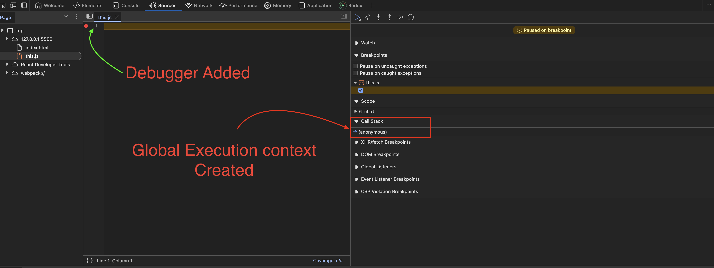
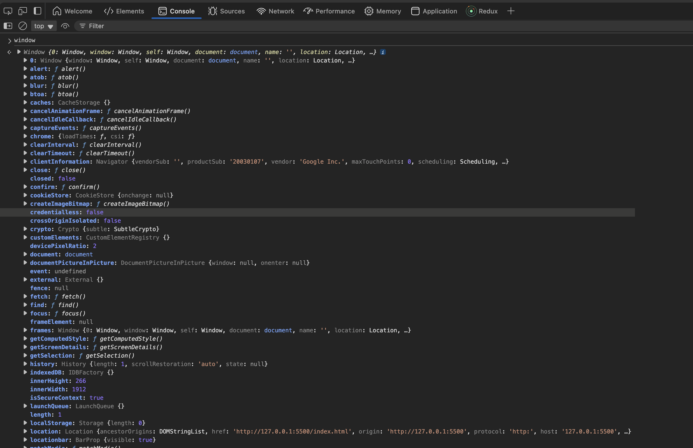
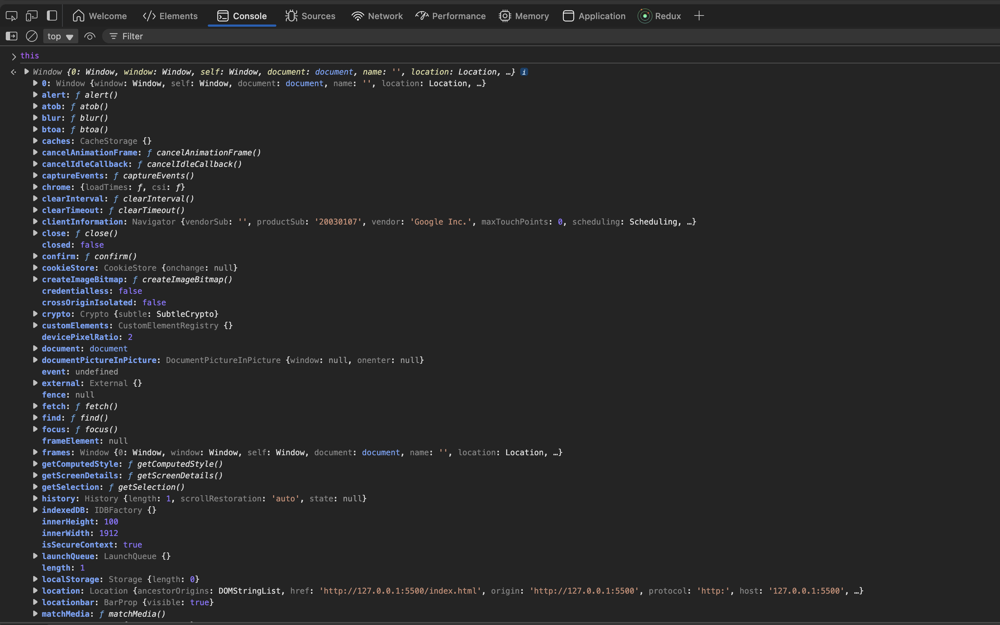
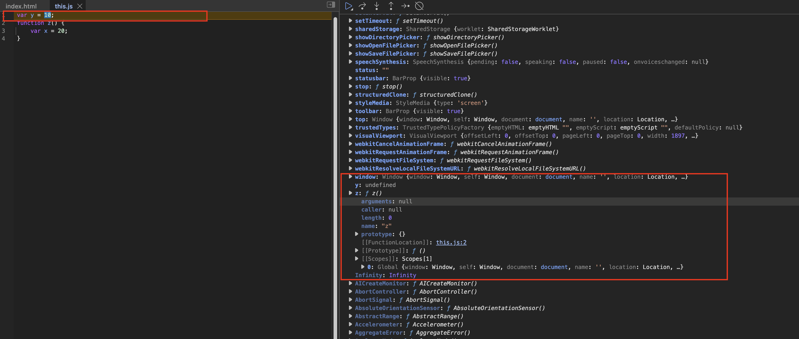

# 🪟 The `this` Keyword in JavaScript

Understanding the `this` keyword is essential for mastering JavaScript, as its value changes depending on **how** and **where** it is used. Let's break down its behavior in different contexts.

---

## :globe_with_meridians: Global Context

Let’s start with an **empty JS file**. Even if there's no code, when you run the file:

- The JavaScript engine creates a **Global Execution Context (GEC)**.
- A **global object**, called `window` in browsers, is created.
- The `this` keyword is initialized to refer to this global object.

{ loading=lazy }

Open the browser console and type:

```js
window; // [Window object]
this;   // [Window object]
window === this; // true
```

{ loading=lazy }

### **Explanation:**
In the browser, the global object is named `window`. All globally declared functions and variables become properties of `window`. The `this` keyword, when used in the global scope, also refers to the `window` object.

{ loading=lazy }

---

## :material-space-station: What Is the "Global Space"?

Any variable or function declared **outside** of any function or block resides in the **global space**. For example:

{ loading=lazy }

```javascript linenums="1" title="index.js"
var y = 10;
function z() {
    var x = 20;
}
console.log(window.y); // 10
console.log(y); // 10
console.log(this.y); // 10
console.log(x); // ReferenceError: x is not defined
```

All the following refer to the **same value** in the global scope:

```javascript linenums="1" title="index.js"
window.y === y === this.y // true
```


!!! abstract "Summary: How Does `this` Work?"
    - **In the global scope** (browser): `this` refers to `window`.
    - **In Node.js**: `this` refers to the `global` object.
    - **Inside an object’s method**: `this` refers to the **object itself**.
    - **Inside a function (non-strict mode)**: `this` refers to the global object.
    - **Inside a function (strict mode)**: `this` is `undefined`.
    - **Arrow functions**: `this` is lexically scoped and inherits `this` from the parent scope.
    - **DOM event handlers**: `this` refers to the HTML element that triggered the event.

---

## :simple-googlelens: Examples

### Global Scope

```javascript linenums="1"
// Uncommenting this line changes 'this' in functions to undefined
// "use strict";

console.log(this); // In browsers: window (global object)
```

### Inside a Function

```javascript linenums="1"
function myFunction() {
    console.log(this);
}

myFunction();         // non-strict mode: window | strict mode: undefined
window.myFunction();  // window
```

### Inside an Object Method

```javascript linenums="1"
const student = {
    name: 'Rajan',
    getName: function () {
        console.log(this);
    }
};
student.getName(); // {name: 'Rajan', getName: ƒ}
```

### Method Borrowing with call, apply, bind

```javascript linenums="1"
const student2 = { name: 'Bhawana' };

// Borrow getName method from student
student.getName.call(student2); // { name: 'Bhawana' }
```

### Inside an Arrow Function

!!! tip
    **Arrow functions do NOT have their own `this`; they inherit `this` from where they are defined.**

```javascript linenums="1"
const obj = {
    name: 'Rajan',
    getName: () => {
        console.log(this);
    }
};
obj.getName(); // window (or global object in Node.js)
```

#### Nested Arrow Functions

```javascript linenums="1"
const obj2 = {
    name: 'Rajan',
    getName: function () {
        const inner = () => {
            console.log(this);
        };
        inner();
    }
};
obj2.getName(); // {name: 'Rajan', getName: ƒ}
```
Here, the arrow function's `this` is inherited from its parent scope, which is the method where `this` refers to `obj2`.

---

### `this` in DOM Event Handlers

```javascript linenums="1"
const button = document.querySelector('button');
button.addEventListener('click', function () {
    console.log(this); // Refers to the <button> element
});
```


!!! quote "Quick Reference"
    - By default, `this` refers to the **global object** (`window` in browsers, `global` in Node.js).
    - Inside an object method, `this` refers to the **object**.
    - In arrow functions, `this` is inherited (lexical).
    - In DOM event handlers, `this` is the element on which the handler is placed.
    - In strict mode, `this` inside functions (not called as a method) is `undefined`.


!!! tip
    An empty JS file is the shortest possible JS program, since it still sets up the global context (`window`, `this`, etc.).
