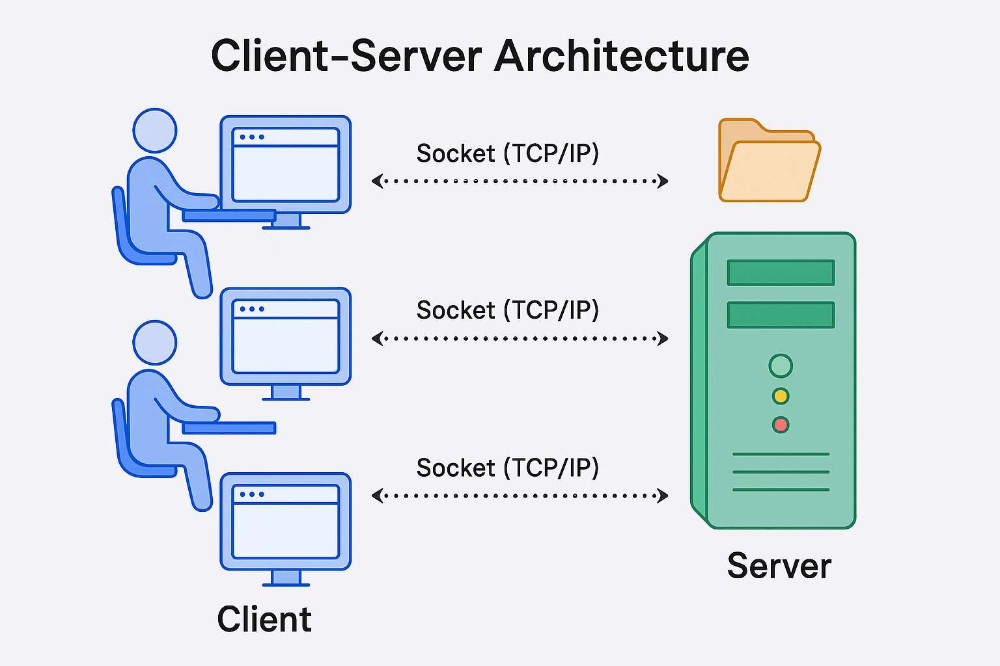

# Creating a Server

## What is a Server :question:

The term "server" can refer to both hardware and software, depending on the context.

*   **Hardware:** A physical machine (computer) that provides resources and services to other computers (clients) over a network.
*   **Software:** An application or program that handles requests and delivers data to clients.

### Deploying an Application on a Server

When someone says "deploy your app on a server," they usually mean:

1.  **Hardware Aspect:** You need a physical machine (server) to run your application. This machine has a CPU, RAM, storage, etc.
2.  **Operating System (OS):** The server hardware runs an operating system like Linux or Windows. Your application runs on this OS.
3.  **Server Software:** The software (e.g., a web server like Apache or an application server built with Node.js) that handles requests from users.

### :fontawesome-brands-aws: and Cloud Computing

:fontawesome-brands-aws: (Amazon Web Services) provides cloud-based resources, including servers.

*   **EC2 Instance:** When you launch an EC2 instance, you’re essentially renting a virtual server from AWS. AWS manages the underlying hardware, and you deploy your application on the virtual server.
*   **Scalability:** AWS allows you to easily scale your resources. For example, you can increase the memory or processing power of your server with a few clicks, which is not as straightforward on a physical laptop or desktop.
*   **Reliability:** AWS servers are equipped with constant power, internet backup, and redundant systems to ensure high availability, which is difficult to achieve with a personal computer.

## Can You Use Your Own Laptop as a Server? :thinking:

Yes, but with limitations:

*   **Hardware Constraints:** Your laptop likely has limited RAM, CPU, and storage, which may not be sufficient for handling a large number of requests.
*   **Internet Connectivity:** A home internet connection is typically less reliable and has dynamic IP addresses, making it less suitable for hosting a publicly accessible server.
*   **Power and Maintenance:** Ensuring that your laptop is always on, connected to the internet, and has backup power is challenging. AWS handles all these concerns for you.

## Software Servers in Node.js

When you create an HTTP server in Node.js, you’re building an application that listens for requests from clients and responds to them. This is an example of a software server.

## Client-Server Architecture



The term "client" refers to someone accessing a server. Imagine a user sitting at a computer wanting to access a file from a server. For this, the client needs to open a socket connection (not to be confused with WebSocket). Every client has an IP address, and every server has an IP address as well. The client could be a web browser.

To access the file, the client opens a socket connection. On the server side, there should be an application that is listening for such requests, retrieves the requested file, and sends it back to the client.

There can be multiple clients, and each client creates a socket connection to get data. After the data is received, the socket connection is closed. If the client needs to make another request, a new socket connection is created, data is retrieved, and the connection is closed again.

Sockets operate using the TCP/IP protocol (Transmission Control Protocol/Internet Protocol).

## What is a protocol?

A protocol is a set of rules that define how computers communicate with each other. Protocols determine the format in which data is sent between devices.

*   **FTP (File Transfer Protocol):** Used for transferring files.
*   **SMTP (Simple Mail Transfer Protocol):** Used for sending emails.

When we talk about a web server, we usually mean an HTTP server. HTTP (HyperText Transfer Protocol) is a language or set of rules that defines how clients and servers communicate.

Essentially, when we create a server, it's often built using HTTP to handle basic data exchanges.

## How is data sent when you make a server request?

Data is sent in chunks, and these smaller units are known as {++packets++}. Whenever data is transmitted, it's broken down into these packets. Remember the term "packets." The TCP/IP protocol is responsible for sending these packets and ensuring that the data transmission is properly managed.

In Node.js, there are concepts of streams and buffers that are used for handling and writing code related to data transmission.

## Domain Names and IP Addresses

We don't generally communicate using IP addresses; instead, we use domain names like `youtube.com`. However, at the end of the day, everything maps to an IP address.

As humans, we don’t easily understand or remember IPs, similar to how we save contacts with names instead of memorizing phone numbers. Similarly, when we request a URL like `youtube.com`, internally, it is translated into an IP address. This is where the Domain Name System (DNS) comes into play.

A DNS server manages the mapping between domain names and IP addresses. When you request a website, your browser calls a DNS server to resolve the domain name into an IP address. Once the IP is resolved, a call is made to the server.

As a user, you don’t see what happens behind the scenes. When you request an IP, it goes to the server where an HTTP server processes the request and sends back the video data. This data is sent in chunks, known as streams, and the process involves buffers, which is why you sometimes see the video buffering.

## Can I create multiple servers?

Yes, you can create multiple HTTP servers.

Now, suppose a user is sending a request. How do we know which server it should go to?

When I mention creating an HTTP server, it means we are setting up two different Node.js applications. The distinction between these servers is defined by a {++port++}, which is a 4-digit number (e.g., port `3000`).

For example, suppose an HTTP server with IP address `102.209.1.3` is running on port `3000`. This combination of IP address and port number (`102.209.1.3:3000`) indicates which specific HTTP server the request should be routed to.

Essentially, this means there’s a single computer (the server) that can run multiple applications, each with its internal servers. The port number determines which application or server the request is directed to.

## Mapping Domain Names, IPs, Ports, and Paths to Applications

When you enter a domain name like `youtube.com`, it gets mapped to an IP address by a DNS (Domain Name System) server. The IP address identifies the specific server where the website is hosted.

Now, when you combine the IP address with a port number, you can direct the request to a specific application running on that server. The port number acts as a gateway to different applications or services on the same server. For example:

*   `102.209.1.3:3000` could point to a React application.
*   `102.209.1.3:3001` could point to a Node.js application.

But there's more! If you add a path to the URL, you can create specific API routes. For example:

*   If you enter `youtube.com`, the server might direct you to the React application running on port `3000`.
*   If you enter `youtube.com/api/...`, it might direct the request to a Node.js application running on port `3001`.

## Distributed Server Architecture

In large companies, the architecture is often distributed across multiple servers rather than relying on a single server. This approach helps manage different aspects of the application efficiently and ensures scalability, reliability, and performance.

### 1. Separation of Concerns:

*   **Frontend Server:** This server handles the user interface (UI) of the application. It serves the HTML, CSS, and JavaScript files that the browser needs to render the website. For example, `rajandangi.com.np` could be hosted on an AWS server that serves both the frontend and backend.
*   **Backend Server:** This server processes the logic, handles requests, and interacts with the database. Even though the backend might be on the same server as the frontend in some cases, it’s often separated in larger systems for better performance and security.

### 2. Dedicated Database Server:

The database is typically hosted on a separate, powerful server that is optimized for storing and managing data. When a client makes a request that involves data retrieval or storage, the backend server interacts with this database server to fulfill the request.

### 3. Media and File Servers:

Large files like videos, images, and other media are often stored on specialized servers. These servers are optimized for handling large amounts of data and delivering it quickly. When you request a video from `rajandangi.com.np`, the video might be fetched from a dedicated media server. Images might also be stored on a different server, often managed by a content delivery network (CDN) to ensure fast delivery to users worldwide.

### 4. Inter-Server Communication:

When a client makes a request, the frontend or backend server might need to communicate with other servers to get the necessary data. For example, if you request a video on `rajandangi.com.np`, the server might make an API call to another server that hosts the video content, retrieve it, and then send it to the client.

In many companies, the frontend and backend may also be hosted on different servers. This separation allows each part of the system to be optimized for its specific role, ensuring better performance and making the system more scalable and resilient.

This distributed approach helps large companies manage massive amounts of data and traffic efficiently, ensuring that users have a smooth and responsive experience.

## Socket vs WebSockets

When a user makes a request to a website, a socket connection is established between the client and the server. This connection is typically used for a single request-response cycle: the client sends a request, the server processes it, sends back the response, and then the socket is closed. This process involves opening a new connection for each request.

On the other hand, WebSockets introduce a more efficient method by allowing the connection to remain open. This means that after the initial connection is established, it stays active, allowing for continuous communication between the client and server. Both the client and server can send and receive data at any time without the need to re-establish the connection. This persistent connection is ideal for real-time applications, where continuous interaction is required, such as in chat applications, online gaming, or live updates.

## Creating a Server

Now, I want to handle different responses for the URL `localhost:3000/getsecretdata`.

Here's how you can create a basic HTTP server in Node.js to achieve this:

```javascript linenums="1"
const http = require('http');

// Create a server instance
const server = http.createServer(function (req, res) {
  // Set the content type to plain text
  res.setHeader('Content-Type', 'text/plain');

  if (req.url === "/getsecretdata") {
    res.end("There is no secret data");
  } else {
    res.end("Hello World from your Node.js server!");
  }
});

// Listen for incoming requests on port 3000
const port = 3000;
server.listen(port, () => {
  console.log(`Server running at http://localhost:${port}/`);
});
```

In this example:
1.  We require the built-in `http` module.
2.  We call `http.createServer()`, providing a callback function that will be executed for each incoming request (`req`).
3.  Inside the callback, we check if the requested `req.url` is `"/getsecretdata"`.
    *   If it is, we send back the response "There is no secret data" using `res.end()`.
    *   Otherwise, for any other URL, we send "Hello World from your Node.js server!".
4.  `server.listen(3000)` starts the server and makes it listen for connections on port `3000`.

This is a fundamental way to create a server. For more complex applications, frameworks can simplify this process.

We use [Express](https://expressjs.com/) to create a server. [Express](https://expressjs.com/) is a framework built on top of Node.js that makes our lives easier.