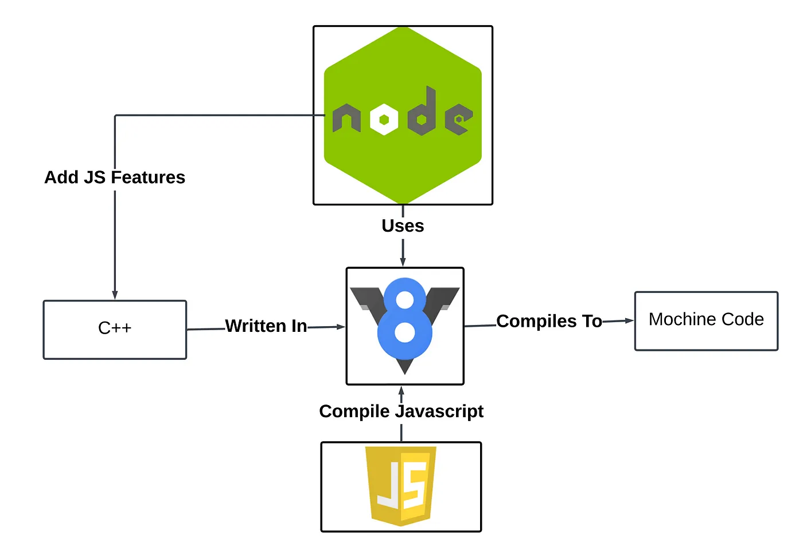

# JavaScript on Server

!!! question "What is a Server?"

A server is essentially a remote computer that provides resources, services, or programs to other computers (clients) over a network. When you interact with a website or app, your device communicates with servers behind the scenes.

Think of it this way: your computer (the client) makes requests, and servers respond by providing what you need - whether that's a webpage, data from a database, or processing power.

When a computer needs to communicate with a server, it sends a request using the server's IP address - a unique identifier that works like a digital postal address.

## What is an IP Address?

An IP address (Internet Protocol address) is a unique numerical label assigned to every device connected to the internet. It serves two primary functions:

- Identifying the host or network interface
- Providing the location of the device in the network

IP addresses allow devices to find and communicate with each other across the internet.

## The V8 Engine

V8 is Google's open-source, high-performance JavaScript and WebAssembly engine written in C++. It powers Chrome browser and Node.js, among other applications.

```
JavaScript Code → V8 Engine → Machine Code → Computer Execution
```

Key features of V8 include:

- Written in C++ with the ability to be embedded into any C++ application
- Implements ECMAScript and WebAssembly standards
- Runs on various operating systems (Windows, macOS, Linux) and processors (x64, IA-32, ARM)
- Compiles JavaScript directly to native machine code before execution, rather than interpreting it

## JavaScript Runtime and Node.js

Originally, JavaScript could only run in web browsers, limiting it to client-side development. However, Node.js changed everything by bringing JavaScript to the server side.

Node.js is essentially a C++ application with the V8 engine embedded into it, but with added capabilities:

- File system operations
- Network requests
- Database connections
- Server creation and management

These additional APIs extend beyond the ECMAScript standards that V8 follows, making Node.js more powerful than V8 alone.

## ECMAScript Standards

ECMAScript is the standard specification that defines JavaScript. JavaScript engines like V8 follow these standards to ensure consistent behavior across different environments.

Think of ECMAScript as the blueprint, while JavaScript is the most popular implementation of that blueprint.

## From High-Level to Low-Level

Ever wonder how your JavaScript code comes to life? :thinking:



We write JavaScript (a high-level language), and then the V8 engine translates it into machine and assembly code (low-level code) so computers can understand and execute it. This transformation process is what makes it possible for our human-readable code to power applications!

Low-level code refers to programming languages that are closer to machine language and hardware, with minimal abstraction:

1. **Assembly Language**: Uses symbolic representations for operations, making it somewhat more readable for humans while still maintaining a direct correlation to machine instructions
2. **Machine Language**: The most basic form, consisting of binary (0s and 1s) instructions that CPUs directly execute