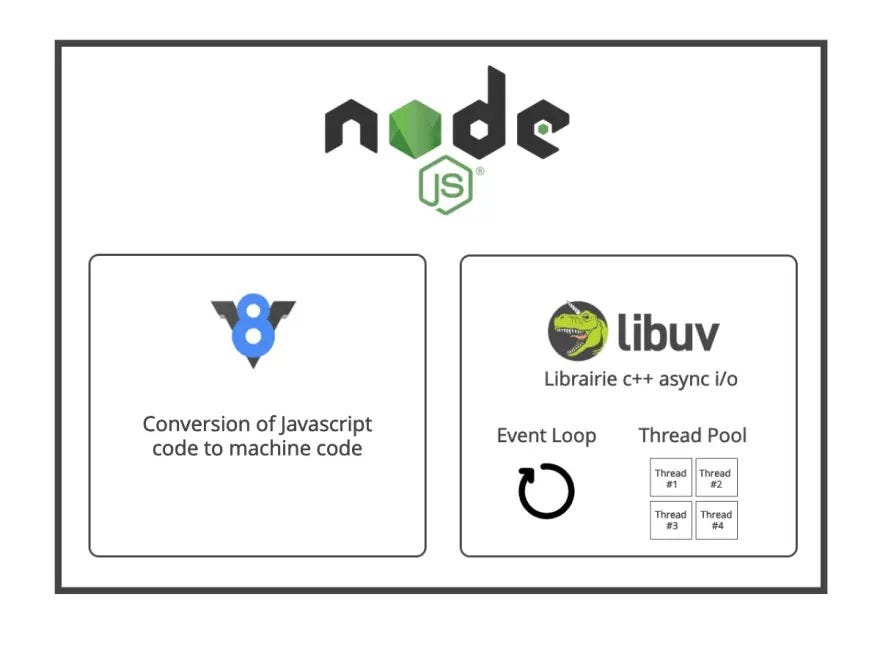
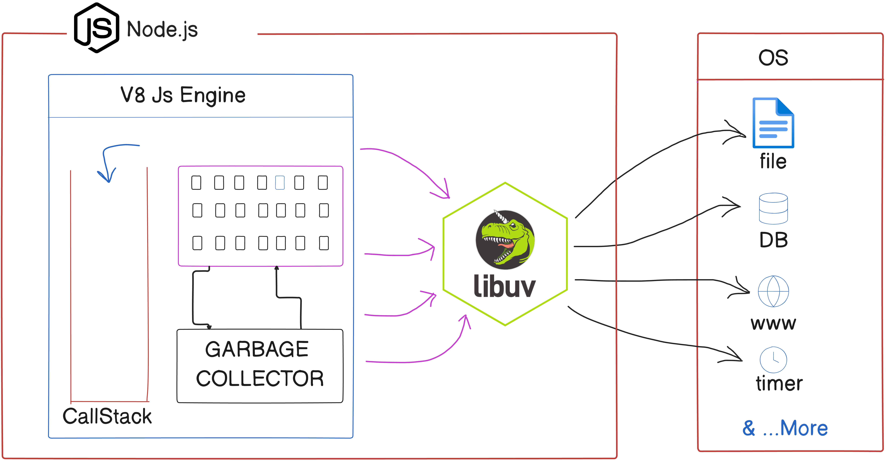

# libuv and Async I/O
The Node.js Wikipedia page mentions that **Node.js has an event-driven architecture capable of asynchronous I/O.** This is a key feature of Node.js, made possible by the underlying library called **libuv**.

In this section, we will explore this concept in detail, including how Node.js handles asynchronous I/O operations and the role of [libuv](https://docs.libuv.org/en/v1.x/) in this process.

---

## :fire: Warmup

!!! question "What is the callback queue (task queue)?"
    - After executing I/O tasks, JavaScript runtimes add them to the callback queue.
    - The event loop picks these tasks from the callback queue and adds them to the call stack.

!!! question "Callback queue vs Microtask queue"
    - **Task queue** handles:
        - `setTimeout`/`setInterval` callbacks
        - I/O operations
    - **Microtask queue** handles:
        - Promise callbacks
    - The **microtask queue** has higher priority. The task queue will only be handled if the microtask queue is empty.

---

## :material-youtube: Watch the video before we start
<iframe width="100%" height="480" src="https://www.youtube.com/embed/YSyFSnisip0" title="How Node JS Works?" frameborder="0" allow="accelerometer; autoplay; clipboard-write; encrypted-media; gyroscope; picture-in-picture; web-share" referrerpolicy="strict-origin-when-cross-origin" allowfullscreen></iframe>

---

Let's start with the fundamentals of JavaScript first.

## :thread: What is a thread?

A thread is the smallest unit of execution within a process that can be scheduled by the operating system. It represents a single sequence of instructions that can be managed independently by a scheduler. Multiple threads can exist within a single process, sharing the same memory space but executing independently. This allows for parallel execution of tasks within a program, improving efficiency and responsiveness.

## What type of threading does JavaScript use? :thinking:

- JavaScript is a **synchronous, single-threaded language**, meaning there is only one thread in which the JavaScript engine (such as the V8 engine) runs. Code is executed line by line within this single thread.

- In other languages like C++ or Java, code can be executed across multiple threads. For example, a portion of the code might be executed in one thread, while another part runs simultaneously in a different thread. However, JavaScript executes code sequentially—one line after the other.

- If you're executing line 2 in JavaScript, it will only run after line 1 has finished executing. This is the essence of synchronous execution: each task is performed one after the other, without overlap.

!!! warning "Twist: JavaScript is single-threaded, but how does Node.js handle asynchronous I/O?"
    - Node.js is built on top of JavaScript and uses a **non-blocking I/O model**. While JavaScript itself is single-threaded, Node.js can handle multiple I/O operations concurrently without blocking the main thread.
    - This is achieved through the use of an **event loop** and a **thread pool**, which allows Node.js to perform asynchronous operations efficiently.
    - This is where [libuv](https://docs.libuv.org/en/v1.x/) comes into play. It provides the underlying mechanisms for handling asynchronous I/O operations in Node.js, enabling tasks like file reading, network requests, and database queries without blocking the main thread.

---

!!! question "What are the components inside the JS engine, and how is synchronous code executed by the JS engine?"

    Must go through the following sections to understand the concept of the event loop and how the JS engine executes synchronous code:

    :octicons-link-external-16: [Execution Contexts and the Call Stack](../javascript/javascript-call-stack.md)

    :octicons-link-external-16: [Callback Functions](../javascript/callback-functions.md)

    :octicons-link-external-16: [Asynchronous JavaScript & The Event Loop](../javascript/async-js-and-event-loop.md)

    :octicons-link-external-16: [JavaScript Engine Architecture](../javascript/js-engine-architecture.md)

---

## How is asynchronous code executed?

The JavaScript engine cannot handle asynchronous tasks alone; it needs additional capabilities. This is where **Node.js** comes into the picture, enabling interaction with operating system functionalities.



The JS engine gains its "superpowers" from Node.js. Node.js provides these powers through a library named [libuv](https://docs.libuv.org/en/v1.x/) — **our superhero**.

The JS engine cannot directly access OS files, so it relies on libuv. Libuv communicates with the OS, performs the necessary tasks, and then returns the response to the JS engine. It offloads the work and handles it efficiently behind the scenes.

## How does JavaScript exhibit asynchronous behavior?

Runtime environments provide the ability to handle asynchronous tasks for the JavaScript engine.

- **Browser**: Browsers provide the ability to handle asynchronous tasks using Web APIs. These APIs are built into the browser and allow JavaScript to perform tasks like making network requests, manipulating the DOM, and handling timers without blocking the main thread.

- **Node.js**: Node.js provides the ability to handle asynchronous tasks using the libuv library. This library allows Node.js to perform non-blocking I/O operations, such as reading files or making network requests, without blocking the main thread. It uses an event loop and a thread pool to manage these operations efficiently.

- Examples of asynchronous tasks in JavaScript:
    - **I/O operations**: Reading and writing files, making network requests, etc.
    - **Timers**: `setTimeout`, `setInterval`, etc. JavaScript does not have built-in timers; it relies on the runtime environment (browser or Node.js) to provide this functionality.

### Browser Runtime Architecture
{ loading=lazy }

### Node.js Runtime Architecture


### Simple Workflow of Handling Async Tasks

1. **Main Thread (Synchronous)**:
    - Executes JavaScript code line by line.
    - When it encounters async tasks, delegates them to the runtime.
2. **Runtime Environment**:
    - Handles async tasks separately (not on the main thread).
    - **Browser Runtime**:
        - Handles tasks using browser APIs.
        - Puts completed tasks in the callback queue/microtask queue.
    - **Libuv**:
        - Handles tasks using libuv's libraries and thread pool.
        - Puts completed tasks in the callback queue/microtask queue.
3. **Event Loop**:
    - Continuously checks if the main thread is idle.
    - Moves callbacks from the queue to the main thread.

### Simple Async Code Execution

```javascript linenums="1" hl_lines="9-20" title="Async Code Execution"
const fs = require("fs");
const https = require("https");

console.log("Start");

var a = 25;
var b = 10;

https.get("https://dummyjson.com/products/1", (res) =>
    console.log("Data Fetched Successfully")
);

setTimeout(() => {
    console.log("setTimeout called for 5 sec");
}, 5000);

fs.readFile(__dirname + "/file.txt", "utf-8", (err, data) => {
    if (err) throw err;
    console.log(data);
});

function multiply(a, b) {
    return a * b;
}

var c = multiply(a, b);
console.log(c);

console.log("End");
```

```console title="Output"
Start
250
END
This is file content.
Data Fetched Successfully
setTimeout called for 5 sec
```

#### Key Points

- **Synchronous Code**: `console.log("Start")`, `multiply(a,b)` and `console.log("End")` are executed synchronously, meaning they are executed one after the other.

- **Asynchronous Code**: `https.get`, `setTimeout`, and `fs.readFile` are executed asynchronously. They are delegated to the runtime (Node.js) for execution, allowing the main thread to continue executing other code without waiting for these tasks to complete.

- Async code executes tasks in parallel. In the example, file reading is the fastest task because it's a small local file and completes within a few milliseconds (20-30 ms). Another task is making a network request, which generally takes longer (around 100-200 ms). Finally, the `setTimeout` function is called after 5 seconds.

- However,changing `fs.readFile` in to `fs.readFileSync` function is synchronous, which means it blocks execution until the file is read and returns the file content directly (or throws an error). It does not accept a callback function.

```javascript linenums="1" hl_lines="6-7" title="Async Code Execution"
fs.readFile(__dirname + "/file.txt", "utf-8", (err, data) => {
    if (err) throw err;
    console.log(data);
});

+ const data = fs.readFileSync(__dirname + "/file.txt", "utf-8");
+ console.log(data);
```

```console title="Output"
Hello World
This is file content.
250
End of sync execution
Data Fetched Successfully
setTimeout called for 5 sec
```

- **Callback Execution**: Once the asynchronous tasks are completed, their callbacks are added to the callback queue. The event loop checks if the main thread is idle and moves the callbacks from the queue to the main thread for execution.

This process ensures that JavaScript remains non-blocking and can handle multiple asynchronous tasks efficiently, even though it is single-threaded.

---

## What is the libuv library? 📚

- [`libuv`](https://libuv.org/) is an open-source, cross-platform C library that provides support for asynchronous I/O operations. It was originally designed for Node.js.
- **Features of libuv**:
    - Event Loop
    - Thread Pool
    - Asynchronous I/O
    - Cross-platform compatibility

---

## How does Node.js utilize libuv to achieve Async I/O? 🛠️

### What is libuv's thread pool?
- The thread pool is a collection of threads that can perform tasks concurrently. It allows Node.js to offload blocking I/O operations to separate threads, freeing up the main thread to continue executing JavaScript code.
- The thread pool is managed by libuv and uses a fixed number of threads (default is 4) to handle I/O operations. When a blocking I/O operation is requested, libuv assigns it to one of the available threads in the pool. Once the operation is complete, the result is passed back to the main thread through a callback function.

### Why the term "Asynchronous I/O"?
All I/O tasks are delegated to libuv, which executes them asynchronously using the thread pool. These tasks run in parallel with the main thread, hence the term **Async I/O**.

### Why the term "Non-Blocking I/O"?
Since all I/O tasks are delegated to libuv and run on the thread pool, the main thread remains unblocked. None of the I/O tasks block the main thread, hence the term **Non-Blocking I/O**.

### Why is Non-Blocking I/O advantageous?
Blocking I/O tasks make the CPU sit idle until a response is received, wasting resources. Since JavaScript is single-threaded, unresolved requests would prevent other requests from being served (assuming only one server instance is running). Non-blocking I/O avoids this issue, improving efficiency and scalability.


---
## Further Reading
- [Trust Issue with setTimeout](../javascript/async-js-and-event-loop.md)