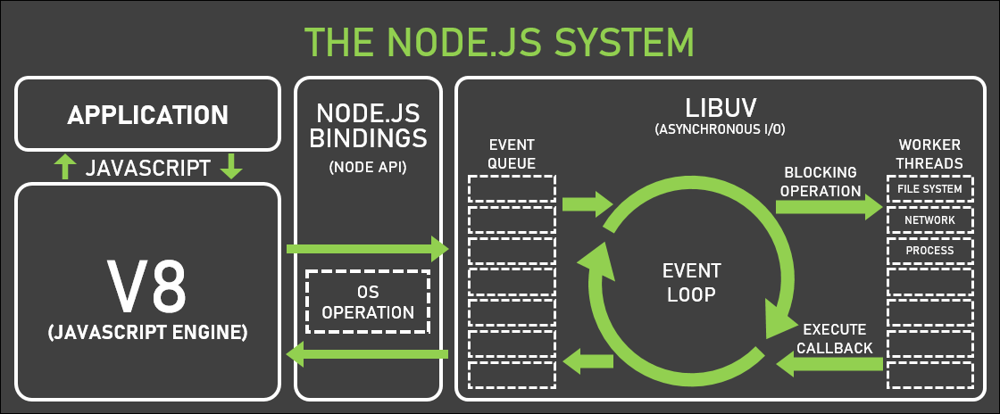
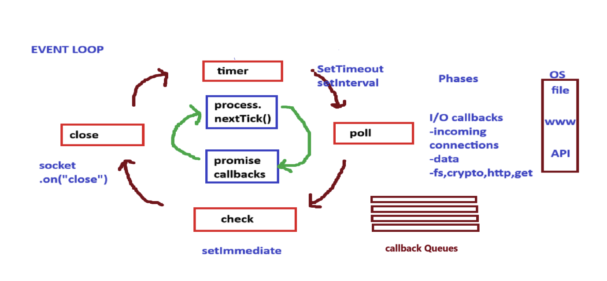
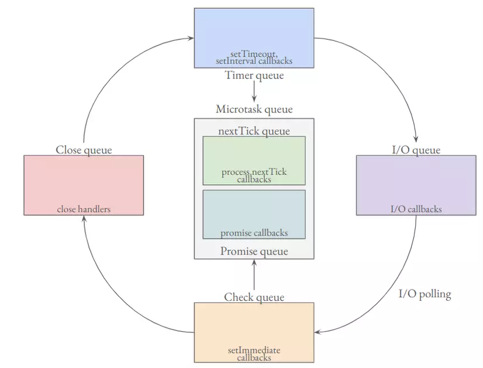

# Libuv and Event Loop

Node.js utilizes **libuv** for its asynchronous, non-blocking operations. Understanding libuv's management of the event loop, callback queues, and thread pool is key to grasping Node.js internals.

{==

User written synchronous Javascript code takes priority over async code that the runtime would like to execute. Only after the call stack is empty, the event loop comes into the picture.

==}

To explain in an easy-to-understand way, if the code that is currently running is in the synchronous segment, the callback of the asynchronous codes that have just been executed will not be called until all synchronous codes (or empty callstack) are executed.

## Core Components

*   **Event Loop**: The heart of Node.js's asynchronous processing. It allows Node.js to handle non-blocking I/O operations efficiently, despite JavaScript being single-threaded.
*   **Callback Queue**: Stores callback functions corresponding to completed asynchronous operations. The event loop processes this queue when the call stack is empty.
*   **Thread Pool**: Libuv uses a thread pool to handle more intensive tasks that would otherwise block the event loop. Examples include file system operations (like `fs.readFile`) or cryptographic functions.

Tasks offloaded to libuv include:

*   File system operations
*   DNS lookups
*   Network requests



## How It Works :question:

When an asynchronous task (e.g., reading a file) is initiated:

1.  The task is offloaded to libuv.
2.  Libuv interacts with the operating system (OS) to perform the task (e.g., read data from disk).
3.  The V8 JavaScript engine continues executing other JavaScript code without waiting.
4.  Once the OS completes the task and returns data to libuv, libuv places the associated callback function into the appropriate callback queue.
5.  The event loop picks up this callback from the queue (when the call stack is free) and pushes it onto the call stack for execution.

This mechanism ensures Node.js remains non-blocking, even with many concurrent operations. Libuv maintains separate queues for different types of tasks (timers, I/O, `setImmediate`) to manage priority.

# Inside the Event Loop: Phases

The event loop processes tasks in a specific order through several phases:



1.  **Timers Phase**: Executes callbacks scheduled by `setTimeout()` and `setInterval()`.
2.  **Poll Phase**:
    *   Retrieves new I/O events.
    *   Executes I/O-related callbacks (e.g., network requests, file system operations).
    *   {++If the event loop is idle and there are no scripts to execute, it will block here, waiting for new events.++}
3.  **Check Phase**: Executes callbacks scheduled by `setImmediate()`. These run immediately after the Poll phase completes.
4.  **Close Callbacks Phase**: Executes close event callbacks (e.g., `socket.on('close', ...)`).

{==

Among the main phrases, the microtask queue will be called, inside it there are 2 more phrases:

==}

Before transitioning to each main phase, the event loop processes **microtasks**.

*   **`process.nextTick()` callbacks**: These have the highest priority among microtasks and are executed immediately after the current operation completes, before the event loop continues.
*   **Promise callbacks** (e.g., `.then()`, `.catch()`, `.finally()`): These are also microtasks and are executed after `process.nextTick()` callbacks but before any other phase.


!!! note "Timer, I/O, check, close are components of libuv, microtask queue is not components of libuv."



## :flag_np: Execution Sequence

1. **Microtask Queue**

    - **Process.nextTick Queue**: Callbacks registered with `process.nextTick()` execute first
    - **Promise Queue**: Then Promise callbacks (`.then()`, `.catch()`, etc.) execute

2. **Timer Queue**
    - Callbacks scheduled by `setTimeout()` and `setInterval()` execute

3. **Microtask Queue** (again)
    - If new microtasks were added, they execute now (nextTick, then Promises)

4. **I/O Queue**
    - Callbacks from I/O operations (file system, network, etc.) execute

5. **Microtask Queue** (again)
    - Any newly added microtasks execute

6. **Check Queue**
    - Callbacks registered with `setImmediate()` execute

7. **Microtask Queue** (again)
    - Any newly added microtasks execute

8. **Close Queue**
    - Close event callbacks execute (e.g., `socket.on('close', ...)`)

9. **Microtask Queue** (final check)
    - Any final microtasks execute

### Loop Continuation

After completing all the steps above:
- If there are new callbacks added to any queue, the Event Loop continues with another cycle
- If there are no callbacks left to execute, the Event Loop exits

### Idle Behavior

If the event loop is idle and there are no scripts to execute, it will block in the poll phase, waiting for new events. This is an important optimization:

- The event loop doesn't waste CPU cycles when nothing needs to be processed
- It efficiently waits for new I/O events, timers to expire, or callbacks to be scheduled
- Once new events arrive, the event loop "wakes up" and resumes processing

!!! abstract "Key Insight"
    The microtask queue is checked and emptied **between each phase** of the Event Loop. This means microtasks have higher priority and can delay other operations if they keep adding new microtasks.

    This prioritization ensures that certain types of asynchronous operations (particularly nextTick & Promises callbacks) complete as soon as possible, making the Node.js Event Loop both efficient and predictable.


## :microscope: Microtask Queue In Depth

### nextTick Queue

The `process.nextTick()` method adds callbacks to the nextTick queue, which has priority over the Promise queue:

- Callbacks in the nextTick queue are executed until the queue is completely empty
- If new callbacks are added to the nextTick queue during execution (via `process.nextTick()`), they will be executed in the same phase in FIFO order
- The event loop will not proceed to the next phase until the nextTick queue is empty

Consider this example:

```javascript
process.nextTick(() => {
  console.log('Next tick 1');
  process.nextTick(() => console.log('Next tick 1.1'));
});

setTimeout(() => console.log('Set timeout 1'));
```

The output will be:
```
Next tick 1
Next tick 1.1
Set timeout 1
```

This demonstrates that even though the callback 'Next tick 1.1' was added during execution, it still runs before the setTimeout callback.

### 🤝 Promise Queue

Promises are also part of the microtask queue but are processed after the nextTick queue:

- Callbacks from resolved Promises (using `.then()` or `.catch()`) are added to the Promise queue
- Similar to nextTick queue, if new Promise callbacks are added during execution, they will be processed in the same phase

Here's a comprehensive example:

```javascript linenums="1"
process.nextTick(() => console.log('nextTick: 1'));

process.nextTick(() => {
  console.log('nextTick: 2');
  Promise.resolve().then(() => console.log('nextTick-Promise: 2.1'));
  process.nextTick(() => console.log('nextTick-nextTick: 2.2'));
});

process.nextTick(() => console.log('nextTick: 3'));

Promise.resolve().then(() => console.log('Promise: 1'));

Promise.resolve().then(() => {
  console.log('Promise: 2');
  Promise.resolve().then(() => console.log('Promise-promise: 2.1'));
  process.nextTick(() => console.log('Promise-nextTick: 2.2'));
});

Promise.resolve().then(() => console.log('Promise: 3'));

setTimeout(() => {
  console.log('Timeout: 1');
}, 0);

console.log('Console 1');
```

```console title="Output"
Console 1
nextTick: 1
nextTick: 2
nextTick: 3
nextTick-nextTick: 2.2
Promise: 1
Promise: 2
Promise: 3
nextTick-Promise: 2.1
Promise-promise: 2.1
Promise-nextTick: 2.2
Timeout: 1
```

#### Execution Process Explained

1. Synchronous code runs first (`Console 1`)
2. Event loop begins processing async code:
    - First, all nextTick callbacks are processed:
        - Prints `nextTick: 1`
        - Prints `nextTick: 2` and adds new callbacks to both Promise and nextTick queues
        - Prints `nextTick: 3`
        - Continues processing nextTick queue until empty (prints `nextTick-nextTick: 2.2`)
    - Then Promise callbacks are processed:
        - Prints `Promise: 1`
        - Prints `Promise: 2` and adds new callbacks to Promise and nextTick queues
        - Prints `Promise: 3`
        - Continues with remaining Promise callbacks (prints `nextTick-Promise: 2.1`, `Promise-promise: 2.1`)
    - Returns to nextTick queue since it has a new callback (prints `Promise-nextTick: 2.2`)
    - Only after both microtask queues are empty does it proceed to Timer queue
    - Prints `Timeout: 1

!!! warning "Important Note"
    If callbacks continually add new items to the nextTick or Promise queues, the event loop can get stuck in the microtask phase, preventing it from moving to other phases such as timers or I/O operations.

!!! tip "Best Practice"
    There are two main reasons to use `process.nextTick`:

    1. To allow users to handle errors, clean up unneeded resources, or retry requests before the event loop continues
    2. To allow a callback to run after the call stack has unwound but before the event loop continues processing


##  I/O Queue and Timer Queue Interactions

Most async methods in Node.js built-in modules (like `fs`, `http`, etc.) push their callbacks into the I/O queue. According to the event loop execution order, the I/O queue has a lower priority than the Timer queue. However, there are some interesting behaviors to note:

```javascript linenums="1"
const fs = require('fs');

fs.readFile(__filename, () => console.log('Readfile 1'));

setTimeout(() => console.log('Timeout: 1'), 1000);
setTimeout(() => console.log('Timeout: 2'), 0);
setTimeout(() => console.log('Timeout: 3'), 0);
```

````console title="Output"
<!-- Round 1 -->
Timeout: 2
Timeout: 3
Readfile 1
Timeout: 1
<!-- Round 2 -->
Readfile 1
Timeout: 2
Timeout: 3
Timeout: 1
<!-- Round 3 -->
Timeout: 2
Timeout: 3
Readfile 1
Timeout: 1
<!-- Round 4 -->
Readfile 1
Timeout: 2
Timeout: 3
Timeout: 1
````

When running this code multiple times, you may notice that the execution order between `Timeout: 2`, `Timeout: 3`, and `Readfile 1` is not consistent. **Why :question:**

### Important Note on setTimeout(0)

When using `setTimeout` with a delay of 0ms, it doesn't guarantee immediate execution. The mechanism works like this:

1. The actual minimum delay for `setTimeout` is approximately 1 millisecond (implementation detail in the libuv library)
2. The timer's callback is only pushed to the Timer queue after this delay has passed
3. I/O operations have varying completion times

This leads to two possible scenarios:

1. **Fast I/O Operation**: If the I/O operation completes before the 1ms delay, and the event loop reaches the I/O phase before the Timer phase, `Readfile 1` will be printed first
2. **Minimum Timer Delay Passed**: If by the time the event loop starts, the 1ms delay has passed, the Timer queue callbacks will execute first, then the I/O queue callbacks

To demonstrate the guaranteed order (Timer queue before I/O queue), we can add CPU-intensive work to ensure the minimum timer delay has passed:

```javascript linenums="1"
const fs = require('fs');

fs.readFile(__filename, (err, data) => { console.log('Readfile 1') });

setTimeout(() => console.log('Timeout: 1'), 1000);
setTimeout(() => console.log('Timeout: 2'), 0);
setTimeout(() => console.log('Timeout: 3'), 0);

for (let index = 0; index < 20000000; index++) {}
```

```console title="Expected Output"
Timeout: 2
Timeout: 3
Readfile 1
Timeout: 1
```
With this CPU-intensive loop, the minimum timer delay will have passed by the time the event loop starts processing, ensuring that the Timer queue callbacks execute before the I/O queue callbacks.

This example proves that under ideal conditions (when timers have had enough time to be added to the Timer queue), the I/O queue will execute after the Timer queue as expected in the event loop order.

## I/O Polling Phase

Between the I/O queue and Check queue phases, there's a critical stage called **I/O Polling**. During this phase, Node.js (through libuv) checks whether async tasks have completed and, if so, pushes their callbacks into the I/O queue.

Consider this example:

```javascript linenums="1"
const fs = require('fs');

setTimeout(() => console.log('Timeout: 1'), 0);

fs.readFile(__filename, () => console.log('Readfile: 1'));

setImmediate(() => console.log('Immediate: 1'));

for (let index = 0; index < 20000000; index++) {}
```

Based on our understanding of the event loop flow and with the CPU-intensive loop, we might expect the output to be:
```
Timeout: 1
Readfile: 1
Immediate: 1
```

However, the actual output is often different:
```
Timeout: 1
Immediate: 1
Readfile: 1
```

Here's what's happening:

1. When control reaches the I/O phase for the first time, there are no callbacks in the I/O queue yet
2. During the I/O polling process, Node.js checks if `fs.readFile` has completed
3. Even if `fs.readFile` completes during this check, its callback is pushed to the I/O queue *after* the current phase has already been passed
4. Control then moves to the Check queue, executing the `setImmediate` callback
5. In the next iteration of the event loop, the I/O phase processes the pending `fs.readFile` callback

This explains why `Readfile: 1` is printed last, despite I/O having higher priority than the Check queue in the event loop order.

## Check Queue

The Check queue handles callbacks registered with `setImmediate()`. Like other phases, during execution of Check queue callbacks, the microtask queues are processed between each callback:

```javascript linenums="1"
const fs = require('fs');

fs.readFile(__filename, (err, data) => {
  console.log('Readfile 1');
  setImmediate(() => {
    console.log('Immediate 1');
    process.nextTick(() => console.log('nextTick 1'));
  });
  setImmediate(() => console.log('Immediate 2'));
});

setTimeout(() => console.log('Timeout: 1'), 0);

for (let index = 0; index < 10e7; index++) {}
```

The output will be:
```
Timeout: 1
Readfile 1
Immediate 1
nextTick 1
Immediate 2
```

This demonstrates that even though the `nextTick` callback is added after the second `setImmediate` callback, it executes first because the microtask queue is processed after each Check queue callback.

## Close Queue

The Close queue is the final queue in the event loop and handles callbacks related to close events from asynchronous operations. For example:

```javascript linenums="1"
const fs = require('fs');

const readableStream = fs.createReadStream(__filename);
readableStream.close();

readableStream.on('close', () => {
  console.log('readableStream close event callback');
});

setImmediate(() => console.log('Immediate: 1'));

setTimeout(() => console.log('Timeout: 1'), 0);

for (let index = 0; index < 10e7; index++) {}
```

The output follows our expected event loop order:
```
Timeout: 1
Immediate: 1
readableStream close event callback
```

This confirms that the Close queue is processed last in the event loop cycle, after all other queues.


## :question: Q1: Event Loop Execution Order

```javascript linenums="1"
const fs = require('fs');

const a = 100;

setImmediate(() => console.log("setImmediate"));

fs.readFile("./file.txt", "utf8", () => {
  console.log("File reading callback");
});

setTimeout(() => console.log("Timer expired"), 0);

function printA() {
  console.log("a=", a);
}

printA();
console.log("Last line of the code");
```

### Output Analysis:

```console title="Output"
a= 100
Last line of the code
Timer expired
setImmediate
File reading callback
```

### Explanation:

1. **Synchronous Code Execution**:

    - `printA()` executes immediately, logging: `a= 100`
    - The last `console.log` executes, logging: `Last line of the code`

2. **Event Loop Begins**:

    - **Microtask Queue**: Empty in this example
    - **Timer Queue**: `setTimeout` callback executes, logging: `Timer expired`
    - **I/O Polling & Queue**: The `fs.readFile` operation is checked, but likely hasn't completed yet
    - **Check Queue**: `setImmediate` callback executes, logging: `setImmediate`
    - **I/O Queue (Next Iteration)**: When the file reading completes, its callback executes, logging: `File reading callback`

## :question: Q2: Event Loop with Promise and nextTick

```javascript linenums="1"
const fs = require('fs');

const a = 100;

setImmediate(() => console.log("setImmediate"));

Promise.resolve().then(() => console.log("Promise resolved"));

fs.readFile("./file.txt", "utf8", () => {
  console.log("File reading callback");
});

setTimeout(() => console.log("Timer expired"), 0);

process.nextTick(() => console.log('process.nextTick()'));

function printA() {
  console.log("a=", a);
}

printA();
console.log("Last line of the code");
```

### Output Analysis:

```console title="Output"
a= 100
Last line of the code
process.nextTick()
Promise resolved
Timer expired
setImmediate
File reading callback
```

### Explanation:

1. **Synchronous Code Execution**:
    - `printA()` executes immediately, logging: `a= 100`
    - The last `console.log` executes, logging: `Last line of the code`

2. **Event Loop Begins**:
    - **Microtask Queue**:
        - First, `nextTick` callbacks execute: `process.nextTick()`
        - Then, Promise callbacks execute: `Promise resolved`
    - **Timer Queue**: `setTimeout` callback executes, logging: `Timer expired`
    - **I/O Polling & Queue**: The `fs.readFile` operation is checked, but likely hasn't completed yet
    - **Check Queue**: `setImmediate` callback executes, logging: `setImmediate`
    - **I/O Queue (Next Iteration)**: When the file reading completes, its callback executes, logging: `File reading callback`

## :question: Q3: Complex Event Loop with Nested Callbacks

```javascript linenums="1"
const fs = require('fs');

setImmediate(() => console.log("setImmediate"));

setTimeout(() => console.log("1st Timer expired"), 0);

Promise.resolve().then(() => console.log("Promise resolved"));

fs.readFile("./file.txt", "utf8", () => {
  setTimeout(() => console.log("2nd Timer expired"), 0);

  process.nextTick(() => console.log('2nd process.nextTick()'));

  setImmediate(() => console.log("2nd setImmediate"));

  console.log("File reading callback");
});

process.nextTick(() => console.log('process.nextTick()'));

console.log("Last line of the code");
```

### 🔍 Output Analysis:

``` console title="Output"
Last line of the code
process.nextTick()
Promise resolved
1st Timer expired
setImmediate
File reading callback
2nd process.nextTick()
2nd setImmediate
2nd Timer expired
```

### Explanation:

The `fs.readFile` callback itself executes as part of the Poll phase (handling I/O events). Once that callback finishes:

1. **Microtasks from `fs.readFile` callback:** `2nd process.nextTick()` runs immediately after the "File reading callback" log.

2. **Event Loop Continues to Check Phase (Current Cycle):** The event loop doesn't start a completely new cycle from Timers immediately. It first proceeds to the Check phase of the current event loop cycle. This is where callbacks scheduled by `setImmediate` are executed. So, the "2nd setImmediate" (which was scheduled inside the `fs.readFile` callback) runs here.

3. **Timers Phase (Next Cycle):** Only after the current cycle's Poll phase, its microtasks, and its Check phase are complete will the event loop begin a new cycle. The "2nd Timer expired" (which was also scheduled inside fs.readFile) will be processed in the Timers phase of this next event loop cycle.

## :question: Q4: Nested nextTick and Promise Chain

```javascript linenums="1"
const fs = require('fs');

setImmediate(() => console.log("setImmediate"));

setTimeout(() => console.log("Timer expired"), 0);

Promise.resolve().then(() => console.log("Promise resolved"));

fs.readFile("./file.txt", "utf8", () => {
  console.log("File reading callback");
});

process.nextTick(() => {
  process.nextTick(() => console.log('Inner process.nextTick()'));
  console.log('process.nextTick()');
});

console.log("Last line of the code");
```

### 🔍 Output Analysis:

``` console title="Output"
Last line of the code
process.nextTick()
Inner process.nextTick()
Promise resolved
Timer expired
setImmediate
File reading callback
```

### Explanation:

1. **Synchronous Code Execution**:
   - The code logs: `Last line of the code`

2. **Event Loop Begins**:
    - **Microtask Queue**:
        - First `process.nextTick()` callback executes, logging: `process.nextTick()`
        - This schedules an inner nextTick, which executes immediately since we're still in the microtask phase: `Inner process.nextTick()`
        - Then Promise callback executes: `Promise resolved`
    - **Timer Queue**: `Timer expired` logs
    - **I/O Polling & Queue**: File reading checked but not yet complete
    - **Check Queue**: `setImmediate` logs
    - **I/O Queue (Next Iteration)**: When the file reading completes, its callback executes, logging: `File reading callback`

## :key: Key Takeaways from These Examples

1. **Execution Order Priority**:
    - Synchronous code executes first
    - Microtasks (nextTick then Promises) execute between each phase of the event loop
    - Timer callbacks execute before I/O callbacks (under ideal conditions)
    - setImmediate callbacks execute after I/O operations

2. **Nested Callbacks**:
    - When callbacks contain their own async operations, these are scheduled for future event loop phases
    - The microtask queue is always checked after each callback completes, before moving to the next phase

3. **nextTick Behavior**:
    - `process.nextTick()` callbacks can create a chain of operations that all execute before moving to the next phase
    - This can potentially block the event loop if not used carefully

## Further Reading

- [Event Loop and the Big Picture](https://blog.insiderattack.net/event-loop-and-the-big-picture-nodejs-event-loop-part-1-1cb67a182810)
- [The Node.js Event Loop](https://nodejs.org/en/learn/asynchronous-work/event-loop-timers-and-nexttick)
- [Event loop Design Overview](https://docs.libuv.org/en/v1.x/design.html)