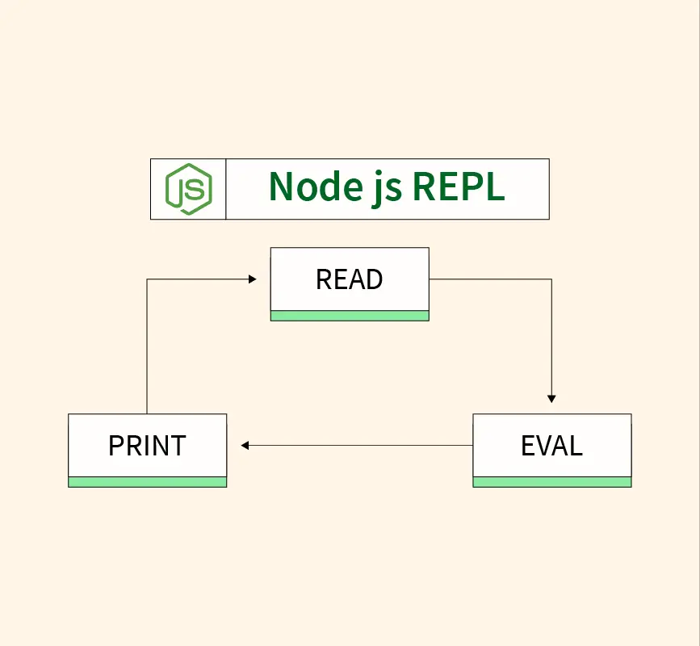
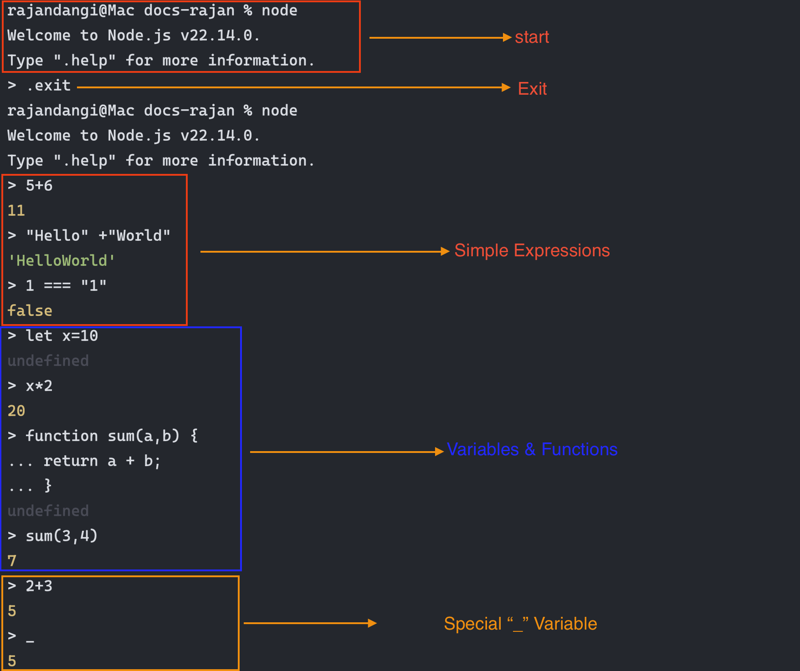

# Node.js REPL: Read, Evaluate, Print, Loop

Ever needed to prototype or debug JavaScript without creating files? The Node.js REPL lets you:

- Instantly run snippets  
- Explore APIs interactively  
- Debug in real time  

It operates in four steps:

1. **Read** your input  
2. **Evaluate** the code  
3. **Print** the result  
4. **Loop** back for more  

{loading="lazy"}


!!! note "Prerequisites"
    - Node.js installed  

## Getting Started

### Start & Exit

```bash
$ node
```

You'll see:
```text
Welcome to Node.js v22.14.0.
Type ".help" for more information.
>
```

Exit by:

- `.exit`
- Ctrl+D (once)
- Ctrl+C (twice)

### Try Simple Expressions

```js
> 5 + 6
11
> "Hello" + " World"
'Hello World'
> 1 === "1"
false
```

### Variables & Functions

```js
> let x = 10
undefined
> x * 2
20

> function sum(a, b) {
...   return a + b;
... }
undefined
> sum(3, 4)
7
```

### Special “_” Variable

The underscore `_` stores the last result:

```js
> 2 + 3
5
> _
5
```

### Multi‑line Mode

When you enter an incomplete statement, REPL switches to multi‑line:

```js
> if (true) {
...   console.log('Hi');
... }
Hi
```

{loading="lazy"}

## REPL Shortcuts & Commands

Shortcuts:

- Up/Down arrows: Browse history  
- Tab: Auto‑complete  
- Ctrl+C: Cancel current input  
- Ctrl+D: Exit  

Built‑in commands (start with `.`):

| Command      | Description                        |
|--------------|------------------------------------|
| .help        | Show help                          |
| .break/.clear| Abort multi‑line input             |
| .editor      | Enter editor mode                  |
| .save <file> | Save session to `<file>`           |
| .load <file> | Load and run `<file>`              |
| .exit        | Exit REPL                          |

#### Save & Load Example

```js
> let a = 5, b = 10
> .save session.js
Session saved to: session.js
```

In a new session:
```bash
$ node
> .load session.js
```

## Summary

- Launch with `node`.  
- Use REPL for quick feedback.  
- Leverage `.help`, `.save`, `.load`.  
- Navigate with arrows and Tab.  
- Harness `_` for the last result.  

---

# Global Objects in Node.js

## What Is the Global Object?

In JavaScript, the global object holds values available everywhere.  
- Browsers: `window`  
- Node.js: `global` or standardized [`globalThis`](https://developer.mozilla.org/en-US/docs/Web/JavaScript/Reference/Global_Objects/globalThis#description)

## Browser vs. Node.js

Browser:
```js
window === this          // true
window.setTimeout === setTimeout // true
```

Node.js:
```js
global.setTimeout === setTimeout // true
this                              // {} (module scope)
globalThis === global            // true
```

## Common Globals in Node.js

```javascript linenums="1" 
// Timers
setTimeout(fn, ms)
setInterval(fn, ms)
clearTimeout(id)

// Console
console.log()
console.error()
console.time(label); console.timeEnd(label)

// Buffer
const buf = Buffer.from('hello')

// Process
process.env
process.argv
process.cwd()
process.exit(0)

// Module info
__dirname
__filename
```

## Module Scope vs. Global Scope

Each file is its own module. Top‑level `let`, `const`, or `var` stay local:

```javascript linenums="1" title="moduleA.js"
// moduleA.js
const local = 'module-only';
global.globalVar = 'truly global';
```

```javascript linenums="1" title="anotherFile.js"
console.log(local);       // ReferenceError
console.log(globalVar);   // 'truly global'
```

To share, attach to `global` or export via `module.exports`.

## Using [globalThis](https://developer.mozilla.org/en-US/docs/Web/JavaScript/Reference/Global_Objects/globalThis#description)

`globalThis` works uniformly across environments:

```js
globalThis.myValue = 42;
console.log(globalThis.myValue); // 42
```

## Best Practices

- Avoid polluting the global namespace.  
- Prefer module exports/imports over globals.  
- Use `process.env` for configuration.  
- Reserve globals for universal utilities (e.g., polyfills).
