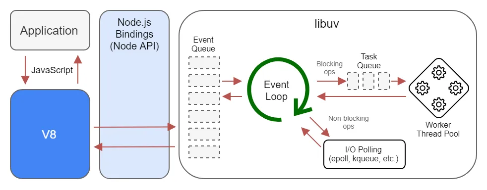
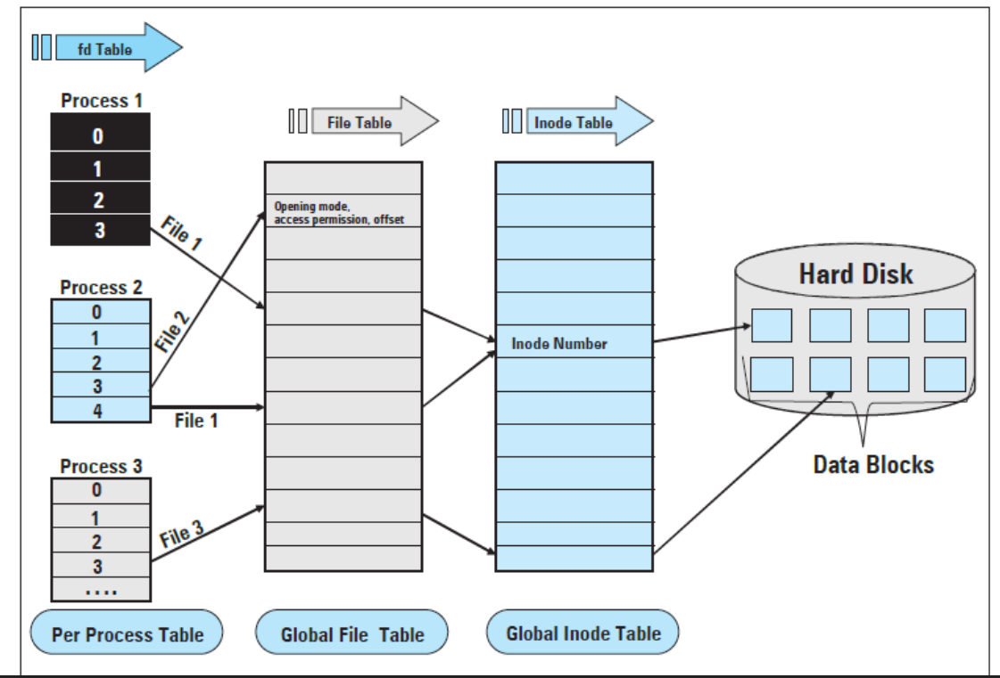

# Thread pool in libuv

Many developers know Node.js as {++JavaScript on the server.++} But have you ever wondered:

- what truly powers its asynchronous nature :question:
- Is Node.js single-threaded or multi-threaded :question:

You might hear conflicting answers, and surprisingly, both can be right :thinking: ! This section aims to clarify these notions, diving deep into the Node.js core to uncover how it's implemented and how it really works. About 30% of Node.js is C++, and we're going to explore what that C++ part, primarily libuv, actually does.

## The Core Trio: V8, Libuv, and C++ APIs

At its heart, Node.js combines:



*   **V8 Engine**: Google's high-performance JavaScript engine that executes your JS code.
*   **Libuv**: A C library that provides the event loop, asynchronous I/O operations (like file system access, networking), and a thread pool. This is where much of the C++ magic happens.
*   **C++ APIs**: These bridge V8 and Libuv, allowing your JavaScript code to interact with system-level operations.

When your JavaScript code runs a synchronous method, it typically executes on the main thread where the V8 instance and the event loop reside. However, for asynchronous operations, the story gets more interesting. :thinking:

## Understanding the Libuv Thread Pool

Whenever there's an asynchronous task that can't be handled directly by the OS kernel's non-blocking mechanisms (like some networking operations), V8 offloads it to libuv. Libuv, in turn, often utilizes its thread pool.

### What is the Thread Pool?
The thread pool is a pre-allocated set of threads managed by libuv. These threads are used to perform {++computationally intensive or blocking operations without blocking the main Node.js thread++} (and thus the event loop).

For example, when reading a file:

1.  The file system (`fs`) call is assigned to a thread in the pool.
2.  That thread makes a request to the operating system (OS).
3.  While the file is being read, this specific thread in the pool is occupied.
4.  Once file reading is complete, the thread is freed up and becomes available for other tasks.

### When Does Libuv Use the Thread Pool?
Libuv uses the thread pool for tasks like:

*   File System (`fs`) operations (unless they are synchronous versions).
*   DNS lookups (e.g., `dns.lookup()`).
*   Certain cryptographic methods (like those in the `crypto` module).
*   Some third-party C++ addons.

### Thread Pool Size and Customization
By default, the libuv thread pool in Node.js has {++4 threads++}.

```javascript
UV_THREADPOOL_SIZE=4
```
Suppose you make 5 simultaneous file reading calls. Four calls will occupy the four threads, and the fifth call will wait until one of the threads becomes free.

**Can we change the size of the thread pool?**

Yes! You can adjust it by setting the `UV_THREADPOOL_SIZE` environment variable before starting Node.js process:

```bash
UV_THREADPOOL_SIZE=8 node your_script.js
```
Or, we can set it from within your Node.js code (this must be done before the thread pool is actively used for the first time):

```javascript
process.env.UV_THREADPOOL_SIZE = 8;
```

If our application involves heavy file handling or other thread pool-bound tasks, increasing this size might improve performance. However, more threads also mean more memory and CPU context switching, so benchmark to find the optimal size for your workload.

## :question: Node.js: Single-Threaded or Multi-Threaded Revisited

So, back to the big question:

!!! question "Is Node.js single-threaded or multi-threaded?"

*   If you're strictly talking about your **JavaScript code execution context**, Node.js primarily operates on a **single main thread**. This is where the event loop runs.
*   However, when dealing with asynchronous I/O or CPU-intensive tasks that libuv offloads to its **thread pool**, Node.js effectively utilizes **multiple threads** behind the scenes.

So, the answer truly is: {++It depends on what part you're looking at!++} Node.js gives you a single-threaded programming model for simplicity, but leverages threads internally for efficiency.

### The Power of Asynchronous Operations: A Crypto Example

Consider CPU-intensive operations like `crypto.pbkdf2()`. If you run multiple synchronous calls to `pbkdf2()`, they will execute one after another on the main thread. However, if you use the asynchronous version, libuv can distribute these calls across its thread pool.

This demonstrates how Node.js can run things in parallel for you if you give it a chance by using asynchronous methods.

Here's an example where we set the thread pool size to 2 and make four `pbkdf2` calls:

```javascript linenums="1"
const crypto = require('crypto');

process.env.UV_THREADPOOL_SIZE = 2;

crypto.pbkdf2("password", "salt", 5000000, 50, "sha512", (err, key) => {
  console.log("1-" + key.toString("hex"));
})

crypto.pbkdf2("password", "salt", 5000000, 50, "sha512", (err, key) => {
  console.log("2-" + key.toString("hex"));
})

crypto.pbkdf2("password", "salt", 5000000, 50, "sha512", (err, key) => {
  console.log("3-" + key.toString("hex"));
})

crypto.pbkdf2("password", "salt", 5000000, 50, "sha512", (err, key) => {
  console.log("4-" + key.toString("hex"));
})
```

You'd observe that roughly two operations complete, then the next two, due to the limited thread pool size (actual behavior also depends on CPU cores and scheduling).

If we run with the default thread pool size (or comment out the `UV_THREADPOOL_SIZE` line), more operations can be processed concurrently by libuv's threads:

```javascript linenums="1" hl_lines="3"
const crypto = require('crypto');

// process.env.UV_THREADPOOL_SIZE = 2;

crypto.pbkdf2("password", "salt", 5000000, 50, "sha512", (err, key) => {
  console.log("1-" + key.toString("hex"));
})

crypto.pbkdf2("password", "salt", 5000000, 50, "sha512", (err, key) => {
  console.log("2-" + key.toString("hex"));
})

crypto.pbkdf2("password", "salt", 5000000, 50, "sha512", (err, key) => {
  console.log("3-" + key.toString("hex"));
})

crypto.pbkdf2("password", "salt", 5000000, 50, "sha512", (err, key) => {
  console.log("4-" + key.toString("hex"));
})
```

You'll see that all four operations can complete in parallel, demonstrating the power of asynchronous programming in Node.js.

## Networking in Node.js: Beyond the Thread Pool

You might ask:

{++ If I have a server with many incoming API requests, do these network operations use the thread pool? ++}

**Generally, no.**

Libuv handles networking tasks differently. It uses sockets for network communication. While creating a separate thread for each incoming connection (a `thread-per-connection` model) is a traditional approach, it doesn't scale well for thousands of concurrent connections.

```c title="Traditional (simplified) thread-per-connection concept"
int server = socket();
bind(server, 8080);
listen(server);

while(int conn = accept(server)) {
  // Create a new thread to handle this connection
  pthread_create(handle_connection_function, conn);
}

void handle_connection_function(int conn) {
  char buf[4096];
  while(int size = read(conn, buf, sizeof buf)) {
    write(conn, buf, size);
  }
}
```

This simplified C-like pseudocode illustrates the idea. Creating a thread for every connection is resource-intensive.

{==

Instead, Node.js (via libuv) leverages efficient, non-blocking, event-driven mechanisms provided by the OS, such as:

*   **`epoll`** (on Linux)
*   **`kqueue`** (on macOS and other BSD systems)
*   **IOCP** (Input/Output Completion Ports on Windows)

These mechanisms allow a single thread (the main event loop thread) to monitor many network sockets (file descriptors) for activity (e.g., new connection, data received). The OS kernel notifies libuv of any events, and libuv then processes them. This allows Node.js to handle a large number of concurrent connections efficiently without needing a thread per connection.

==}

## Key Asynchronous Concepts in Node.js

To better grasp how Node.js manages all this, let's touch upon a few core concepts:

### File Descriptors (FDs) and Socket Descriptors
Integral to Unix-like systems (Linux, macOS), File Descriptors are small integers that the OS uses to identify open files, sockets, or other I/O resources. Socket descriptors are a specific type of FD for network connections. Work in Unix is often based around these descriptors. A `socket()` system call returns such a descriptor. These descriptors point to objects in the Kernel with a virtual "interface" (read/write/poll/close/etc.).



### Event Emitters
A cornerstone of Node.js for handling asynchronous events. The `EventEmitter` class (from the `events` module) allows objects to emit named events that other parts of the application can listen to and react accordingly.

*   **Creating:** Instantiate `EventEmitter`, use `on()` to register listeners.
*   **Emitting:** Use `emit()` to trigger events, passing data.
*   **Handling:** Listener functions execute when their event is emitted.

### Streams
Objects that facilitate reading from or writing to a data source continuously. Streams are excellent for handling large data sets efficiently (e.g., reading large files, network data transfer) without loading everything into memory at once.

### Buffers
Used for handling binary data. `Buffer` objects provide a way to work with raw memory allocations, essential for operations like file I/O and network communications.

### Pipes
A powerful Node.js feature for managing data flow between streams. Pipes simplify connecting a readable stream to a writable stream (`readable.pipe(writable)`), enabling efficient data processing pipelines. For tasks that use the thread pool (like `fs`), if they need to signal the event loop, pipes can be used internally. A thread writes to one end of the pipe, and the other end is watched by `epoll` (or similar) in the event loop.

## The Event Loop: Orchestrating Asynchronous Operations

What exactly is this event loop? It's the heart of Node.js's non-blocking I/O model.
Essentially, the event loop is an infinite loop that:

1.  Checks for pending asynchronous operations (timers, I/O events, etc.).
2.  Executes their callbacks once the operations are complete.
3.  Offloads operations to the system kernel (for most network I/O) or to the libuv thread pool (for `fs`, some `dns`, `crypto`, etc.) whenever possible.

It continuously polls the OS (using mechanisms like `epoll` or `kqueue`) for new events. When an event occurs (e.g., data received on a socket, file read completed), the event loop takes the corresponding callback and queues it to be executed. This is why Node.js is called "event-driven."

One iteration of the Node.js event loop is called a **tick**, and it has several distinct phases (e.g., timers, I/O callbacks, `setImmediate`, close callbacks). You can find more details in the [official Node.js documentation on the Event Loop, Timers, and `process.nextTick()`](https://nodejs.org/en/docs/guides/event-loop-timers-and-nexttick/).

## Beyond the Main Thread: `worker_threads`

Since Node.js v10.5.0, the `worker_threads` module allows you to use threads that execute JavaScript in parallel. To access it:

```javascript
const { Worker } = require('worker_threads');
```
Workers are useful for CPU-intensive JavaScript operations, not so much for I/O-intensive work where Node.js's built-in asynchronous I/O operations are generally more efficient. Unlike `child_process` or `cluster`, `worker_threads` can share memory by transferring `ArrayBuffer` instances or sharing `SharedArrayBuffer` instances. For more details, refer to the [official `worker_threads` documentation](https://nodejs.org/api/worker_threads.html).

## Understanding Processes and Threads

To fully appreciate Node.js's model, it's helpful to distinguish between processes and threads:

*   **Process**: A top-level execution container with its own dedicated memory system. Communication between processes (Inter-Process Communication or IPC) typically requires mechanisms like system sockets and data serialization (e.g., `JSON.stringify`), which can be slower.
*   **Thread**: The smallest sequence of programmed instructions managed independently by a scheduler. Threads run within a process and share the same memory space. This makes communication between threads very fast (e.g., accessing a global variable). However, shared memory introduces complexities like race conditions, where the outcome depends on the non-deterministic order of operations between threads.

Node.js's main JavaScript execution is single-threaded to avoid these complexities in user code, while libuv uses threads internally for performance.

## Which APIs Use What?

Here's a simplified breakdown of how different functionalities map to libuv's mechanisms:

**Primarily Handled by OS Kernel (via `epoll`, `kqueue`, IOCP, etc., managed by the Event Loop):**

*   TCP/UDP Servers and clients (networking)
*   Pipes (for inter-process communication and internal signaling)
*   `dns.resolve()` (uses system facilities, often non-blocking)
*   Child processes (`child_process` module: `exec`, `spawn`)
*   TTY input (console interactions)

**Primarily Handled by Libuv's Thread Pool:**

*   File System operations (`fs.*`, unless they are synchronous)
*   `dns.lookup()` (can be blocking, so often uses thread pool)
*   CPU-intensive `crypto` functions (like `crypto.pbkdf2` asynchronous version)
*   Some third-party native addons.

The event loop acts as a central dispatcher, routing requests to C++ APIs (which might use the thread pool or OS kernel) and sending results back to your JavaScript callbacks.

## Conclusion

Node.js is more than just {++JavaScript on the server.++} Its power comes from a sophisticated architecture involving the V8 engine, the C++ library libuv, and a clever event-driven, non-blocking I/O model. While your JavaScript code runs in a single main thread, Node.js efficiently handles concurrency by offloading operations to the OS kernel or libuv's internal thread pool. Understanding these core mechanics allows you to write more performant and scalable Node.js applications. So, next time someone asks if Node.js is single-threaded or multi-threaded, you can confidently say, "It's complicated, but in a good way!"

## Further Reading
- [Node.js Event loop architecture (Medium Article by the original author)](https://medium.com/preezma/node-js-event-loop-architecture-go-deeper-node-core-c96b4cec7aa4)

