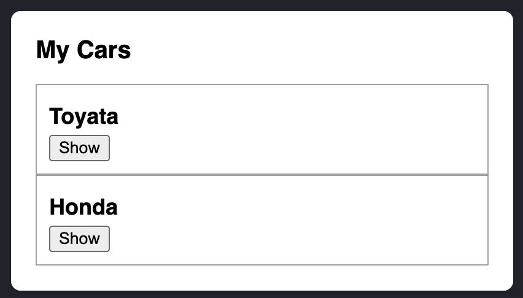

# 11 - Data is the New Oil

## 🛠️ Higher-Order Components (HOC) 🛠️

A **higher-order component (HOC)** is a function that takes a component and returns a new component.
```javascript
const EnhancedComponent = higherOrderComponent(WrappedComponent);
```

While a **component transforms props into UI**, a **HOC transforms a component into another component**.

It takes a component as input, enhances it by adding features, and returns the enhanced component.

🌟 **Key Points:**
- HOCs are **pure functions** because they don’t change the existing behavior of the input component.

---

### 💡 Example of HOC:

```jsx
// This is our higher component
function withLoadingSpinner(WrappedComponent) {
  return function EnhancedComponent({ isLoading, ...props }) {
    if (isLoading) {
      return <div>Loading... ⏳</div>;
    }
    return <WrappedComponent {...props} />;
  };
}

// This is a simple component that we will enhance with out HOC
const MyComponent = ({ data }) => <div>{data}</div>;

// Usage: Create a new component by applying HOC
const EnhancedComponent = withLoadingSpinner(MyComponent);

// Render
<EnhancedComponent isLoading={true} data="Hello, World!" />;
```

In this example, the `withLoadingSpinner` HOC adds a loading spinner feature to any component.


## 🔄 Sharing State Between Components

Sometimes, you want two components to share and update the same state. To achieve this, remove the state from both components, move it to their closest common parent, and pass it down via props. This process is called **lifting state up** and is common in React development.

## 📚 You Will Learn

- How to share state between components by lifting it up
- What are controlled and uncontrolled components

## 🛠️ Lifting State Up by Example

Consider a parent `Accordion` component that renders two `Panel` components:

- **Accordion**
  - **Panel**
  - **Panel**

Each `Panel` has an `isActive` state to determine if its content is visible.

### Original Implementation

Each `Panel` manages its own `isActive` state independently.

```jsx
import { useState } from 'react';

function Panel({ title, children }) {
  const [isActive, setIsActive] = useState(false);
  return (
    <section className="panel">
      <h3>{title}</h3>
      {isActive ? (
        <p>{children}</p>
      ) : (
        <button onClick={() => setIsActive(true)}>Show</button>
      )}
    </section>
  );
}

export default function Accordion() {
  return (
    <>
      <h2>My Cars</h2>
      <Panel title="Toyota">
        Toyota is a reliable car brand known for its durability and efficiency.
      </Panel>
      <Panel title="Honda">
        Honda offers a range of vehicles that are both stylish and economical.
      </Panel>
    </>
  );
}
```



**Behavior:** Clicking "Show" on one panel doesn't affect the other; they operate independently.

## 📈 To coordinate these two panels, you need to “lift their state up” to a parent component

To ensure only one panel is open at a time, follow these steps:

### 1. Remove State from Child Components

Move the `isActive` state to the `Accordion` parent component.


### 2. Pass Props from the Common Parent

Let `Accordion` control the `isActive` state for each `Panel`.

### 3. Add State to the Parent

Manage which panel is active in `Accordion` and pass handlers to `Panel`.

```jsx
import { useState } from 'react';

export default function Accordion() {
  const [activeIndex, setActiveIndex] = useState(0);
  return (
    <>
      <h2>My Cars</h2>
      <Panel
        title="Toyota"
        isActive={activeIndex === 0}
        onShow={() => setActiveIndex(0)}
      >
        Toyota is a reliable car brand known for its durability and efficiency.
      </Panel>
      <Panel
        title="Honda"
        isActive={activeIndex === 1}
        onShow={() => setActiveIndex(1)}
      >
        Honda offers a range of vehicles that are both stylish and economical.
      </Panel>
    </>
  );
}

function Panel({ title, children, isActive, onShow }) {
  return (
    <section className="panel">
      <h3>{title}</h3>
      {isActive ? (
        <p>{children}</p>
      ) : (
        <button onClick={onShow}>Show</button>
      )}
    </section>
  );
}
```

**Result:** Only one panel can be active at a time. Clicking "Show" on one panel closes the other.

## 🔍 Deep Dive

### 🎛️ Controlled vs. Uncontrolled Components

- **Uncontrolled Components:** Manage their own state internally. Example: Original `Panel` with local `isActive` state.

- **Controlled Components:** Receive state via props and rely on parent components for state management. Example: Final `Panel` controlled by `Accordion`.

**Pros:**
- **Uncontrolled:** Easier to use with less setup.
- **Controlled:** More flexibility and coordination between components.

### 🏛️ Single Source of Truth

In React, each piece of state should be owned by a single component. This component is the **single source of truth**. Instead of duplicating state across components, lift it up to a common parent and pass it down as needed.

**Benefits:**
- Consistent and predictable state management.
- Easier to debug and maintain.

## 📝 Recap

- When you want to coordinate two components, move their state to their common parent.
- Then pass the information down through **props** from their common parent.
- Finally, pass the **event handlers** down so that the children can change the parent’s state.
- **Controlled vs. Uncontrolled:** Decide which state is managed internally and which is controlled by parents.
- **Single Source of Truth:** Ensure each state piece is owned by one component.


!!! info
    By lifting state up, you create more manageable and predictable React applications. [Learn more on React Docs](https://react.dev/learn/sharing-state-between-components#controlled-and-uncontrolled-components)

## Passing Data Deeply with Context 🌐

In React, **props** are the primary way to pass data from a parent component to a child component. But passing props can become verbose and inconvenient if you have to pass them through many components in the middle, or if many components in your app need the same information. React's **Context API** solves this problem by allowing you to share data across the component tree without explicitly passing props at every level.

### The Problem with Passing Props 📜
While passing props is a straightforward way to transfer data, it becomes **verbose and inconvenient** when:

- **Data needs to be passed deeply** through many components.
- **Multiple components** require the same piece of data.

This leads to **prop drilling**, where intermediary components pass props they don't use, cluttering the code and making maintenance difficult.

### What is Prop Drilling? 🕳️

**Prop drilling** refers to passing props through several levels of nested components to reach a deeply nested child. Here's a simple example:

```jsx
// Top-level component
function App() {
  const data = "Hello, prop drilling!";
  return (
    <div>
      <ParentComponent data={data} />
    </div>
  );
}

// Intermediate component
function ParentComponent({ data }) {
  return (
    <div>
      <ChildComponent data={data} />
    </div>
  );
}

// Deeply nested component
function ChildComponent({ data }) {
  return <div>{data}</div>;
}
```

In this example, `data` is passed from `App` to `ChildComponent` through `ParentComponent`, even though `ParentComponent` doesn't use `data` itself.

### Solution: React's Context API 🌟

React's **Context API** provides a way to share data between components without having to explicitly pass props through every level of the tree.

#### Example Scenario: A User Authentication System

Imagine you’re building an app where you need to display the authenticated user’s information (like their name and email) in multiple components. Without context, you’d have to pass the user data through every component, even if some of them don’t use it. With context, you can make the user data available to any component in the tree, no matter how deeply nested.

### Step-by-Step Implementation

#### 1. **Create a Context**
First, you need to create a context to hold the user data. Think of this as a "box" where you can store the data and make it accessible to any component.

```javascript
import { createContext } from 'react';

// Create a context for the user data
export const UserContext = createContext(null);
```

- `UserContext` is the "box" where the user data will be stored.
- `createContext(null)` initializes the context with a default value of `null`.

#### 2. **Provide the Context**
Next, you need to "provide" the context to the component tree. This is done using the `Provider` component. Any component inside the `Provider` can access the context.

```javascript
import { UserContext } from './UserContext';

export default function App() {
  // Simulate user data (e.g., fetched from an API)
  const user = { name: 'John Doe', email: 'john.doe@example.com' };

  return (
    // Wrap the component tree with the UserContext.Provider
    <UserContext.Provider value={user}>
      <Dashboard />
    </UserContext.Provider>
  );
}
```

- `UserContext.Provider` makes the `user` data available to all components inside it.
- The `value` prop is where you pass the data you want to share (in this case, the `user` object).

#### 3. **Consume the Context**
Now, any component inside the `Provider` can access the `user` data using the `useContext` hook.

```javascript
import { useContext } from 'react';
import { UserContext } from './UserContext';

function Profile() {
  // Access the user data from the context
  const user = useContext(UserContext);

  return (
    <div>
      <h1>Welcome, {user.name}!</h1>
      <p>Email: {user.email}</p>
    </div>
  );
}

function Dashboard() {
  return (
    <div>
      <h2>Dashboard</h2>
      <Profile />
      {/* Other components can also access the context */}
    </div>
  );
}
```

- `useContext(UserContext)` retrieves the `user` data from the context.
- The `Profile` component can now display the user’s name and email without needing to receive it as a prop.

### How It Works

1. **Create Context:** A "box" (`UserContext`) is created to hold the user data.
2. **Provide Context:** The `App` component wraps its children with `UserContext.Provider` and passes the `user` data as the `value`.
3. **Consume Context:** The `Profile` component accesses the `user` data using `useContext(UserContext)` and displays it.

### How Context API Solves Prop Drilling 🛠️

1. **Create a Context**: Define a context with a default value.
2. **Provide Context**: Use a Context Provider to pass the current value to the tree below.
3. **Consume Context**: Any component within the tree can access the context value directly.


### Benefits of Using Context

- **Avoids Prop Drilling:** You don’t need to pass the `user` data through every intermediate component.
- **Cleaner Code:** Components only receive the data they need, making the code easier to read and maintain.
- **Flexibility:** Context can be used for various purposes, such as theming, authentication, or localization.

### When to Use Context

- **Global Data:** Use context for data that needs to be accessed by many components (e.g., user authentication, theme preferences).
- **Avoid Overuse:** Don’t use context for data that only a few components need. In such cases, passing props or lifting state up might be a better option.

## Alternatives to Context 🔄

Before using Context, consider:

1. **Passing Props**: Clear and straightforward for small data needs.
2. **Component Composition**: Break down components and pass only necessary data.
3. **State Management Libraries**: Tools like Redux or zustand for complex state needs.


## Recap 📝
- Context lets a component provide some information to the entire tree below it.
- To pass context:
  1. Create and export it with `export const MyContext = createContext(defaultValue)`.
  2. Pass it to the `useContext(MyContext)` Hook to read it in any child component, no matter how deep.
  3. Wrap children into `<MyContext.Provider value={...}>` to provide it from a parent.
- Context passes through any components in the middle.
- Context lets you write components that “adapt to their surroundings”.
- Before you use context, try passing props or passing JSX as `children`.

---
## ❓ What are Context Provider and Context Consumer?

In React, the **Context API** allows you to pass data through the component tree without manually passing props at every level. The two main components of the Context API are the **Context Provider** and **Context Consumer**.

### 🚀 Context Provider

The **Context Provider** is a component that lets its children subscribe to context changes. It accepts a `value` prop, which is the data shared with descendant components. You create a Provider using `React.createContext()` and include it in your component tree to provide data to its descendants.

**Example:**

```javascript
// Creating a context
const MyContext = React.createContext();

// Parent component serving as the provider
class MyProvider extends React.Component {
  state = {
    data: "Hello from Context!",
  };

  render() {
    return (
      <MyContext.Provider value={this.state.data}>
        {this.props.children}
      </MyContext.Provider>
    );
  }
}
```

### 👥 Context Consumer

The **Context Consumer** subscribes to context changes from the nearest Provider ancestor. It allows components to access context data without prop drilling. The Consumer uses a function as its child, receiving the current context value as an argument.

**Example:**

```javascript
// Child component consuming the context
class MyConsumerComponent extends React.Component {
  render() {
    return (
      <MyContext.Consumer>
        {(contextData) => <p>{contextData}</p>}
      </MyContext.Consumer>
    );
  }
}
```

By using the Context Provider and Consumer, you can avoid prop drilling and easily share global state across different parts of your React application. This is especially useful for passing data to deeply nested components without explicitly passing props through each intermediate component.

## ❓ If we don't pass a value to the provider, does it take the default value?

**Yes.** If you don't pass a `value` to the Provider in React's Context API, it uses the default value specified when creating the context with `React.createContext(defaultValue)`.

**Example:**

```javascript
// Creating a context with a default value
const MyContext = React.createContext("Default Value");

// Parent component serving as the provider without providing a value
class MyProvider extends React.Component {
  render() {
    return (
      <MyContext.Provider>
        {this.props.children}
      </MyContext.Provider>
    );
  }
}
```

In this example, if no `value` is provided to `MyContext.Provider`, it will use the default value `"Default Value"`. Any component that consumes this context using `MyContext.Consumer` will receive the default value if there is no Provider higher up in the tree supplying a different value.