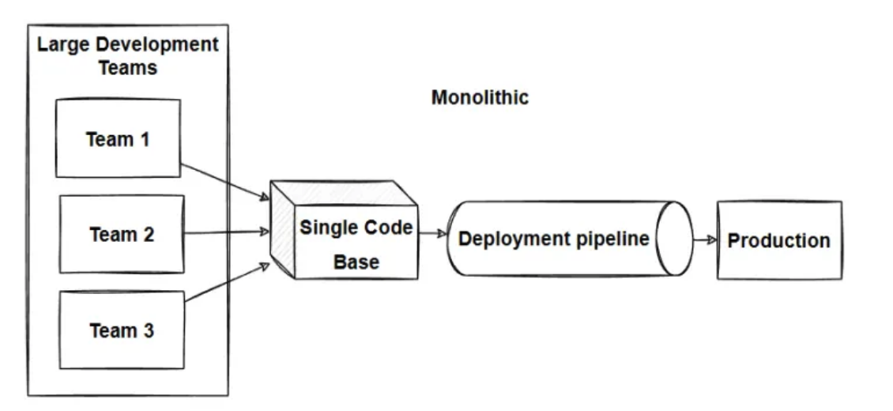
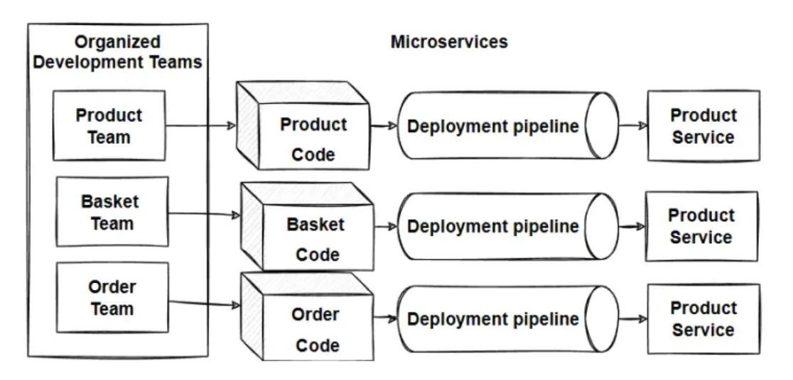
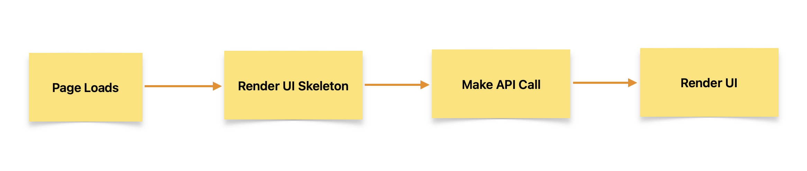

# 06 - Exploring the World

## Q1: What Are Monolithic and Microservices Architectures?

Understanding **Monolithic** and **Microservices** architectures is essential in software development. Let's break them down:

#### Monolithic Architecture

Traditionally, applications were built as a single large project where all components—APIs, user interface, database connections, authentication, and notification services—resided in one codebase.



**Drawbacks:**

- **Size and Complexity:** Becomes too large and hard to manage.
- **Slow Startup:** Large size can slow down startup time.
- **Full Deployment:** Every update requires redeploying the entire application.
- **Limited Change Understanding:** Changes can have wide impacts, requiring extensive testing.
- **Deployment Challenges:** Difficult to implement continuous deployment.
- **Scaling Issues:** Conflicting resource needs make scaling hard.
- **Reliability:** A bug in one module can crash the entire application.
- **Technology Adoption:** Changing frameworks or languages is costly and time-consuming.

#### Microservices Architecture

Instead of a single application, **Microservices** split the system into smaller, interconnected services. Each service handles a specific task, such as user accounts or payments, with its own business logic and tools. Services communicate via REST, messaging, or other methods and can have their own interfaces.



**Benefits:**

- **Simpler Development:** Breaks down complex applications into manageable services.
- **Independent Teams:** Teams can develop services independently.
- **Technology Flexibility:** Choose the best technology for each service.
- **Continuous Deployment:** Allows independent deployment of services.
- **Scalability:** Scale each service independently for efficient resource use.
- **Separation of Concerns:** Keeps architecture organized and manageable.
- **Single Responsibility:** Each service has a specific job, ensuring focused development.

## Q2: Why Microservices?

Breaking down applications into microservices allows for faster and smarter work. Services can be updated or replaced independently without causing disruptions, much like a well-oiled machine where each part functions perfectly.


## Fetching Data from an API

There are two approaches to fetching data from an API:

#### 1. Load and Render


  1. As soon as the page loads, initiate an API call.
  2. Once the API response is received, populate the data and render the UI.

#### 2. Render First, Fetch Later



  1. As soon as the page loads, display the UI skeleton.
  2. Make an API call.
  3. Once the API response is received, populate the data and update the UI.

**Note:** In React, we always follow the second approach.


## [Shimmer UI](https://johannes-z.github.io/office-ui-fabric-vue/components/progress/shimmer.html)

Shimmer UI displays placeholder content (i.e skeleton UI) while data is loading, improving user experience by reducing perceived wait times. Instead of a generic "loading" message, a `<Shimmer />` component provides visual feedback during data fetching. This concept is known as **conditional rendering**. This technique complements the **Render First, Fetch Later** approach.

### Integrating Shimmer UI with Render First, Fetch Later

With **Render First, Fetch Later**, the UI skeleton is rendered immediately as soon as page loads, and data is loaded afterward. Shimmer UI enhances this by showing a polished placeholder.

**Steps:**

1. **Page Loads:** Render the UI skeleton using `<Shimmer />`.
2. **Fetch Data:** Make an API call to retrieve data.
3. **Update UI:** Replace shimmer placeholders with the actual data once fetched.

### Example in React

```jsx
import React, { useState, useEffect } from 'react';
import Shimmer from './Shimmer';
import RestaurantList from './RestaurantList';

const App = () => {
  const [restaurants, setRestaurants] = useState([]);

  useEffect(() => {
    fetch('/api/restaurants')
      .then(res => res.json())
      .then(data => setRestaurants(data));
  }, []);

  if (restaurants.length === 0) {
    return <Shimmer />;
  }

  return <RestaurantList restaurants={restaurants} />;
};

export default App;
```

## useEffect() Hook

The `useEffect()` Hook is a function provided by React that allows you to manage side effects in your components. It helps in handling tasks like data fetching, subscriptions, and manually changing the DOM in React components.

#### Importing useEffect

To use `useEffect()`, first import it from React:

```javascript
import { useEffect } from "react";
```

#### Syntax of useEffect

`useEffect()` accepts two arguments:

1. **Callback Function:** The function that contains the side-effect logic.
2. **Dependency Array:** An array of dependencies that determine when the effect should run.

```jsx
useEffect(() => {
  // Side-effect logic here
}, []);
```

#### When Does the Callback Function Get Called?

The callback function inside `useEffect()` is executed **after** the entire component has rendered. For example, if you use `useEffect()` inside a `Body` component, the callback will run once the `Body` component has completed its render cycle. This is ideal for performing actions that need to occur after the component is displayed, such as fetching data.

#### Where to Fetch Data?

Data fetching should be done inside the `useEffect()` Hook using a function like `fetchData()`. This ensures that the data is fetched after the component has rendered, aligning with the **Render First, Fetch Later** approach.

**Example:**

```jsx
import React, { useState, useEffect } from 'react';
import Shimmer from './Shimmer';
import RestaurantList from './RestaurantList';

const Body = () => {
  const [restaurants, setRestaurants] = useState([]);

  useEffect(() => {
    // Function to fetch data
    const fetchData = async () => {
      const response = await fetch('/api/restaurants');
      const data = await response.json();
      setRestaurants(data);
    };

    fetchData();
  }, []); // Empty dependency array ensures this runs once after initial render

  if (restaurants.length === 0) {
    return <Shimmer />;
  }

  return <RestaurantList restaurants={restaurants} />;
};

export default Body;
```

**Explanation:**

1. As soon as Page loads, the `Body` component renders, and `restaurants` is an empty array.
2. After the render, `useEffect()` runs the `fetchData()` function to fetch restaurant data.
3. Once data is fetched, `setRestaurants(data)` updates the state, triggering a re-render.
4. **Conditional Rendering:** If `restaurants` is empty, the `<Shimmer />` component is displayed. After data is loaded, `<RestaurantList />` is rendered with the fetched data.


## [React: Using useState() for Dynamic Buttons](https://www.linkedin.com/pulse/did-alex-know-simple-task-unveils-reacts-state-management-rajan-dangi-idjvc/?trackingId=TwObbjCzQu%2BKfjBS3q4Eyg%3D%3D)

#### Problem: Regular JavaScript Fails to Trigger UI Updates

```jsx
const btnName = "Login";

return (
  <button
    onClick={() => {
      btnName = "Logout";
    }}
  >
    {btnName}
  </button>
);
```

### •	Issue:
Updating btnName doesn’t update the UI because React doesn’t detect changes in regular variables and won’t re-render the component.

### Solution: Use useState()

```jsx
import React, { useState } from 'react';

const Header = () => {
  const [btnLabel, setBtnLabel] = useState("Login");

  return (
    <button
      onClick={() =>
        setBtnLabel(btnLabel === "Login" ? "Logout" : "Login")
      }
    >
      {btnLabel}
    </button>
  );
};
```

### How It Works:

1.	**State Declaration**:  `useState("Login")` initializes `btnLabel` and provides `setBtnLabel` for updates.
2.	**UI Sync**: Updating btnLabel with setBtnLabel triggers a re-render, reflecting changes in the UI.


## What is Optional Chaining?
It is a feature that simplifies accessing properties and methods of nested objects or arrays when intermediate properties may be `null` or `undefined`.

### Example of Optional Chaining

Let's look at a JavaScript example to understand how optional chaining works:

```javascript
const user = {
  name: 'Alice',
  profile: {
    email: 'alice@example.com',
    address: {
      city: 'Wonderland'
    }
  }
};

// Accessing nested properties without optional chaining
const city = user.profile && user.profile.address && user.profile.address.city;
console.log(city); // Outputs: Wonderland

// Accessing nested properties with optional chaining
const cityWithOptional = user.profile?.address?.city;
console.log(cityWithOptional); // Outputs: Wonderland

// Attempting to access a property that doesn't exist
const phone = user.contact?.phone;
console.log(phone); // Outputs: undefined
```

**Explanation:**

1. **Without Optional Chaining:**
    - To safely access `user.profile.address.city`, you need to check each property exists to avoid errors.
    - This results in a longer and more cumbersome code: `user.profile && user.profile.address && user.profile.address.city`.

2. **With Optional Chaining (`?.`):**
    - The `?.` operator simplifies the syntax by automatically checking if the preceding property exists.
    - `user.profile?.address?.city` will return `'Wonderland'` if all properties exist.
    - If any property in the chain is `null` or `undefined`, the entire expression short-circuits and returns `undefined` without throwing an error.

3. **Accessing a Non-Existent Property:**
    - `user.contact?.phone` attempts to access the `phone` property inside `contact`.
    - Since `contact` doesn't exist on `user`, the expression returns `undefined` instead of causing a runtime error.

**Benefits of Using Optional Chaining:**

- Reduces the need for repetitive checks (`&&`) when accessing nested properties.
- Avoids runtime errors when attempting to access properties on `null` or `undefined`.
-  Makes the code easier to read and maintain.

Optional chaining is especially useful when dealing with complex data structures or responses from APIs where certain properties might be missing.
