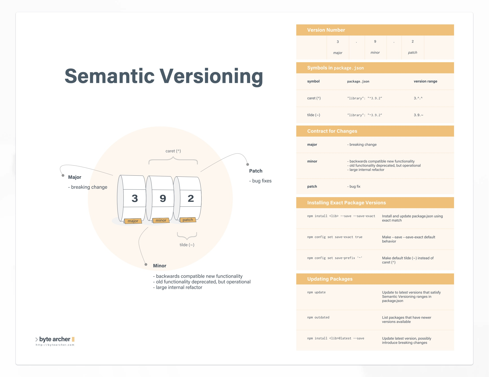

# 02 - Igniting our app

## Difference between NPM and NPX
| NPM                 | NPX                          |
| :-----------------: | :--------------------------: |
| NPM is a package manager used to install, delete, and update JavaScript packages on your machine. | NPX is a package executor that allows you to run JavaScript packages directly without installing them.  |
| NPM installs packages globally, which means your machine may accumulate packages that are no longer needed. | NPX does not install packages, so package pollution on the machine is not a concern. |
| To use `create-react-app` with NPM, you must first install it globally and then run it, which can be redundant. | The most common use of NPX is the `create-react-app` command. Since it is only needed once to initialize the project, it does not require installation. |


## What is a Bundler?

- A JavaScript bundler is a tool that combines your code and all its dependencies into one JavaScript file.
- It is a development tool that merges many JavaScript files into a single, production-ready file that can be loaded in the browser.
- The top 5 bundlers in JavaScript are:
  - Browserify
  - ESbuild
  - Parcel
  - Rollup
  - Webpack

`package.json` is a configuration file for npm. Create React App uses the Webpack bundler behind the scenes.

## Types of Dependencies

There are two types of dependencies in the packages we install:

1. **Dev dependencies**: These are the packages required only during the development phase. They are not needed in the production environment. Examples include testing frameworks, build tools, and transpilers. In `package.json`, they are listed under the `devDependencies` section.

2. **Normal dependencies**: These are the packages required for the application to run in both development and production environments. They are essential for the application to function correctly. In `package.json`, they are listed under the `dependencies` section.

## Caret (^) and Tilde (~) in `package.json`

{ loading=lazy }


## What is the role of the *package-lock.json* file?

- The package-lock.json file in npm serves as a lockfile that captures the exact versions of packages and their dependencies.
- It ensures that the same version of packages is used across different installations or environments.
- This consistency prevents unexpected package versions and helps avoid compatibility issues.
- When you install or update packages using npm, it checks the `package-lock.json` file to ensure the specified versions are installed.
- This lockfile is especially important when collaborating on projects as it guarantees that all contributors use consistent package versions.

## Transitive Dependencies

- When a dependency has its own dependencies, and those dependencies have their own dependencies, it is known as transitive dependencies.
- In a React project, inside the node_modules folder, every dependency folder has its own `package.json` file which contains the dependencies and the description of that dependency.

## Why should we not push the *node_modules* to git or production?

- Node_modules are huge in size.
- If we have `package.json` and `package-lock.json`, we can recreate the `node_modules` anytime.
- This is why it is not recommended to push the `node_modules`.

## Build Our App Using Parcel

To build our app using Parcel, run the following command:

```bash
npx parcel index.html
```

- Parcel is a web application bundler known for its developer-friendly experience.
- When you run `npx parcel index.html`, Parcel performs the following actions:

  - **Development mode (default)**
    - It starts a development server.
    - It serves the `index.html` file and watches for changes in your files.
    - It automatically reloads the browser when it detects changes.

  - **Build mode (with additional options)**
    - If you specify a build option (e.g., `npx parcel build index.html`), Parcel will create an optimized, production-ready bundle.
    - It minifies the code and optimizes assets for better performance.

## Why Should CDN Links Not Be Used to Bring React and React-DOM into the Project?

- **Network Dependency**: Using CDN links requires a network call to bring React into the project.
- **Version Management**: Currently, we use React version 18, which is specified in the CDN link. If React version 19 is released in the future, we will need to update the CDN links.
- **Local Installation**: Installing React using `npm install react` stores React in `node_modules`, avoiding dependency issues.
- **Internet Requirement**: To get React from a CDN link, an internet connection is necessary.

## Browser Scripts Cannot Have Imports/Exports

- **Error on Removal of CDN Links**: When React is installed and CDN links are removed, an error `Uncaught ReferenceError: React is not defined` occurs.
- **Importing React**: This happens because React is installed but not imported into the JavaScript file.
```javascript
import React from 'react';
```
- **Import/Export Error**: Importing React this way results in an error `Browser scripts cannot have imports or exports`.
- **Script Tag Modification**: Since `app.js` is imported in `index.html` using a `<script>` tag, the browser treats it as a normal JavaScript file. To indicate that it is a module, add an extra attribute to the `<script>` tag:
```html
<script type="module" src="./app.js"></script>
```

## HMR (Hot Module Replacement)

- **Functionality**: HMR exchanges, adds, or removes modules while an application is running without a full reload.
- **Development Speed**: This speeds up development by:
  - Retaining the application state, which is lost during a full reload.
  - Saving development time by only updating what has changed.
  - Instantly updating the browser when modifications are made to CSS/JS files, similar to changing styles directly in the browser's dev tools.
- **How It Works**:
  1. The application asks the HMR runtime to check for updates.
  2. The runtime asynchronously downloads the updates and notifies the application.
  3. The application asks the runtime to apply the updates.
  4. The runtime synchronously applies the updates.

## How Does Parcel Know There Are Changes in the File/Code?

- **File Watching Algorithm**: Parcel uses a file-watching algorithm developed in C++.
- **Tracking Changes**: This algorithm keeps track of every file and every change made to a file.

## How Does Parcel Perform Builds So Quickly?

- **Caching**: When the server is started using Parcel for the first time, it creates a folder named `.parcel-cache` in the project.
- **Cache Updates**: Parcel uses caching and updates the cache after every subsequent build.


## What Other Things Does [Parcel](https://parceljs.org) Do?

- **Zero Configuration**: Automatically detects the entry point and handles configuration.
- **Code Splitting**: Supports dynamic imports for optimized loading.
- **Asset Management**: Inlines small assets and handles URL references.
- **Development Server**: Includes a built-in server with live reloading and HMR.
- **Tree Shaking**: Removes unused code to reduce bundle size.
- **Source Maps**: Generates source maps for easier debugging.
- **Environment Variables**: Supports configuration for different environments.
- **Minification**: Automatically minifies CSS and JS in production.
- **TypeScript Support**: Built-in support for TypeScript.
- **Plugin System**: Allows custom plugins for extended functionality.
- **Modern JavaScript**: Integrates with Babel for latest ECMAScript features.
- **PWA Support**: Generates service workers and manifest files.
- **Multi-Target Builds**: Supports building for browsers, Node.js, and Electron.
- **Dependency Management**: Automatically resolves and installs dependencies.

## Removing "main" from package.json

- The `main` field in `package.json` specifies the entry point (e.g., `App.js`)
- Since Parcel handles the entry point through commands, the `main` field is not needed
- Having `main` can cause errors when running `npx parcel build index.html`
- Solution: Simply delete the `main` field from `package.json`

## Making Our App Compatible with Older/Specific Browsers

- To make the app compatible with older/specific browsers, use `browserslist`.
- Add `browserslist` configuration in `package.json`
- Example:
```json
{
"browserslist": [
    "last 2 versions",
    "> 1%"
]
}
```
- Parcel uses `browserslist` from `node_modules` to ensure compatibility.
- **Reference**: Refer to [browserslist.dev](https://browserslist.dev)
