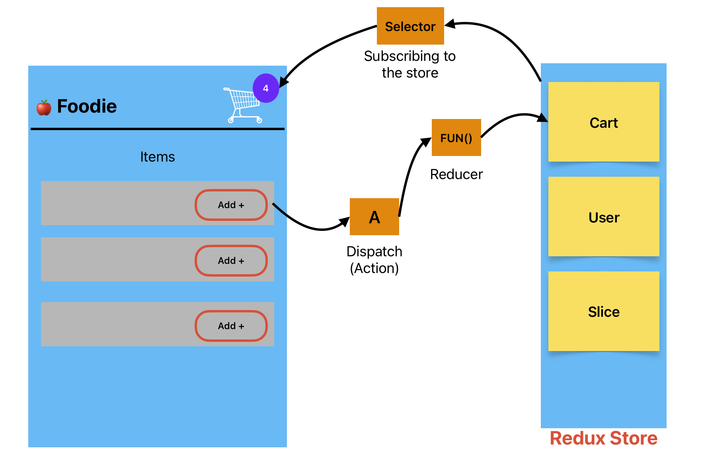

# 12 - Let's Build Our Store

## 💡 What is Redux?

Redux is a **JavaScript library** for managing and centralizing an application's state. The **state** represents the data that determines how a user interface (UI) looks and behaves at any given time. Centralizing the state means storing all of the application's state in a single location, typically called the **Store**, which makes it easier to manage, debug, and maintain. By using Redux, developers can ensure that the state remains consistent and predictable across the entire application, even as it grows in complexity.


!!! abstract "Key Concepts"
    - **State:** Data that controls how the UI looks and behaves.
    - **Centralized Store:** A single source of truth for the entire app’s state.
    - **Predictable Updates:** Ensures that state updates follow strict rules, making debugging easier.

## 🎯 Why Use Redux?

Redux offers several benefits that make it a popular choice for state management:

- ✅ **Predictability:** State changes in a structured and traceable way.
- ✅ **Centralized State:** Keeps all application data in one place, avoiding prop drilling.
- ✅ **Scalability:** Ideal for large apps that require structured state management.
- ✅ **Debugging Tools:** Integrates well with Redux DevTools for debugging.

## 🍔 Example: Redux in a Foodie App

To understand Redux in action, let's consider a food ordering application.

### 📌 Scenario

- **Add Items:** Users can add items to the cart by clicking the "Add +" button.
- **Dynamic Cart Count:** The cart count in the top right corner updates dynamically.
- **State Management:** The Redux store manages the state and updates the UI when changes occur.

### 🖼 Diagram Representation



### 🔄 Step-by-Step Breakdown

1. **Action Dispatch:** Clicking the "ADD" button dispatches an action.
2. **Reducer Function:** The action calls the reducer function associated with the cart slice.
3. **State Modification:** The reducer modifies the cart slice's state in the Redux store.
4. **State Update:** The cart component, subscribed to the store via a selector, updates its cart count dynamically.
5. **UI Re-render:** The component re-renders to reflect the updated state.

### 🛠 Redux Flow in the Foodie App

- `useDispatch()` sends the action (`addItem`) when the button is clicked.
- `useSelector()` fetches the cart count and updates the UI.
- The Redux store manages the state centrally and efficiently.

## 📌 Redux Terminology

Before diving deeper, let's understand some essential Redux concepts:

### 1️⃣ Store

- 🗄️ **Definition:** The centralized location where the entire app’s state is stored.
- 💡 **Think of it as:** A global database for your application.

### 2️⃣ Action

- 📩 **Definition:** A plain JavaScript object describing a change in the state.

  ```javascript
  {
    type: "addItem",
    payload: "Pizza"
  }
  ```

- 💡 **Think of it as:** A request to update the store.

### 3️⃣ Reducer

- 🔄 **Definition:** A pure function that takes the current state and an action and returns a new state.
- 💡 **Think of it as:** A function that tells Redux how to update the state.

### 4️⃣ Dispatch

- 🚀 **Definition:** A method used to send an action to the reducer.
- 💡 **Think of it as:** Clicking a button to tell Redux “Do this!”

### 5️⃣ Selector

- 🎯 **Definition:** A function used to retrieve data from the Redux store.
- 💡 **Think of it as:** A filter that selects the required data from the store.

## 🚀 Setting Up Redux in a React Application

### 📦 Libraries Required

- **React-Redux:** Connects Redux with React components, allowing components to read from the Redux store and dispatch actions. It provides the `Provider` component to make the Redux store available to all components, and hooks like `useSelector` and `useDispatch`.

- **Redux Toolkit:** A set of tools for efficient Redux development, offering a simplified approach to setting up and working with Redux. It addresses major issues associated with Redux:

  - **Complex Store Configuration:** Simplifies setting up a Redux store.
  - **Excessive Packages:** Reduces the need for multiple additional packages.
  - **Boilerplate Code:** Minimizes repetitive code needed for effective Redux usage.

### 🛠️ Installation

Redux Toolkit is available as a package on NPM for use with a module bundler.

```bash
npm install @reduxjs/toolkit
npm install react-redux
```

### 🏗️ Create Redux Store

Use `configureStore` from Redux Toolkit to set up the Redux store. This function automatically includes Redux DevTools integration.

```jsx
import { configureStore } from '@reduxjs/toolkit';

const appStore = configureStore({
  // Add slices here
});

export default appStore;
```

### 🔗 Wrap Your Application with Provider

To make the Redux store accessible to your React components, wrap your root component with the `Provider` component from `react-redux`. Pass the store as a prop to the provider.

**Example:**

```jsx
import { Provider } from 'react-redux';
import appStore from '../utils/appStore.js';

<Provider store={appStore}>
  <App />
</Provider>
```

!!! question "Why is `configureStore` imported from Redux Toolkit and `Provider` from React-Redux?"

!!! answer "Reason"
    `configureStore` is imported from Redux Toolkit because it is used to build the Redux store. On the other hand, `Provider` is imported from React-Redux because it supplies the store to the React application, effectively connecting Redux and React.

### 🍰 Create a Redux Slice

Use `createSlice` from Redux Toolkit to define a slice of the state along with its actions and reducers.

- **Actions:** Payloads of information that send data from your application to the Redux store.
- **Reducers:** Pure functions that specify how the application's state changes in response to actions.

If you don’t understand these concepts right now, don’t worry; you’ll explore them in depth soon.

```jsx
import { createSlice } from "@reduxjs/toolkit";

const cartSlice = createSlice({
  name: 'cart',
  initialState: {
    items: []
  },
  reducers: {
    addItem: (state, action) => {
      state.items.push(action.payload);
    },
  }
});

export const { addItem } = cartSlice.actions;
export default cartSlice.reducer;
```

### 📄 Explanation

The `createSlice` function from `@reduxjs/toolkit` creates a slice of the Redux state with a specific configuration:

- **name:** `'cart'` – This names the slice, useful for debugging and action types.
- **initialState:** `{ items: [] }` – Sets the initial state with an empty `items` array.
- **reducers:** Contains all the reducer functions for this slice.

**Reducers:**

- **addItem:** `(state, action)` – Defines how to add an item to the cart. It takes the current state and an action as parameters and adds the new item (from `action.payload`) to the `items` array.

**Exporting:**

- `export const { addItem } = cartSlice.actions;` – Exports the `addItem` action creator so other parts of the application can dispatch this action.
- `export default cartSlice.reducer;` – Exports the reducer function to be used in the Redux store configuration.

Now your slice is ready to be added to the store.

To add your slice to the store, configure the store with the `configureStore` function, which combines the slice reducers into the main root reducer.

```jsx
import { configureStore } from "@reduxjs/toolkit";
import cartReducer from './cartSlice'; // Adjust the path as needed

const appStore = configureStore({
  reducer: {
    cart: cartReducer, // Adding cart slice reducer to the store
  },
});

export default appStore;
```

## 🔄 Redux Core Concepts

### 🔄 Step 1: Understanding Dispatch in Redux

**Dispatch** is a function provided by Redux that allows you to send actions to the Redux store. These actions are plain JavaScript objects that describe what happened in your application, and the store uses them to update the state via reducer functions.

##### 🔧 How to Import and Use Dispatch

To use `dispatch` in a component, first import `useDispatch` from the `react-redux` library. Then, within your component, call `useDispatch` to get the `dispatch` function and use it to send actions to the Redux store.

```jsx
import { useDispatch } from 'react-redux';
import { addItem } from './cartSlice';

const FoodieComponent = () => {
  const dispatch = useDispatch();

  const handleAddItem = () => {
    dispatch(addItem("pizza"));
  };

  return (
    <div>
      <button onClick={handleAddItem}>ADD | +</button>
    </div>
  );
};

export default FoodieComponent;
```

### 🔄 Step 2: What is a Reducer?

A **reducer** is a pure function in Redux that takes the current state and an action as arguments and returns a new state. It determines how your application's state changes in response to actions dispatched to the store. Each reducer typically manages a specific slice of the application state.

#### 🔧 How to Import and Use a Reducer

This is already covered above when creating a slice and defining reducers within the slice, along with an example.

### 🔍 Step 3: What is a Selector

A **selector** in Redux is a function that extracts specific pieces of data from the Redux store. Selectors are used to read and retrieve state from the store so that components can use this data.

#### 🔧 How to Import

Selectors are used with the `useSelector` hook from the `react-redux` library.

```jsx
import { useSelector } from 'react-redux';

const CartComponent = () => {
  const cartItemsCount = useSelector((state) => state.cart.items.length);

  return (
    <div>
      <h2>Cart Items: {cartItemsCount}</h2>
    </div>
  );
};

export default CartComponent;
```

#### 📄 Explanation

- **useSelector:** This hook is imported from `react-redux` and is used to access the Redux store’s state.
- **state.cart.items.length:** The selector function retrieves the length of the `items` array from the `cart` slice, representing the number of items in the cart. This value is displayed in the `CartComponent`.

This approach allows the `CartComponent` to dynamically update whenever the number of items in the cart changes.

## 📚 Further Reading

- **[Redux Official Documentation](https://redux.js.org/):** For an in-depth look at Redux, including advanced concepts and best practices.
- **[React Redux Guide](https://react-redux.js.org/introduction/quick-start):** Learn how to integrate Redux with React.
- **[Redux Toolkit](https://redux-toolkit.js.org/):** Explore the Redux Toolkit, the official, recommended way to write Redux logic, which simplifies store setup and reduces boilerplate.
- **[Redux Saga and Middleware](https://redux-saga.js.org/):** For managing complex asynchronous logic in Redux, consider looking into Redux Saga and other middleware options.
- **[Scaling Redux Applications](https://redux.js.org/advanced/scaling-reducers):** Learn best practices for scaling Redux to keep your codebase clean and manageable as your applications grow.
- [From Setup to Mastery: Dive into Efficient State Management with Redux Toolkit in React](https://namastedev.com/blog/from-setup-to-mastery-dive-into-efficient-state-management-with-redux-toolkit-in-react/)


---
## 🔘 Understanding `onClick` Handler Syntax in React

When handling click events in React, you have several ways to define the `onClick` handler. Here's a breakdown of the different approaches:

### 1. `onClick={handleAddItem}`

- **Direct Assignment**: This syntax assigns the `handleAddItem` function directly to the `onClick` event.
- **No Arguments**: When the button is clicked, `handleAddItem` is called without any arguments.

### 2. `onClick={() => handleAddItem(item)}`

- **Arrow Function**: Uses an arrow function to call `handleAddItem` with the `item` argument.
- **Passing Arguments**: Useful when you need to pass specific arguments to the `handleAddItem` function upon clicking.
- **Scope Requirement**: Ensure that `item` is defined or in scope when the button is rendered.
- **Contextual Variable**: If `item` is a variable available in the component’s context, it will be passed to `handleAddItem` when clicked.

### 3. `onClick={handleAddItem(item)}`

- **Incorrect Usage**: This syntax is incorrect and won't work as expected.
- **Immediate Invocation**: `handleAddItem(item)` is invoked immediately when the component renders, instead of waiting for the click event.
- **Undefined Assignment**: The return value of `handleAddItem(item)` (typically `undefined` unless it returns another function) is assigned to `onClick`.
- **Proper Usage**: To call `handleAddItem` with an argument when the button is clicked, wrap it in an anonymous function as shown in the second example.

## 🔄 Modern Redux State Management

Managing state in Redux has evolved over time. Here's how it has changed:

### **Older Redux (Vanilla Redux)**

- **Immutable State**: Direct mutation of the state was not allowed.
- **State Copying**: Developers had to create a copy of the state and then modify it.
- **Returning New State**: After modifications, the new state had to be returned explicitly.

### **New Redux with Immer**

- **Simplified Mutations**: Redux now allows direct mutation of the state in reducers.
- **Immer Integration**: Redux uses the [Immer](https://immerjs.github.io/immer/) library under the hood to handle immutable updates.
- **No Need to Return State**: It's no longer mandatory to return the state explicitly, as Immer manages it automatically.
- **Developer Convenience**: This change streamlines the state management process, reducing boilerplate code and potential errors.

---
## 🔄 useContext vs Redux

`useContext` and `Redux` are both tools used for state management in React applications, but they serve different purposes and have different use cases.

### 🎯 useContext

- **Scope**: Part of React core, used for managing state within the component tree. Provides direct access to context values within components and their descendants.
- **Complexity**: Simpler and lightweight, with no additional concepts or boilerplate code.
- **Component Coupling**: State is local to components where context is provided.
- **Integration**: Seamlessly integrates with React and component lifecycle.

### 🔧 Redux

- **Scope**: Global state management library providing centralized state container.
- **Complexity**: Introduces concepts like actions, reducers, and store. More complex but valuable for larger applications.
- **Component Coupling**: Global state accessible by any component.
- **Integration**: Requires separate integration with actions, reducers, and store setup.

### 🤔 When to Use?

**useContext**:
- Small-scale state management needs
- Lightweight solutions needed
- Limited state sharing across components

**Redux**:
- Complex applications with large state
- Predictable state management needed
- Extensive state sharing required
- Middleware for async actions needed

## 💡 Advantages of Redux Toolkit over Redux

1. **Less Boilerplate**: Reduces repetitive code
2. **Easier Async Operations**: Simplified handling with `createAsyncThunk`
3. **Simple Store Setup**: Easy configuration with `configureStore`
4. **Built-in DevTools Support**: Seamless debugging integration
5. **Best Practices**: Follows Redux development standards
6. **Automatic Immutability**: Uses Immer for data handling
7. **Backward Compatibility**: Works with existing Redux code
8. **Faster Development**: Reduced setup time

Redux Toolkit streamlines Redux development by providing essential tools and simplifying common tasks, making it an excellent choice for both new projects and existing applications.