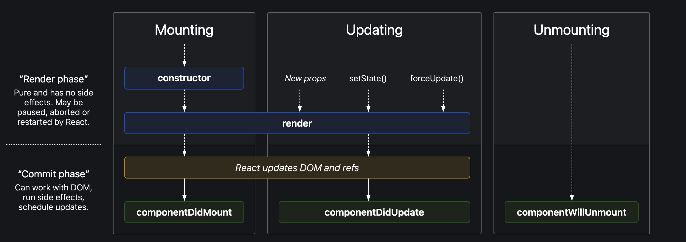

# 08: Let's Get Classy

## Creating Class-Based Components

```jsx
import React from 'react';

class User extends React.Component {
  constructor(props) {
    super(props);
  }

  render() {
    return (
      <div>
        <h1>Hello, {this.props.name}</h1>
      </div>
    );
  }
}

export default User;
```

## Why do we need super(props)?

- `super(props)` allows access to `this.props` in a constructor function.
- The `super()` function calls the constructor of the parent class.
- When we call `super(props)`, we're calling the constructor of `React.Component`.
- `super()` is a reference to the parent class constructor (`React.Component`).
- If we want to use `this.props` or `this` keyword inside the constructor, we need to pass props to `super()`.

**Note:**
- Loading a functional component means invoking/mounting that function.
- Loading a class-based component means creating an instance of the class.

## Creating State Variables in Class-Based Components

```jsx
import React from 'react';

class User extends React.Component {
  constructor(props) {
    super(props);
    this.state = {
      name: 'John',
      age: 25
    };
  }

  render() {
    return (
      <div>
        <h1>Hello, {this.state.name}</h1>
      </div>
    );
  }
}

export default User;
```

### Using Destructuring

```jsx
import React from 'react';

class User extends React.Component {
  constructor(props) {
    super(props);
    this.state = {
      name: 'John',
      age: 25
    };
  }

  render() {
    const { name, age } = this.state;
    return (
      <div>
        <h1>Hello, {name}</h1>
      </div>
    );
  }
}

export default User;
```

## Updating State Variables

```jsx
import React from 'react';

class User extends React.Component {
  constructor(props) {
    super(props);
    this.state = {
      name: 'John',
      age: 25
    };
  }

  updateName = () => {
    this.setState({ name: 'Doe' });
  };

  render() {
    const { name, age } = this.state;
    return (
      <div>
        <h1>Hello, {name}</h1>
        <button onClick={this.updateName}>Update Name</button>
      </div>
    );
  }
}

export default User;
```

**Important Notes:**
- When updating state, React will only modify the specified state variables and preserve others.
- Loading a component means mounting it on a web page.
- When a class-based component loads, the constructor is called first, followed by the render() method.

## React Lifecycle Methods



### Basic Component Structure
```jsx
import React from 'react';

class App extends React.Component {
  constructor(props) {
    super(props);
    console.log('Parent constructor called');
  }

  componentDidMount() {
    console.log('Parent Component did mount');
  }

  render() {
    console.log('Parent Component rendered');
    return (
      <div>
        <h1>Hello, World!</h1>
        <Child />
      </div>
    );
  }
}
```

## Lifecycle Phases

### 1. Mounting Phase (Birth of Component)
Components go through these methods in order:

1. **constructor()**
   - Called first when component initializes
   - Used to set initial state and bind methods
   - Called only once

2. **render()**
   - Required method
   - Returns JSX to display
   - Pure function - should not modify state

3. **componentDidMount()**
   - Called after component is mounted to DOM
   - Perfect for API calls, subscriptions, or DOM manipulations
   - Called only once after first render

### 2. Updating Phase (Growth of Component)
Occurs when props or state changes:

1. **render()**
   - Called whenever there's an update
   - Re-renders component with new changes

2. **componentDidUpdate(prevProps, prevState)**
   - Called after component updates
   - Good for side effects after state/prop changes
   - Can compare previous and current props/state

### 3. Unmounting Phase (Death of Component)
**componentWillUnmount()**
- Called right before component is removed from DOM
- Used for cleanup (removing event listeners, cancelling API calls)
- Last lifecycle method to be called

## Execution Order

### Single Child Component Flow
```
Constructor (Parent)
  → render (Parent)
    → Constructor (Child)
      → render (Child)
        → componentDidMount (Child)
          → componentDidMount (Parent)
```

### Multiple Children Components Flow
```
1. Constructor (Parent)
2. Render (Parent)
3. Constructor (Child 1)
4. Render (Child 1)
5. Constructor (Child 2)
6. Render (Child 2)
7. componentDidMount (Child 1)
8. componentDidMount (Child 2)
9. componentDidMount (Parent)
```

## React Lifecycle Phases

### 1. Render Phase
- Includes constructor() and render()
- Can be interrupted
- Pure and has no side effects
- May be executed multiple times

### 2. Commit Phase
- Includes componentDidMount()
- Updates the DOM
- Can work with side effects
- Runs only once per update

## Example with Console Output
```jsx
class Child extends React.Component {
  constructor(props) {
    super(props);
    this.state = {
      name: 'John'
    };
    console.log('Child constructor called');
  }

  componentDidMount() {
    console.log('Child Component did mount');
  }

  componentDidUpdate() {
    console.log('Child Component did update');
  }

  componentWillUnmount() {
    console.log('Child Component will unmount');
  }

  render() {
    console.log('Child Component rendered');
    return (
      <div>
        <h2>Hello, Child!</h2>
        <p>{this.state.name}</p>
        <button onClick={() => this.setState({ name: 'Doe' })}>Update Name</button>
      </div>
    );
  }
}
```

Console output:
```
Parent constructor called
Parent Component rendered
Child constructor called
Child Component rendered
Child Component did mount
Parent Component did mount
```

When the button is clicked to change the name:
```
Child Component rendered
Child Component did update
```

When the component is about to be removed:
```
Child Component will unmount
```

## Performance Notes
- React batches the constructor and render methods of children components
- DOM updates are expensive, so they're batched in the commit phase
- React batches all constructor methods and render methods of children components and only performs the commit phase once there are no more child components to process
- This batching optimization helps in better performance, especially with multiple children


## Best Practices
1. Use componentDidMount for:
   - API calls
   - Subscriptions
   - DOM manipulations

2. Use componentWillUnmount for:
   - Clearing timers
   - Cancelling API calls
   - Removing event listeners

```jsx
// Example of proper cleanup
componentDidMount() {
  this.timer = setInterval(() => {}, 1000);
}

componentWillUnmount() {
  clearInterval(this.timer);
}
```
3. Use componentDidUpdate for:
   - Network requests based on prop changes
   - DOM manipulations after update

**Note**: Modern React encourages the use of functional components with Hooks, which provide a more straightforward way to handle lifecycle events through useEffect.


!!! info
    Find React lifecycle methods diagram [here](https://projects.wojtekmaj.pl/react-lifecycle-methods-diagram/).

## Questions and Answers
---
# Q1. What is the order of lifecycle method calls in Class-Based Components?

1. **Constructor**
   The constructor is the first method called when a component is created. It initializes the component's state and binds event handlers.

2. **Render**
   The render method generates the component's UI. It must return a React element (usually JSX) representing the component's structure.

3. **componentDidMount**
   This method is invoked immediately after the component is added to the DOM. It is commonly used for making AJAX requests, setting up subscriptions, or performing other initializations.

4. **componentDidUpdate**
   Called after the component updates (re-renders) due to changes in state or props. It's often used for side effects, such as updating the DOM in response to state or prop changes.

5. **componentWillUnmount**
   This method is called just before the component is removed from the DOM. It's used to clean up resources, such as removing event listeners or canceling network requests.

_For more information, refer to [React Lifecycle Methods](https://reactjs.org/docs/react-component.html#the-component-lifecycle)._

---

# Q2. Why do we use `componentDidMount`?

The `componentDidMount` lifecycle method in React class-based components is used for tasks that need to occur after the component is inserted into the DOM. This is crucial for:

- **Fetching Data**
  Making asynchronous requests to APIs or external sources to retrieve dynamic content.

- **DOM Manipulation**
  Interacting directly with the DOM, such as selecting elements, setting attributes, or integrating third-party libraries that require DOM elements to be present.

#### Example:

```jsx
class MyComponent extends React.Component {
  componentDidMount() {
    // Fetch data from an API
    fetch('https://api.example.com/data')
      .then(response => response.json())
      .then(data => {
        // Update the component's state with the fetched data
        this.setState({ data });
      })
      .catch(error => {
        // Handle any errors
        console.error(error);
      });
  }

  render() {
    // Render component based on state
    return (
      <div>{/* Display data from this.state.data */}</div>
    );
  }
}
```

By using `componentDidMount`, data fetching or other side effects occur after the initial render, ensuring proper interaction with the DOM or external data sources.

---

# Q3. Why do we use `componentWillUnmount`? Show with an example.

The `componentWillUnmount` lifecycle method in React class-based components is used to perform cleanup tasks just before a component is removed from the DOM. This helps prevent memory leaks and ensures that resources are properly released.

**Uses of `componentWillUnmount`:**

1. **Cleanup Resources**
   Release any resources the component has allocated, such as event listeners, subscriptions, or timers.

2. **Cancel Pending Requests**
   Abort any ongoing asynchronous operations like AJAX calls or timers to avoid unexpected behavior after the component is unmounted.

#### Example:

```jsx
class MyComponent extends React.Component {
  constructor() {
    super();
    this.handleResize = this.handleResize.bind(this);
  }

  componentDidMount() {
    // Add a window resize event listener when the component mounts
    window.addEventListener('resize', this.handleResize);
  }

  componentWillUnmount() {
    // Remove the window resize event listener when the component unmounts
    window.removeEventListener('resize', this.handleResize);
  }

  handleResize(event) {
    // Handle the resize event
    console.log('Window resized:', event);
  }

  render() {
    return <div>My Component</div>;
  }
}
```

In this example, the component adds a resize event listener when it mounts and removes it just before unmounting, ensuring no memory leaks occur.

---

# Q4. Why can't we have the callback function of `useEffect` async?

In React, the `useEffect` hook manages side effects in functional components. However, its callback function cannot be asynchronous (i.e., it cannot return a Promise) for the following reasons:

1. **Return Value Expectation**
   The `useEffect` callback should return either nothing or a cleanup function. An async function returns a Promise, which doesn't align with what React expects.

2. **Execution Order and Timing**
   Async functions can complicate the control over the execution order of side effects and cleanup. React relies on the cleanup function to manage resources when components unmount or dependencies change. Returning a Promise disrupts this mechanism.

#### Proper Pattern for Using Async Operations in `useEffect`:

```javascript
import React, { useEffect, useState } from 'react';

function MyComponent() {
  const [data, setData] = useState(null);

  useEffect(() => {
    // Define the async function inside useEffect
    const fetchData = async () => {
      try {
        // Perform asynchronous operations
        const response = await fetch('https://api.example.com/data');
        const result = await response.json();
        // Update the state with the fetched data
        setData(result);
      } catch (error) {
        // Handle errors
        console.error(error);
      }
    };

    fetchData(); // Call the async function

    return () => {
      // Cleanup code, if necessary
      // This function runs when the component unmounts or dependencies change
    };
  }, []); // Dependency array

  return (
    <div>
      {/* Render your data here */}
    </div>
  );
}
```

In this pattern:

- An async function `fetchData` is defined within the `useEffect` callback.
- The async function is invoked immediately.
- A cleanup function is optionally returned to handle any necessary cleanup when the component unmounts or dependencies change.

This approach allows you to manage asynchronous operations effectively while adhering to React's expectations for the `useEffect` callback's return value.


# 🔄 What Are Lifecycle Hooks or Lifecycle Methods in React?

These are methods that allow you to run code at specific stages in a component's lifecycle, such as when it is created, updated, or destroyed. With the introduction of React Hooks in version 16.8, functional components gained the ability to manage side effects and lifecycle events using hooks like `useEffect`.

## **Lifecycle Methods in Class Components**
In class components, React provides specific methods to handle lifecycle events:
1. **Mounting Phase**:
   - `constructor()`: Called when the component is initialized.
   - `render()`: Renders the component's UI.
   - `componentDidMount()`: Called after the component is mounted to the DOM.

2. **Updating Phase**:
   - `shouldComponentUpdate()`: Determines if the component should re-render.
   - `render()`: Re-renders the component's UI.
   - `componentDidUpdate()`: Called after the component is updated.

3. **Unmounting Phase**:
   - `componentWillUnmount()`: Called before the component is removed from the DOM.


## **Lifecycle Hooks in Functional Components**
In functional components, React Hooks (like `useEffect`) replace lifecycle methods:
1. **Mounting Phase**:
   - Use `useEffect` with an empty dependency array (`[]`) to mimic `componentDidMount`.
   ```jsx
   useEffect(() => {
     console.log("Component mounted");
   }, []);
   ```

2. **Updating Phase**:
   - Use `useEffect` with dependencies to mimic `componentDidUpdate`.
   ```jsx
   useEffect(() => {
     console.log("Component updated");
   }, [someDependency]); // Runs when `someDependency` changes
   ```

3. **Unmounting Phase**:
   - Return a cleanup function in `useEffect` to mimic `componentWillUnmount`.
   ```jsx
   useEffect(() => {
     return () => {
       console.log("Component will unmount");
     };
   }, []);
   ```

---

### **Key Differences**
- **Class Components**: Lifecycle methods are explicit and tied to the class structure.
- **Functional Components**: Hooks like `useEffect` provide a more flexible and concise way to handle lifecycle events.

---

## Example: Lifecycle in Functional Components
```jsx
import React, { useEffect, useState } from 'react';

function MyComponent() {
  const [count, setCount] = useState(0);

  // Mounting
  useEffect(() => {
    console.log("Component mounted");

    // Unmounting
    return () => {
      console.log("Component will unmount");
    };
  }, []);

  // Updating
  useEffect(() => {
    console.log("Count updated:", count);
  }, [count]);

  return (
    <div>
      <p>Count: {count}</p>
      <button onClick={() => setCount(count + 1)}>Increment</button>
    </div>
  );
}

export default MyComponent;
```

---

### Summary
- **Lifecycle hooks** in React refer to methods or hooks that allow you to manage a component's lifecycle.
- In class components, lifecycle methods like `componentDidMount`, `componentDidUpdate`, and `componentWillUnmount` are used.
- In functional components, the `useEffect` hook replaces these lifecycle methods, providing a more modern and flexible approach.

# 🚫 **Why `useState` is Not a Lifecycle Hook**

1. **Purpose**:
   - `useState` manages **state**, not lifecycle events like mounting, updating, or unmounting.
   - Lifecycle hooks are specifically tied to a component's lifecycle (e.g., creation, update, destruction).

2. **Behavior**:
   - `useState` initializes state when the component first renders and preserves it across re-renders.
   - It doesn't run code during component lifecycle events like mount or unmount.

3. **Lifecycle Hooks vs. State Hooks**:
   - Lifecycle hooks (e.g., `useEffect`) perform side effects at specific points in the component's lifecycle.
   - `useState` is solely for managing and updating state within the component.

---

## 🔄 **How `useState` Relates to Lifecycle**

While `useState` itself isn't a lifecycle hook, it interacts with lifecycle events indirectly:
- **Mounting**: `useState` initializes the state when the component mounts.
- **Updating**: Updating the state with the setter function (e.g., `setCount`) triggers a re-render, which is part of the component's update lifecycle.
- However, `useState` doesn’t directly handle lifecycle events like mounting or unmounting.

---

## 💡 **Example: `useState` and Lifecycle**

Here’s how `useState` and `useEffect` (a lifecycle hook) work together:

```jsx
import React, { useState, useEffect } from 'react';

function MyComponent() {
  const [count, setCount] = useState(0);

  // Lifecycle hook: runs on mount and when `count` changes
  useEffect(() => {
    console.log("Count updated:", count);
  }, [count]);

  return (
    <div>
      <p>Count: {count}</p>
      <button onClick={() => setCount(count + 1)}>Increment</button>
    </div>
  );
}

export default MyComponent;
```

- `useState` manages the `count` state.
- `useEffect` listens for changes to `count` and logs updates, demonstrating lifecycle behavior.

---

## 📝 **Summary**
- `useState` is a **state management hook**, not a lifecycle hook.
- It is used to declare and update state in functional components.
- Lifecycle hooks like `useEffect` handle side effects and lifecycle events.
- While `useState` interacts with the component's lifecycle indirectly (e.g., triggering re-renders), its primary role is state management, not lifecycle control.


# 🔍 How React Detects Successful Component Rendering?

You're absolutely right! React relies on the **browser's rendering engine** to determine when a component has been successfully rendered and mounted into the DOM. This process involves a combination of React's internal mechanisms and the browser's rendering pipeline. Let’s explore how React and the browser work together to determine when a component is mounted and when to trigger lifecycle methods like `componentDidMount` or the equivalent `useEffect` hook.

## 🤝 How React and the Browser Work Together

### 1. **React's Rendering Process**
- React uses a **virtual DOM** to represent the UI. When a component is rendered, React creates a virtual DOM tree and compares it with the previous one to determine the minimal set of changes needed (a process called **reconciliation**).
- Once React identifies the changes, it schedules them to be applied to the actual DOM.

### 2. **Browser's Rendering Pipeline**
- The browser follows its own rendering pipeline, which includes:
  1. **Layout/Reflow**: Calculating the size and position of elements.
  2. **Paint**: Rendering pixels on the screen.
  3. **Composite**: Combining layers to display the final result.
- React interacts with the browser's DOM API (e.g., `document.createElement`, `appendChild`) to apply changes to the actual DOM.

### 3. **Mounting and Lifecycle Events**
- When React updates the DOM, it ensures the browser completes its rendering process (layout, paint, composite).
- Once the browser has rendered the component's elements into the DOM, React considers the component "mounted."

---

## 🚀 How React Triggers `componentDidMount` or `useEffect`

### 1. **React's Fiber Architecture**
- React uses a **fiber tree** to manage component lifecycles. Each component is a fiber node with metadata about its lifecycle state.
- React's scheduler monitors the progress of rendering and mounting components.

### 2. **Commit Phase**
- React's rendering process has two phases:
  1. **Render Phase**: React generates the virtual DOM and determines necessary changes.
  2. **Commit Phase**: React applies these changes to the actual DOM.
- During the **commit phase**, React updates the DOM and schedules lifecycle methods (like `componentDidMount`) or hooks (like `useEffect`) to run after the DOM update.

### 3. **Browser's Feedback to React**
- React doesn't directly wait for the browser to finish rendering. Instead, it assumes that once DOM updates are applied (e.g., using `appendChild`), the component is mounted.
- The browser processes these updates asynchronously, but React only needs to ensure the DOM nodes have been inserted.

### 4. **Lifecycle Method Execution**
- After committing changes to the DOM, React schedules the `componentDidMount` method (for class components) or the `useEffect` hook (for functional components) to run.
- These methods/hooks execute after the component's elements are in the DOM, ensuring the component is fully mounted.

---

## 🛠️ Example: React and Browser Interaction

### Class Component (`componentDidMount`)
```jsx
class MyComponent extends React.Component {
  componentDidMount() {
    console.log("Component is mounted!");
  }

  render() {
    return <div>Hello, World!</div>;
  }
}
```
1. React creates the virtual DOM for `MyComponent`.
2. React updates the actual DOM using the browser's DOM API.
3. Once the DOM is updated, React calls `componentDidMount`.

### Functional Component (`useEffect`)
```jsx
import React, { useEffect } from 'react';

function MyComponent() {
  useEffect(() => {
    console.log("Component is mounted!");
  }, []); // Runs only once after mount

  return <div>Hello, World!</div>;
}
```
1. React creates the virtual DOM for `MyComponent`.
2. React updates the actual DOM using the browser's DOM API.
3. Once the DOM is updated, React schedules the `useEffect` callback to run.

---

## 📌 Key Points
- React uses the browser's DOM API to insert, update, or remove elements.
- React considers a component mounted once DOM updates are applied.
- React's fiber architecture and scheduler manage component lifecycles, ensuring lifecycle methods or hooks execute at the right time.
- The browser handles the actual rendering (layout, paint, composite), but React doesn't wait for these steps to complete before firing lifecycle methods.


## 📝 Summary
React determines that a component is mounted by successfully applying changes to the DOM using the browser's DOM API. Once the DOM is updated, React schedules lifecycle methods like `componentDidMount` or hooks like `useEffect` to run. The browser's rendering engine handles the actual rendering process, but React only ensures that the DOM nodes have been inserted without waiting for the rendering to finish. This collaboration between React's internal mechanisms and the browser's rendering pipeline ensures that lifecycle methods are triggered at the appropriate time.