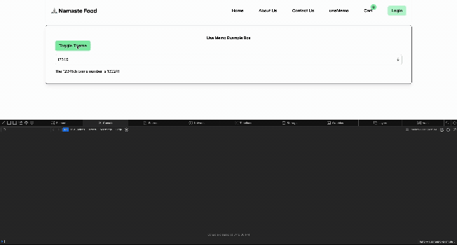

# useMemo

## The Problem: Expensive Calculations

Have you ever noticed your React app becoming sluggish when performing complex calculations? This happens because React re-executes all code in your component body during every re-render.

Consider this example where we calculate the nth prime number:

```jsx linenums="1" title="MemoExample.js" hl_lines="12"
import { useState } from "react";
import { findNthPrime } from "../utils/helper";

const MemoExample = () => {
    const [memoInput, setMemoInput] = useState(0);
    const [theme, setTheme] = useState("light");

    console.log("MemoExample Rendered");

    // This expensive calculation runs on EVERY render!
    console.log("Calculating prime number for:", memoInput);
    const prime = findNthPrime(memoInput);

    return (
        <div className={theme === "dark" ? "bg-gray-800 text-white" : "bg-white text-black"}>
            <h1>Use Memo Example Box</h1>
            <button onClick={() => setTheme(theme === "dark" ? "light" : "dark")}>
                Toggle Theme
            </button>
            <input
                type="number"
                value={memoInput}
                onChange={(e) => setMemoInput(e.target.value)}
            />
            <p>
                The {memoInput}th prime number is {memoInput ? prime : "?"}
            </p>
        </div>
    )
}
```

In this code, the [findNthPrime](https://www.tutorialspoint.com/finding-the-nth-prime-number-in-javascript) function is computationally expensive, especially for values greater than or equal to 6. The critical issue is that this calculation runs **every time the component re-renders** - even when toggling the theme, which has nothing to do with our prime number!



## The Solution: useMemo

React's `useMemo` hook lets you cache expensive calculations between renders:

```jsx
const cachedValue = useMemo(calculateValue, dependencies)
```

### Parameters:

- `calculateValue`: A function that returns the value you want to cache
- `dependencies`: An array of values that, when changed, will trigger recalculation

### Fixing Our Example:

```jsx linenums="1" title="MemoExample.js" hl_lines="11-14"
import { useMemo, useState } from "react";
import { findNthPrime } from "../utils/helper";

const MemoExample = () => {
    const [memoInput, setMemoInput] = useState(0);
    const [theme, setTheme] = useState("light");

    console.log("MemoExample Rendered");

    // Now the calculation only runs when memoInput changes!
    const prime = useMemo(() => {
        console.log("Calculating prime number for:", memoInput);
        return findNthPrime(memoInput);
    }, [memoInput]);

    return (
        <div className={theme === "dark" ? "bg-gray-800 text-white" : "bg-white text-black"}>
            <h1>Use Memo Example Box</h1>
            <button onClick={() => setTheme(theme === "dark" ? "light" : "dark")}>
                Toggle Theme
            </button>
            <input
                type="number"
                value={memoInput}
                onChange={(e) => setMemoInput(e.target.value)}
            />
            <p>
                The {memoInput}th prime number is {memoInput ? prime : "?"}
            </p>
        </div>
    )
}
```

With this change, the expensive calculation now only runs when the `memoInput` changes. When you toggle the theme, React reuses the previously calculated value, keeping your UI responsive.

!!! abstract "Important Notes"
    - `useMemo` is a Hook, so you can only call it at the top level of components or custom hooks
    - In development mode (Strict Mode), React calls your calculation function twice to help detect impurities
    - Only use `useMemo` for computationally expensive operations - it has its own overhead
    - React may occasionally discard cached values for internal optimization reasons


## :gear: Common Use Cases

- Skipping expensive calculations
- Preventing unnecessary re-renders of child components
- Stabilizing dependencies for useEffect
- Memoizing callback functions (though useCallback is often better for this)

Try entering a large number (like 100000) in the example app and toggle the theme. With `useMemo`, the UI remains responsive during theme changes because the prime calculation doesn't need to run again.


## Further Reading

- [:octicons-link-external-16: React Docs: useMemo](https://react.dev/reference/react/useMemo)
- [:octicons-link-external-16: React Docs: useCallback](https://react.dev/reference/react/useCallback)
